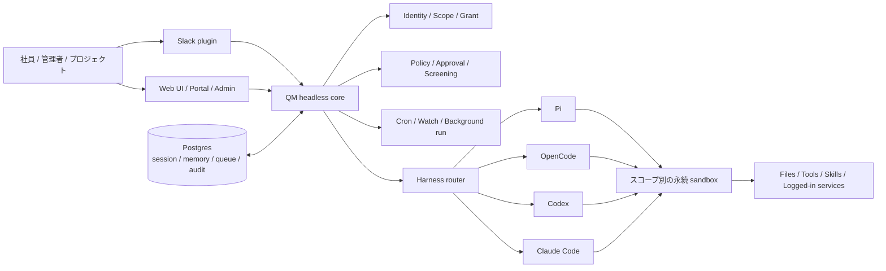
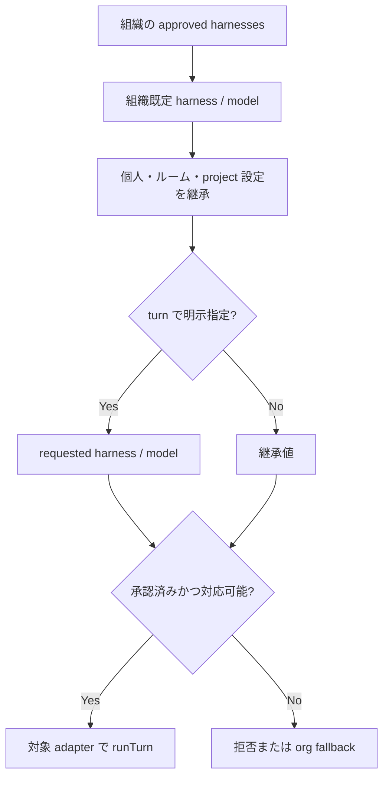

# QM（yc-software/qm）調査報告：組織向けエージェント基盤と Continue / OpenCode との比較

- 調査基準日: 2026-08-03（Asia/Tokyo）
- 対象リポジトリ: [`yc-software/qm`](https://github.com/yc-software/qm)
- 対象コミット: [`7f2c916360f1797a8ff2a77ce2ce40c5fabab087`](https://github.com/yc-software/qm/commit/7f2c916360f1797a8ff2a77ce2ce40c5fabab087)
- 対象 CLI: `@yc-software/qm` 0.1.4
- ライセンス: 原則 MIT（リポジトリ内で別途明記される部分を除く）

## 先に結論

QM は、Continue や OpenCode と同じ種類の「開発者個人が IDE やターミナルで使うコーディングエージェント」ではない。QM は、社員、Slack の部屋、プロジェクトごとに分離されたメモリ、ファイル、認証情報、権限、定期実行、永続サンドボックスを用意し、複数のエージェントハーネスを組織として運用するための **共有エージェント基盤／コントロールプレーン** である。

比較関係は次のように整理すると正確である。

- **OpenCode と Continue**: コーディングエージェントとして相互に比較しやすい。
- **QM と OpenCode**: 一部の利用場面では製品選定上比較できるが、技術的には QM が OpenCode を実行ハーネスとして内包できる。単純な二者択一ではない。
- **QM と Continue**: コーディング機能だけなら重なるが、主目的と運用単位が異なる。対象コミットの QM に Continue 用アダプターはない。
- **組織向け常駐エージェント基盤としての QM**: Continue / OpenCode よりも、OpenClaw や Hermes のエージェント群を組織でセルフホスト・管理する仕組み、または自社製 AI employee platform と比較する方が自然である。

また、QM に `harness-router` は存在するが、確認できた実装は組織・スコープ設定、明示リクエスト、フォールバックを解決するものである。タスクの難易度やコストを自動判定してモデルを切り替える「知的な複雑度ルーター」ではない。

## QM が生まれた背景

Y Combinator は2026年7月、QM をオープンソース化したと説明した。YC では初期の社内エージェントを拡張した後、50体を超える Hermes エージェントを社員ごとのパーソナルアシスタントとして用意したが、その規模でも管理が難しくなったという。QM は、Hermes の柔軟性と初期システムの管理しやすさを両立し、組織自身が所有・ホストできる基盤を目指したものである。

名称は `quartermaster` に由来し、船内の運用を調整する役割を表す。これは、QM がモデルそのものよりも、複数のエージェント、利用者、作業環境、権限を取りまとめる製品であることとも一致する。

根拠: [YC: QM](https://qm.ycombinator.com/)

## QM の位置づけ

QM の README は QM を「A multiplayer agent harness for work」と表現する。通常のパーソナルアシスタントを単純に全社共有するのではなく、各社員が互いに影響しない独立ワークスペースを持ちながら、Slack のチャンネル、グループメッセージ、プロジェクトでは共同作業できる設計である。

各人物・各ルームのスコープには、次の要素を持たせられる。

- メモリ
- ファイル
- keychain view と認証情報
- 権限
- cron
- Web アプリ
- durable sandbox

QM は、モデルやコーディングハーネスを固定しない。対象コミットには Pi、OpenCode、Codex、Claude Code のアダプターがあり、組織が許可したハーネスとモデルを選択できる。

根拠: [QM README](https://github.com/yc-software/qm/blob/7f2c916360f1797a8ff2a77ce2ce40c5fabab087/README.md)、[harness 実装一覧](https://github.com/yc-software/qm/tree/7f2c916360f1797a8ff2a77ce2ce40c5fabab087/src/harness)

## アーキテクチャ



### レイヤーごとの責務

| レイヤー | QM の責務 | OpenCode 等に委譲する責務 |
|---|---|---|
| Surface | Slack、Web、管理画面、portal | ターミナルや各ハーネス固有 UI は必須ではない |
| Control plane | ID、スコープ、ポリシー、承認、監査、予算、レート制限 | モデルの推論そのもの |
| Persistence | セッション、メモリ、キュー、監査記録、成果物 | ハーネス固有の一時状態 |
| Scheduling | cron、watch、バックグラウンド実行 | 1 turn 内の tool-use loop |
| Agent runtime | 共通インターフェース、ハーネス／モデル選択 | Pi、OpenCode、Codex、Claude Code の agent loop |
| Execution | スコープ別 sandbox の払い出しと接続 | sandbox 内でのコマンド生成・実行要求 |
| Deployment | Docker、Fly.io、AWS 向けの構成・検証・ライフサイクル | 各モデル provider の API |

QM core は Node 上で TypeScript を直接実行し、HTTP に Fastify、Slack に Bolt、Web UI の build に Vite、表示に Lit を使用する。Postgres が永続状態を保持し、`execute` を含む小さな共通 tool surface を介して、スコープ固有の sandbox でコマンドを実行する。

## 主な機能

### 1. 個人スコープと共有スコープ

QM の最も重要な差別化点は、個人用と共有用を同じ仕組みのスコープとして扱うことである。社員は自分専用のエージェントをカスタマイズでき、同時に Slack チャンネルやプロジェクトでは別の共有コンテキストを使って共同作業できる。

これは単なる「チャット履歴をチームで共有する」機能ではない。メモリ、ファイル、認証情報、権限、sandbox をスコープに結びつけることが設計の中心である。

### 2. Slack と Web の共通 ID

Slack と Web UI の間で同じ ID と設定を持ち回る。Web UI、admin panel、public portal は core HTTP API 上の任意プラグインであり、Slack は core が直接起動・監督する in-process plugin である。

### 3. 組織管理

管理者は次を組織レベルで制御できる。

- 利用可能なハーネス
- 利用可能なモデル
- セキュリティ姿勢
- 組織設定と各スコープが継承する下限
- スキルの全社昇格
- 認証、接続先、sandbox image、インフラ構成

### 4. 共有スキルと社内 Web アプリ

スキルはスコープが所有し、grant により共有できる。全社向けに昇格させる場合は管理者の gate を通す。Git リポジトリから skill pack を取り込むことも想定される。

エージェントは社内 Web アプリを作成し、対象者へ限定公開できる。これは IDE コーディング支援だけでなく、社内業務の小規模なアプリ化と継続運用を狙った機能である。

### 5. バックグラウンド処理

cron と watch により、人が画面を見ていない間も作業を継続できる。README が挙げる用途には、受信箱の定期整理、CI やログの監視、プロジェクト更新、社内データの同期などが含まれる。

### 6. コーディング作業

QM は既存リポジトリでテストを実行し、PR を作り、CI を監視し、ログを確認する用途も想定する。ただしこの能力の品質は、選択された OpenCode、Codex、Claude Code、Pi、モデル、sandbox tools、組織設定に依存する。QM 単体の名称だけからコード生成品質を評価することはできない。

## Harness router の実態

対象コミットの `resolveRuntimeChoice` は、概ね次の順でハーネスとモデルを決める。

1. 組織が承認したハーネス一覧を取得する。
2. 組織スコープの保存済み選択または base model を取得する。
3. 個人・ルーム・プロジェクト等の下位スコープ設定があれば継承値を上書きする。
4. turn のリクエストで `harnessId` または `modelId` が明示されていれば使用する。
5. 未承認または非対応の組み合わせなら拒否するか、安全なフォールバックへ戻す。
6. 同一セッション中にハーネスが変わった場合は、前後のハーネスセッションを reset する。



ここにはプロンプト内容、タスク難易度、推定コスト、失敗回数を分類する処理はない。したがって、QM の「複数ハーネスを切り替えられる」という説明を、「タスクに応じて自動的に最適なモデルへルーティングする」と読み替えてはいけない。

根拠: [`harness-router.ts`](https://github.com/yc-software/qm/blob/7f2c916360f1797a8ff2a77ce2ce40c5fabab087/src/harness/harness-router.ts)

## Continue / OpenCode と比較できるか

### 比較の前提

比較可能かどうかは、選定しようとしているものによって変わる。

| 選定対象 | QM を比較対象に含めるか | 理由 |
|---|---|---|
| IDE のコード補完・インライン編集 | 基本的に含めない | QM の主目的ではない。Continue の得意領域 |
| ターミナルの coding agent UX | 基本的に含めない | OpenCode 自体と他の coding agent を比較すべき |
| agent loop や tool-use の品質 | そのままでは含めない | QM は複数の下位ハーネスを選べるため、使用ハーネスを固定して評価する必要がある |
| 社員ごとの常駐 AI workspace | 含める | QM の中心用途 |
| Slack 上の個人・共有エージェント | 含める | QM の中心 surface |
| 組織的なメモリ・権限・監査 | 含める | QM の control-plane 機能 |
| cron・watch・常時運用 | 含める | QM の background work 機能 |
| 単一ハーネスへのロックイン回避 | 含める | Pi / OpenCode / Codex / Claude Code を差し替え可能 |

### 総合比較

| 観点 | QM | OpenCode | Continue |
|---|---|---|---|
| 主な製品レイヤー | 組織向け共有エージェント基盤 | coding agent / runtime | IDE・CLI coding agent |
| 主な surface | Slack、Web、admin、portal | TUI、Desktop、Web、IDE、headless server | VS Code、JetBrains、CLI |
| 主な利用単位 | 社員、ルーム、プロジェクト、組織 | 開発者、repository、session | 開発者、IDE workspace、session |
| agent loop | Pi / OpenCode / Codex / Claude Code へ委譲可能 | 自身が提供 | 自身が提供 |
| OpenCode との関係 | adapter と SDK を使って内包 | QM 内で動く実行ハーネスになれる | 直接関係なし |
| Continue との関係 | 対象コミットに adapter なし | 別製品 | 比較される側 |
| モデル選択 | 組織・スコープ・request 単位 | provider / agent / session 単位 | chat / edit / apply / autocomplete 等の role 単位 |
| 永続 workspace | スコープ別 cloud sandbox | 主にローカル project / worktree | 主にローカル IDE / CLI workspace |
| 永続メモリ | core の主要機能 | session、rules、skills が中心 | session、rules、context が中心 |
| 組織的権限・監査 | 中核機能 | agent / tool permission 中心 | tool policy / config 中心 |
| バックグラウンド運用 | cron、watch、queue | headless / server / automation は可能だが、QM 型の組織 scheduler とは異なる | headless CLI は可能だが、QM 型の常駐組織基盤ではない |
| インライン autocomplete | なし | なし | あり |
| セルフホスト負担 | 大きい | 比較的小さい | 比較的小さい |
| 対象時点の保守状況 | 公開直後、実験的 | active | final 2.0.0 後、公式 upstream は read-only |

OpenCode の公式文書は、OpenCode を terminal、Desktop、IDE で利用できるオープンソース coding agent と説明する。また `opencode serve` は headless HTTP / OpenAPI server を提供し、生成 SDK からプログラム的に操作できる。この client-server 境界が、QM に OpenCode を組み込みやすくしている。

Continue は IDE の Agent、Chat、Edit、Autocomplete と CLI を持つが、2026年8月3日時点の公式文書は、最終2.0.0を公開し、upstream repository を read-only にしたと案内している。そのため、新規の長期採用比較では機能だけでなく、自社保守または fork 継続の負担を含める必要がある。

根拠: [OpenCode Intro](https://opencode.ai/docs)、[OpenCode Server](https://opencode.ai/docs/server)、[Continue Docs](https://docs.continue.dev/index)

## OpenCode との関係

QM と OpenCode は、次のような包含関係を取れる。

```text
QM
└── 組織・社員・room・project の運用層
    └── OpenCode adapter
        └── OpenCode agent loop / provider / model
            └── QM が用意した scope sandbox で tools を実行
```

QM の root `package.json` は対象コミットで `@opencode-ai/plugin` と `@opencode-ai/sdk` 1.17.18 に依存し、`src/harness/opencode-harness.ts` と `opencode-plugin.ts` を持つ。つまり「OpenCode ではなく QM を選ぶ」というより、**OpenCode を個人利用するか、QM を外側に置いて組織運用するか**という選択になる。

注意点として、QM の security policy は、OpenCode adapter が provider key を supervised sidecar へ渡す経路を既知の制約として挙げている。QM を外側に置くだけで、下位ハーネスの認証情報リスクが消えるわけではない。

根拠: [`package.json`](https://github.com/yc-software/qm/blob/7f2c916360f1797a8ff2a77ce2ce40c5fabab087/package.json)、[`opencode-harness.ts`](https://github.com/yc-software/qm/blob/7f2c916360f1797a8ff2a77ce2ce40c5fabab087/src/harness/opencode-harness.ts)、[QM Security Policy](https://github.com/yc-software/qm/blob/7f2c916360f1797a8ff2a77ce2ce40c5fabab087/SECURITY.md)

## Continue との関係

対象コミットで確認できる adapter は Pi、OpenCode、Codex、Claude Code、mock であり、Continue adapter は存在しない。したがって、QM が掲げる「pick your own harness」を、任意のハーネスが設定だけで直ちに動くという意味に取るべきではない。新しいハーネスには、QM の共通 turn、session、tool、permission、sandbox、model selection と接続する adapter 実装が必要である。

Continue CLI は headless mode を持つため技術的な統合可能性は考えられるが、QM 公式資料に Continue 対応は明記されていない。さらに Continue upstream は read-only である。このため「Continue を QM 配下で利用できる」は、現時点では確認済み機能ではなく、追加開発を前提とする推論に留める。

## Deployment と運用負担

`qm` CLI は QM runtime そのものではなく、長時間稼働する QM services の deployment を生成・検証・操作する control-plane CLI である。対象 CLI 0.1.4 は Node 24 以上を要求し、次の環境を扱う。

- local: Docker
- Fly.io: Fly apps と Fly Machines
- AWS: ECS Fargate の ARM64 tasks と Lambda MicroVM agent computers

初期化の基本形は次である。

```bash
npm exec --yes --package=@yc-software/qm@latest -- \
  qm init . --org <slug> --target <fly-or-aws>
npm install
```

`qm init` は実行した CLI の正確なバージョンを deployment repository の `package.json` に pin し、その後の `npm install` が lockfile を作る。bootstrap に `@latest` を使うことと、運用 repository が floating version を使い続けることは同じではない。

deployment directory には、少なくとも設定、環境変数の雛形、sandbox tools / skills / Dockerfile、plugin image、infra 定義、生成された deployment runbook が含まれる。組織固有の設定、認証、ネットワーク、秘密情報、cloud account、billing、image、運用監視は導入者の責任になる。

したがって、`npm install -g opencode-ai` や IDE extension の導入と同程度の負担ではない。QM の評価では、agent の回答品質だけでなく、インフラ費用、Postgres、sandbox lifecycle、バックアップ、監査、秘密情報、障害対応を含む TCO を測る必要がある。

根拠: [QM CLI README](https://github.com/yc-software/qm/blob/7f2c916360f1797a8ff2a77ce2ce40c5fabab087/cli/README.md)、[`cli/package.json`](https://github.com/yc-software/qm/blob/7f2c916360f1797a8ff2a77ce2ce40c5fabab087/cli/package.json)、[Getting Started](https://github.com/yc-software/qm/blob/7f2c916360f1797a8ff2a77ce2ce40c5fabab087/docs/getting-started.md)

## セキュリティ姿勢

QM は3種類の posture を説明する。

| Posture | 動作 |
|---|---|
| Strict | 原則として全 harness tool call を人間の承認で停止する |
| Auto（既定） | provenance label 付きの外部データや対応 tool result を classifier で検査する |
| Dangerous | content screening や tool 間の停止を行わない |

すべての posture で、再帰削除や破壊的 SQL 等を対象とする事前定義 command policy と hard denial は適用される。ただし、公式 security policy はこの command policy 自体を sandbox 境界とは認めていない。

### 既知の重要な制約

| 制約 | 実務上の意味 |
|---|---|
| command policy は回避可能 | 難読化、encoding、script を書いて実行する方法などを完全には防げない |
| browser action の一部は core gate 外 | command policy や tool ごとの human approval を再通過しない経路がある |
| sandbox credential は使用中 plaintext | sandbox process が侵害されると、利用可能な credential の使用・流出があり得る |
| credential の purpose は強制 authorization ではない | 用途説明は model instruction と audit field であり、process の挙動を閉じ込めない |
| Auto screening は不完全・heuristic | 全出力形式や全経路を覆わず、prompt injection 耐性を保証しない |
| audience filtering に既知の欠落 | 異なる閲覧権限の情報を混在させる場合に完全な由来追跡がない |
| egress enforcement は backend 依存 | すべての backend が要求された粒度を強制できるとは限らない |
| admin は機密内容を読める | scope-authorized admin の読取は監査されるが、利用者の追加承認を要求しない |
| durable data が長期間残る | request capture は既定で有効。artifact の expiry や完全な byte reclamation は未実装 |
| 公開アプリ URL は bearer capability | URL を得た第三者が対象アプリへ到達でき、受信者本人には束縛されない |
| 一部 provider path が gateway を迂回 | ambient Slack judge や OpenCode adapter に例外経路がある |
| governance / DLP が未完成 | org kill switch、provider token revoke、file write 時の secret scanning 等が不完全 |

QM 自身が security policy の冒頭で「early, experimental software」とし、スコープ分離という設計目標はデータ非漏えいの保証、認証、deployment 固有レビューの代替ではないと明記している。YC が利用経験を基に公開したことは有力な設計背景だが、第三者監査、形式的な isolation guarantee、成熟した enterprise certification の証明ではない。

根拠: [QM Security Policy](https://github.com/yc-software/qm/blob/7f2c916360f1797a8ff2a77ce2ce40c5fabab087/SECURITY.md)

## 成熟度の評価

調査時点で確認できる肯定材料は次である。

- YC の社内エージェント運用経験を背景としている。
- core、adapter、sandbox、deployment、plugin、test が公開されている。
- `@yc-software/qm` CLI が公開され、provenance 付き release workflow を説明している。
- AWS / Fly / local Docker の deployment contract が用意されている。
- security policy が既知の欠落を具体的に公開している。

一方、慎重に扱うべき材料は次である。

- 2026年7月に公開されたばかりである。
- CLI のバージョンは対象時点で 0.1.4 である。
- 公式に experimental とされる。
- security control に既知の未完成部分が多い。
- 公開された独立ベンチマーク、長期運用実績、SLA、第三者 security audit は今回の一次資料では確認できない。
- 回答品質、コスト、速度は選んだハーネス、モデル、provider、sandbox、組織設定で大きく変わるため、「QM の性能」という単一値では評価できない。

したがって、現状の位置づけは「完成済みの汎用 enterprise SaaS」ではなく、**設計思想と実装範囲が広い、セルフホスト前提の初期段階 OSS 基盤**である。

## 選定ガイド

### QM が向く条件

- 社員ごとに常駐エージェントと永続 workspace を提供したい。
- 個人、Slack room、project でメモリと権限を分離したい。
- Slack と Web を共通 ID で使いたい。
- cron、watch、社内アプリ、接続サービスを含む業務エージェントが必要である。
- OpenCode、Codex、Claude Code、Pi のいずれか一社・一製品へ固定されたくない。
- AWS または Fly.io、Postgres、sandbox、秘密情報、監査を自社で運用できる。
- experimental software の security review と改修を引き受けられる。

### OpenCode を直接使う方がよい条件

- 主目的が個人の coding agent である。
- terminal-first の TUI、Desktop、IDE、ローカル Web を使いたい。
- provider-neutral なモデル選択、custom agent、MCP、plugin、LSP を重視する。
- 組織用 control plane より、導入の軽さと開発者 UX を優先する。
- 必要な隔離は既存の container、VM、CI runner 等で用意できる。

### Continue が適する可能性がある条件

- VS Code / JetBrains の inline autocomplete、Next Edit、Chat、Edit を一体で使いたい。
- chat、autocomplete、embed、rerank、edit、apply 等の機能別 model role を重視する。
- final 2.0.0 を固定利用するか、read-only になった upstream を自社で保守できる。

新規導入では、Continue の保守終了を明示的なリスクとして扱う必要がある。QM と Continue の二択ではなく、QM の下位ハーネス候補として現在サポートされる OpenCode / Codex / Claude Code / Pi を評価し、IDE autocomplete が別途必要なら Continue 系機能を独立に評価する方が設計しやすい。

## 推奨する検証方法

QM を採用候補にする場合は、全社投入の前に限定された非機密業務で pilot を行う。

1. 1つの組織、少人数、1つの共有 project scope に限定する。
2. Strict posture から始め、全 tool call と model request capture を確認する。
3. OpenCode または Codex の一方にハーネスを固定し、QM 外で直接使った場合と比較する。
4. 同じタスクセットで回答品質、完了率、人間の介入回数、token cost、wall-clock time を記録する。
5. 個人／共有 scope 間で memory、file、credential が漏れないことを adversarial prompt で検証する。
6. browser、external content、Slack message、connector data からの prompt injection を試験する。
7. sandbox からの filesystem、network、credential 到達範囲を実測する。
8. admin read、audit、退職者削除、artifact retention、backup / restore、kill procedure を確認する。
9. cron / watch の重複実行、再試行、停止、費用上限、障害復旧を確認する。
10. Auto posture への移行は、classifier の false positive / false negative と未検査経路を測定してから判断する。

比較時には、`QM + OpenCode` と `OpenCode 単体` を比べるのが有効である。これにより、コード生成品質ではなく、QM が加えるスコープ分離、共有メモリ、Slack、scheduler、監査、運用コストの増分を測れる。

## 最終評価

QM は「新しいコーディングエージェント」ではなく、既存の coding agent harness を交換可能な実行エンジンとして扱い、社員・チーム・プロジェクトへ配備するための組織レイヤーである。

そのため Continue / OpenCode の比較表に第3の同列製品として追加するだけでは、QM の特徴を正しく捉えられない。比較は次の二段階に分けるべきである。

1. **下位ハーネス選定**: OpenCode、Codex、Claude Code、Pi、および必要なら Continue 相当機能を、coding UX、モデル、agent loop、tool、IDE、sandbox で比較する。
2. **上位運用基盤選定**: QM を、スコープ分離、Slack / Web、永続 workspace、メモリ、認証情報、cron、監査、組織ポリシー、self-host TCO で評価する。

最も正確な短い表現は、**QM は OpenCode の競合というより、OpenCode を含む複数ハーネスを組織で運用するための experimental な control plane** である。

## 主要一次資料

| 資料 | 本稿で確認した内容 |
|---|---|
| [YC: QM](https://qm.ycombinator.com/) | 公開時期、開発背景、50体超の Hermes 運用経験、self-host 方針 |
| [QM README](https://github.com/yc-software/qm/blob/7f2c916360f1797a8ff2a77ce2ce40c5fabab087/README.md) | 製品目的、scope、機能、architecture、posture、deployment |
| [QM Security Policy](https://github.com/yc-software/qm/blob/7f2c916360f1797a8ff2a77ce2ce40c5fabab087/SECURITY.md) | threat model、operator assumption、既知の制約、experimental status |
| [QM harness router](https://github.com/yc-software/qm/blob/7f2c916360f1797a8ff2a77ce2ce40c5fabab087/src/harness/harness-router.ts) | 組織・scope・request による harness / model 解決処理 |
| [QM harness directory](https://github.com/yc-software/qm/tree/7f2c916360f1797a8ff2a77ce2ce40c5fabab087/src/harness) | Pi、OpenCode、Codex、Claude Code adapter の存在と Continue adapter の不在 |
| [QM CLI README](https://github.com/yc-software/qm/blob/7f2c916360f1797a8ff2a77ce2ce40c5fabab087/cli/README.md) | CLI と runtime の区別、Docker / Fly / AWS、deployment directory |
| [QM CLI package](https://github.com/yc-software/qm/blob/7f2c916360f1797a8ff2a77ce2ce40c5fabab087/cli/package.json) | `@yc-software/qm` 0.1.4、Node 要件、package metadata |
| [OpenCode Intro](https://opencode.ai/docs) | OpenCode の製品位置づけと surface |
| [OpenCode Server](https://opencode.ai/docs/server) | headless HTTP / OpenAPI server と SDK 境界 |
| [Continue Docs](https://docs.continue.dev/index) | Continue の製品位置づけ、final 2.0.0、upstream read-only status |

すべて2026年8月3日に確認した。GitHub 上の QM ソースリンクは、時間経過による内容変更を避けるため対象コミットへ固定した。
