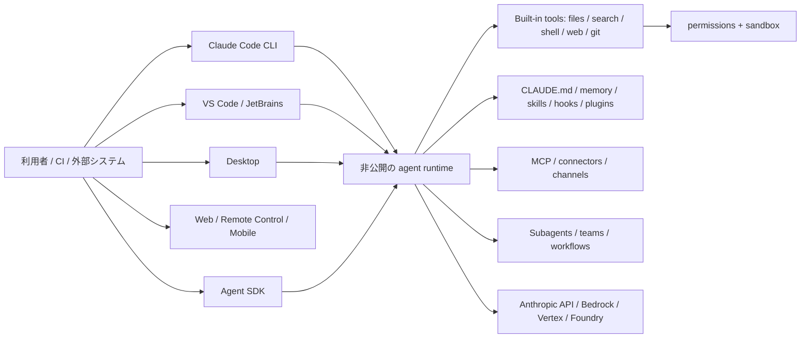

# Claude Code 機能・実装調査

- 調査日: 2026-08-01（Asia/Tokyo）
- 対象リポジトリ: `anthropics/claude-code`
- 対象コミット / tag: [`7ef6eec9d9ba84ea6f233f26c45f1df5c5991843`](https://github.com/anthropics/claude-code/tree/7ef6eec9d9ba84ea6f233f26c45f1df5c5991843) / `v2.1.220`
- ライセンス: Anthropic All rights reserved、Commercial Terms 適用

## 最重要の結論: このリポジトリは Claude Code 本体の OSS ソースではない

Claude Code はしばしば OSS コーディングエージェントと並べて語られるが、調査対象の `anthropics/claude-code` は、**CLI 本体の完全なソースコードを公開する OSS リポジトリではない**。

根拠は明確である。

- [`LICENSE.md`](https://github.com/anthropics/claude-code/blob/7ef6eec9d9ba84ea6f233f26c45f1df5c5991843/LICENSE.md) は “All rights reserved” と Commercial Terms を示す。
- top-level には README、CHANGELOG、issue 管理 script、公式 plugin 例があるが、CLI 本体の `src` はない。
- README も `@anthropic-ai/claude-code` の利用案内と、同 repo に含まれる plugins の説明が中心である。

したがって本稿では、次を厳密に分ける。

1. リポジトリで直接読めるもの: README、CHANGELOG、plugin 定義・hook script・agent prompt
2. 公式ドキュメントで確認するもの: Claude Code 本体の機能・設定・セキュリティ
3. 実装詳細を断定できないもの: 非公開の agent loop、内部 permission classifier、UI runtime 等

## 結論

Claude Code は、**Claude モデルと密接に統合された、多機能な terminal-first coding agent**である。CLI、VS Code、JetBrains、Desktop、Web、mobile / Remote Control、GitHub / GitLab / Slack、Agent SDK まで広がる。特に強いのは次の領域である。

- `CLAUDE.md`、auto memory、rules、skills、plugins の成熟した拡張体系
- command / HTTP / MCP tool / prompt / agent hook
- custom subagent、background agent、worktree isolation、agent teams / workflows
- MCP の複数 scope、OAuth、plugin 同梱、channels
- permission rule と OS-level sandbox の二層防御
- headless / Agent SDK / structured output / streaming

モデル選択は Continue のような任意モデル marketplace 型ではなく、Claude を Anthropic API、Amazon Bedrock、Google Vertex AI、Microsoft Foundry 等から利用する構造である。

## 全体像

## 本体機能

### 1. Terminal-first の自律 coding agent

Claude Code は自然言語から repo を探索し、計画を作り、複数ファイルを変更し、command を実行し、テスト結果を受けて修正を続ける。Git の status / diff / history を読み、branch、commit、pull request も扱う。

公式 [Overview](https://code.claude.com/docs/en/overview) は、テスト作成、lint 修正、merge conflict、dependency 更新、機能開発、bug 修正、commit / PR、CI review を代表用途として挙げる。リポジトリ README も terminal、IDE、GitHub の3 surface を明記する。

### 2. Plan mode と checkpoints / rewind

Plan mode は、調査・設計を先に行い、実装前に利用者が計画を確認するモードである。VS Code では plan を Markdown document として開き、inline comment で修正できる。

Claude Code は edit 前の checkpoint を保持し、会話だけ、コードだけ、または双方を rewind できる。これは Git commit とは別の session 内 recovery mechanism である。ただし外部 command が行った変更など、すべての状態を完全に巻き戻す一般 snapshot とみなすべきではない。

### 3. Built-in tools と Web / browser

公式 [How Claude Code works](https://code.claude.com/docs/en/how-claude-code-works) は、project files、terminal、Git state、`CLAUDE.md`、auto memory、MCP、skills、subagents、Claude in Chrome を文脈・拡張として挙げる。

主要な tool category は Read / Edit / Write、Glob / Grep、Bash / PowerShell、WebSearch / WebFetch、AskUserQuestion、Agent、Notebook / IDE integration 等である。Chrome integration や browser automation は環境・アカウント・plugin に依存する。

### 4. `CLAUDE.md`、Rules、Auto memory

- `CLAUDE.md`: project 固有の規約・architecture・build command・review checklist
- `.claude/rules/`: path 等に応じて分割した指示
- Auto memory: 作業中に学んだ build / debug 手順や好みを次回へ保持

公式文書によれば auto memory の `MEMORY.md` は開始時に先頭 200 行または 25KB まで読み込む。すべてを system prompt に無制限投入するのではなく、上限を持つ。

### 5. Skills と slash commands

Skill は `SKILL.md` と付属 reference / script をまとめた再利用可能な知識・workflow である。利用者が `/skill-name` で起動でき、description に応じて Claude が自動選択することもできる。project、personal、enterprise、plugin scope を持ち、file change の live detection もある。

旧 `commands/*.md` も互換利用できるが、現行ドキュメントは新規 plugin に `skills/<name>/SKILL.md` を推奨する。

### 6. Hooks

Claude Code の Hooks はこの3製品で最も多機能である。公式 [Hooks reference](https://code.claude.com/docs/en/hooks) は次の handler type を定義する。

- `command`: shell command
- `http`: endpoint へ POST
- `mcp_tool`: 接続済み MCP tool
- `prompt`: 単発の Claude 判定
- `agent`: tool を使う subagent による検証（experimental）

イベントは PreToolUse、PostToolUse、PermissionRequest、UserPromptSubmit、SessionStart / End、Stop、SubagentStart / Stop、PreCompact、Notification 等を含む。tool input の変更、block、追加 context、非同期 side effect などが可能である。

公開 repo の `hookify` plugin は、hook input の tool name / input に条件を当て、警告または block response を返す実コードを含む。したがって plugin 層については、設定例だけでなく実行 script を直接検証できる。

### 7. Plugins と marketplace

Plugin は次を1パッケージで配布できる。

- skills / commands
- custom agents
- hooks
- MCP servers
- LSP servers
- output styles / themes
- background monitors
- executable / settings

公式 [Plugins guide](https://code.claude.com/docs/en/plugins) と [reference](https://code.claude.com/docs/en/plugins-reference) が manifest と directory 構成を定義する。公開 repo 自体にも code review、feature development、commit、frontend design、plugin development、security guidance 等の公式 plugin が含まれる。

### 8. Subagents、background agents、agent teams / workflows

Custom subagent は独立 context window、system prompt、model、effort、tool allow / deny、skills、memory、MCP、hook、max turns、background、worktree isolation を設定できる。main conversation の context を膨らませず、結果の要約だけを返せる。

公式 [Subagents](https://code.claude.com/docs/en/sub-agents) は、自動委譲、自然言語指定、`@` mention、session-wide `--agent` を説明する。調査 tag の CHANGELOG では、subagent のネスト、並行数上限、background 実行、stream-json forwarding が継続的に強化されている。

さらに agent teams / dynamic workflows は、独立 agent が shared task と peer-to-peer message を使って協調する。公式 [Extend Claude Code](https://code.claude.com/docs/en/features-overview) は、単純な isolated subagent と、相互通信する team を区別し、agent teams を experimental / disabled by default としている。

公開 repo の [code-review plugin](https://github.com/anthropics/claude-code/blob/7ef6eec9d9ba84ea6f233f26c45f1df5c5991843/plugins/code-review/README.md) は、複数 agent を並列に走らせ、CLAUDE.md 遵守、bug、git history を別視点で評価し、confidence threshold で false positive を除く具体例である。

### 9. MCP

Claude Code は MCP client として高度な機能を持つ。

- stdio / HTTP 等の server
- local / project / user / plugin / managed scope
- OAuth 2.0
- tools / resources / prompts
- plugin 同梱 MCP
- subagent 専用 MCP（親 context に tool schema を載せない）
- channels による CI / alert 等から session への push
- enterprise allowlist / denylist

公式 [MCP guide](https://code.claude.com/docs/en/mcp) は scope の保存場所、優先順位、project config の信頼確認、OAuth、output limit を説明する。また Claude Code 自身の tool を MCP client に公開する server mode も案内している。

### 10. Permissions と OS-level sandbox

Claude Code は permissions と sandbox を分離する。

- permissions: tool、command、file、domain、MCP、Agent を allow / ask / deny
- sandbox: Bash と子 process の filesystem / network を OS レベルで制限

公式 [Sandboxing](https://code.claude.com/docs/en/sandboxing) によれば、macOS は Seatbelt、Linux / WSL2 は bubblewrap を用い、network は外部 proxy の domain allowlist で制御する。sandbox 内 command を auto-allow するモードと、毎回通常 permission flow を通すモードがある。

重要な制約もある。

- 依存物不足・非対応環境では、既定で warning を出して **sandbox なしで実行を継続**する。強制失敗には `sandbox.failIfUnavailable` が必要。
- built-in proxy は TLS を復号・検査しない。
- `dangerouslyDisableSandbox` の escape hatch は通常 permission を要求するが、設定で完全無効化できる。
- permissions の Read / Edit deny と Bash subprocess の隔離は別層である。

### 11. Headless と Agent SDK

`claude -p` は stdin、text / JSON / stream-json、JSON Schema structured output、tool allowlist、permission mode、session continuation を提供する。公式 [Headless mode](https://code.claude.com/docs/en/headless) は CI / shell pipe / build script の例と token / cost field を説明する。

Python / TypeScript の Claude Agent SDK は message stream、hooks、MCP、custom tools、subagents、session resume、permission callback 等をアプリへ組み込む。

### 12. IDE、Desktop、Web、Remote Control

- VS Code: native panel、inline diff、`@` mention、plan review、複数 conversation、remote session resume
- JetBrains: terminal launch、IDE diff、selection / diagnostic sharing
- Desktop: visual diff、local session、plugins、複数 task
- Web / mobile: hosted 長時間 task、GitHub repo、terminal への `--teleport`
- Remote Control: browser / phone から terminal session を継続操作

公式 [Platforms](https://code.claude.com/docs/en/platforms) は CLI を最も完全な surface とし、Desktop / IDE では一部 CLI-only feature と引き換えに visual review を提供すると説明する。

### 13. モデル・provider

Claude Code は Claude model 専用である。接続先は主に次である。

- Anthropic API / Claude subscription
- Amazon Bedrock
- Google Vertex AI
- Microsoft Foundry
- enterprise gateway

VS Code 公式文書も Bedrock / Vertex / Foundry を third-party provider として案内する。Continue のように OpenAI、Gemini、Mistral、Ollama 等の異なるモデル family を同じ adapter registry で選ぶ設計ではない。

## 公開リポジトリで直接確認できる特色

### 公式 plugins が「拡張の実物」になっている

`plugins/` には次のような実装例がある。

- multi-agent code review
- feature-dev の explorer / architect / reviewer
- commit / push / PR workflow
- hookify rule engine
- Stop hook で反復を続ける Ralph Wiggum loop
- security pattern を監視する PreToolUse hook
- plugin / skill / agent authoring支援

つまり、本体 core は読めないが、**Claude Code が外部へ公開する拡張 contract と、その上に構築する workflow は相当具体的に読める**。

### CHANGELOG が product behavior の詳細な一次資料

調査 tag の先頭では、network strict allowlist、MCP validation error、nested subagent、dynamic workflow size、background code review、sandbox filesystem switch、worktree isolation、permission parser 等が記載される。非公開 core の architecture を証明するものではないが、version 付きの利用者可視 behavior の一次資料になる。

## 強み

1. **拡張体系の完成度**: CLAUDE.md、memory、skills、hooks、plugins、MCP、LSP。
2. **高度な複数 agent**: isolated subagent、background、worktree、teams / workflows。
3. **幅広い surface**: CLI、IDE、Desktop、Web、mobile、Remote Control、CI、SDK。
4. **セキュリティ機能**: granular permissions、sandbox、network proxy、managed settings。
5. **Claude との垂直統合**: model capability と agent UX を一体で更新できる。

## 制約・リスク

1. **本体は OSS ではない**: core implementation の監査・fork・改造性は Continue / Codex と異なる。
2. **Claude model に限定**: 接続 provider は選べても、任意 model family の harness ではない。
3. **機能・課金・surface の差**: Web、Desktop、subscription、API、Bedrock 等で利用可否が異なる。
4. **agent teams 等の成熟度**: experimental 機能は仕様変更を前提にする必要がある。
5. **sandbox fallback**: `failIfUnavailable` を設定しないと sandbox 起動失敗時に非隔離実行へ進む。
6. **複雑性**: hooks、plugins、subagents、managed policy の重ね合わせは強力だが、運用設計が必要。

## 向いている用途

- Claude の coding performance と UX を最大限利用したい
- 複数 agent の専門分業、background 実行、worktree isolation が必要
- hooks / plugins / MCP を用いた組織 workflow を作りたい
- terminal、IDE、Desktop、Web / mobile を横断したい
- Agent SDK で Claude Code と同型の agent behavior を組み込みたい

OSS core の改造可能性や異種・ローカルモデルの自由度を最優先する場合は、Continue または Codex の方が要件に合いやすい。

## 主要参照資料

### クローン済みリポジトリ

- [README](https://github.com/anthropics/claude-code/blob/7ef6eec9d9ba84ea6f233f26c45f1df5c5991843/README.md)
- [License](https://github.com/anthropics/claude-code/blob/7ef6eec9d9ba84ea6f233f26c45f1df5c5991843/LICENSE.md)
- [Changelog v2.1.220](https://github.com/anthropics/claude-code/blob/7ef6eec9d9ba84ea6f233f26c45f1df5c5991843/CHANGELOG.md)
- [Official plugins](https://github.com/anthropics/claude-code/tree/7ef6eec9d9ba84ea6f233f26c45f1df5c5991843/plugins)
- [Code review plugin](https://github.com/anthropics/claude-code/blob/7ef6eec9d9ba84ea6f233f26c45f1df5c5991843/plugins/code-review/README.md)
- [Hookify rule engine](https://github.com/anthropics/claude-code/blob/7ef6eec9d9ba84ea6f233f26c45f1df5c5991843/plugins/hookify/core/rule_engine.py)

### 公式 Web 文書

- [Overview](https://code.claude.com/docs/en/overview)
- [How Claude Code works](https://code.claude.com/docs/en/how-claude-code-works)
- [Feature / extension overview](https://code.claude.com/docs/en/features-overview)
- [Subagents](https://code.claude.com/docs/en/sub-agents)
- [Hooks](https://code.claude.com/docs/en/hooks)
- [Plugins](https://code.claude.com/docs/en/plugins)
- [MCP](https://code.claude.com/docs/en/mcp)
- [Permissions](https://code.claude.com/docs/en/permissions)
- [Sandboxing](https://code.claude.com/docs/en/sandboxing)
- [Headless mode](https://code.claude.com/docs/en/headless)
- [Platforms](https://code.claude.com/docs/en/platforms)
- [VS Code](https://code.claude.com/docs/en/vs-code)
- [JetBrains](https://code.claude.com/docs/en/jetbrains)
