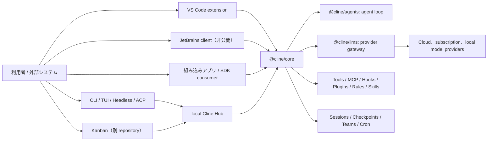
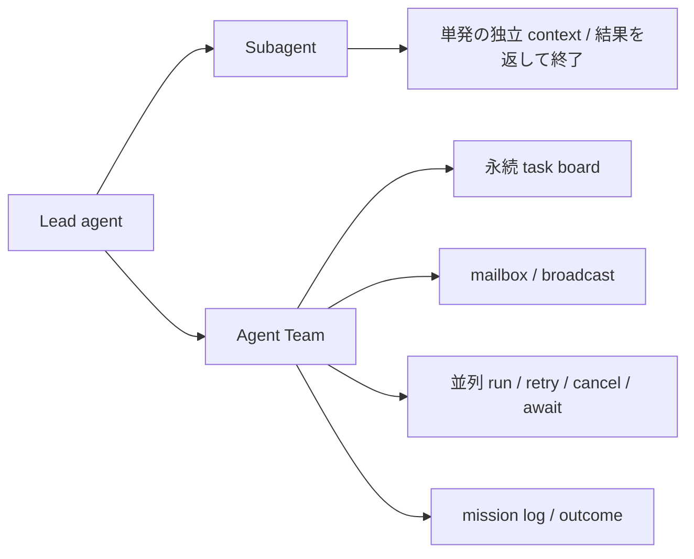

# Cline 機能・実装調査

- 調査日: 2026-08-01（Asia/Tokyo）
- 対象リポジトリ: `cline/cline`
- 対象コミット: [`8e68b146739cea67d6c4d4b3e9eec290d8d9be75`](https://github.com/cline/cline/tree/8e68b146739cea67d6c4d4b3e9eec290d8d9be75)
- 対象バージョンの目安: CLI 3.0.48、VS Code extension 4.1.2、SDK 0.0.68
- ライセンス: Apache License 2.0

## 結論

Cline は、VS Code 内で人間が変更を承認するコーディングエージェントとして出発しつつ、対象 snapshot では **IDE、CLI、Agent SDK、local Hub、定期実行、multi-agent を共通 runtime でつなぐ OSS agent platform** に拡張されている。モデルプロバイダーの選択肢、ブラウザ操作、Git checkpoint、MCP、Rules / Skills、Hooks、配布可能 plugin が揃い、特に CLI / SDK / Kanban における永続 Agent Teams、cron、チャット connector は特色が強い。

ただし、すべての機能が全 surface に存在するわけではない。ブラウザ操作と細かな IDE diff は主に IDE、plugins・Agent Teams・schedule は主に CLI / SDK / Kanban である。JetBrains 製品は提供されているが、その client 実装は公開されていない。また Cline の「sandbox」という名称は、CLI state や plugin subprocess の分離にも使われており、**Codex のような OS 強制 filesystem / network sandbox と同義ではない**。

## 調査範囲と注意点

本稿では次を分けて確認した。

1. クローン済みソースに、型だけでなく tool executor、agent loop、永続化、復元処理が存在すること
2. Cline 公式ドキュメントで、利用者向け機能として案内されていること
3. VS Code、CLI、SDK、Kanban の surface 差

対象リポジトリは移行途中の新旧実装を含む。`apps/vscode` には従来の IDE 向け tool 群、`sdk/packages/core` には CLI / SDK を支える新しい共通 tool 群がある。このため、単一の tool 一覧だけを Cline 全体の仕様とみなしてはいけない。

また、ルート README は JetBrains plugin を明示的に **非 OSS** としている。Cline の agent core、CLI、VS Code extension、SDK は Apache-2.0 だが、「全 surface が OSS」ではない。

## 全体構成

ソースの責務分離は明確である。

- `apps/vscode/`: VS Code host、Webview、diff、terminal、Puppeteer browser、従来の Cline tool 群
- `apps/cli/`: TUI、headless / NDJSON、ACP、Hub 管理、schedule、connectors
- `apps/cline-hub/`: 複数 client と background task を受ける local daemon
- `sdk/packages/agents/`: browser-compatible な状態付き agent loop
- `sdk/packages/llms/`: model provider gateway と model catalog
- `sdk/packages/core/`: session、tool executor、MCP、plugin、checkpoint、team、cron を統合
- `sdk/packages/sdk/`: 公開 SDK のまとめ口

この依存関係は [`ClineCore`](https://github.com/cline/cline/blob/8e68b146739cea67d6c4d4b3e9eec290d8d9be75/sdk/packages/core/src/ClineCore.ts#L84-L103) と公式の [SDK architecture](https://docs.cline.bot/sdk/architecture/overview) で確認できる。

## 主要機能

### 1. Plan / Act と反復 Agent loop

Cline の基本 UX は Plan と Act の切り替えである。

| モード | 意図 | 主な操作 |
|---|---|---|
| Plan | コードベースを調査して方針を合意 | 読み取り、検索、質問、設計 |
| Act | 計画を実装して検証 | ファイル編集、command、MCP 等 |
| YOLO | 無人・自動化向け Act | tool 承認を省略 |

公式 [Plan & Act Mode](https://docs.cline.bot/core-workflows/plan-and-act) は Plan mode をファイル変更・command 実行なしと説明する。一方、対象 snapshot の SDK preset は Plan で editor を無効にするが `enableBash: true` のままであり、コメントの「no shell access」と実値にも食い違いがある（[`presets.ts`](https://github.com/cline/cline/blob/8e68b146739cea67d6c4d4b3e9eec290d8d9be75/sdk/packages/core/src/extensions/tools/presets.ts#L39-L55)）。したがって、**Plan という名称だけを command 非実行の強制境界と考えず、surface、tool policy、承認設定を確認すべき**である。

基底の [`AgentRuntime`](https://github.com/cline/cline/blob/8e68b146739cea67d6c4d4b3e9eec290d8d9be75/sdk/packages/agents/src/agent-runtime.ts#L396-L444) は、model response から tool call を取り出し、policy と `beforeTool` hook を評価して executor を呼び、結果を会話へ戻す反復 loop である。tool は逐次実行だけでなく runtime 設定上の並列実行にも対応する。

### 2. ファイル、検索、command、Web の組み込み tools

新しい Cline Core の既定 tools は次である。

- `read_files`: 複数ファイル、行範囲、画像の読み取り
- `search_codebase`: regex によるコード検索
- `run_commands`: shell command の実行
- `fetch_web_content`: URL 取得と内容抽出
- `editor` または `apply_patch`: 作成・置換・挿入または patch 適用
- `skills`: `SKILL.md` の段階的読み込み
- `ask_question`: 選択肢付き質問
- `submit_and_exit`: headless run の完了

tool 名は [`constants.ts`](https://github.com/cline/cline/blob/8e68b146739cea67d6c4d4b3e9eec290d8d9be75/sdk/packages/core/src/extensions/tools/constants.ts#L12-L36)、executor を含む生成処理は [`definitions.ts`](https://github.com/cline/cline/blob/8e68b146739cea67d6c4d4b3e9eec290d8d9be75/sdk/packages/core/src/extensions/tools/definitions.ts) にある。command executor は child process group、timeout、abort、出力量制限を実装するが、通常の OS 権限で command を実行する（[`bash.ts`](https://github.com/cline/cline/blob/8e68b146739cea67d6c4d4b3e9eec290d8d9be75/sdk/packages/core/src/extensions/tools/executors/bash.ts#L127-L149)）。

VS Code 側には、これらに加えて browser、Web search、MCP resource、code definition、task handoff 等を含む従来の tool set がある（[`tools.ts`](https://github.com/cline/cline/blob/8e68b146739cea67d6c4d4b3e9eec290d8d9be75/apps/vscode/src/shared/tools.ts#L7-L35)）。この二重構成は、Cline が IDE 実装を共通 SDK へ段階的に移行していることを示す。

### 3. IDE 統合とブラウザ操作

VS Code では次を一つの sidebar workflow にまとめる。

- project tree、選択範囲、Problems、terminal、Git diff、URL の context 化
- 複数ファイル編集と editor 内 diff の承認・修正・取消
- compiler / linter error を見ながら再修正
- terminal command と長時間 process の監視
- browser の launch、click、type、scroll、screenshot、console log 取得
- checkpoint の compare / restore

browser 実装は Puppeteer Core で local / remote Chrome に接続する [`BrowserSession`](https://github.com/cline/cline/blob/8e68b146739cea67d6c4d4b3e9eec290d8d9be75/apps/vscode/src/services/browser/BrowserSession.ts#L1-L18) にあり、単なる URL fetch ではない。公式 [Adding Context](https://docs.cline.bot/core-workflows/working-with-files) も file、folder、Problems、terminal、Git、URL の `@` mention を説明する。

Cline は Agent 型編集を中心とし、Continue のような独立したインライン autocomplete / Next Edit engine は対象 snapshot で確認できない。

JetBrains plugin も配布されるが、ルート README が明記する通り client source は非公開である。したがって、JetBrains 対応は製品機能としては「あり」、OSS 実装としては「一部非公開」と評価する。

### 4. CLI、Headless、ACP、Hub

CLI は単なる extension launcher ではなく独立した surface である。

- OpenTUI による対話 TUI
- one-shot prompt と stdin pipe
- `--json` による NDJSON event stream
- `--plan`、`--thinking`、`--compaction`
- session history と `--id` による resume
- `--worktree` による task 用 Git worktree
- `--acp` による Agent Client Protocol mode
- `--zen` による local Hub への background dispatch
- `doctor`、provider auth、MCP、plugin、schedule、connector 管理

ソース内の CLI 説明は [`apps/cli/README.md`](https://github.com/cline/cline/blob/8e68b146739cea67d6c4d4b3e9eec290d8d9be75/apps/cli/README.md#L84-L120)、公式仕様は [CLI Reference](https://docs.cline.bot/cli/cli-reference) にある。Zen は Hub に task を渡して CLI 自体は終了するが、無人実行なので auto-approve となり、spawn / team tools は既定で外される。

### 5. モデルとプロバイダー

Cline はベンダー中立性が高い。対象 snapshot の built-in provider ID には次が含まれる。

- Anthropic、OpenAI native / compatible、Gemini
- AWS Bedrock、Google Vertex AI、OpenRouter、Vercel AI Gateway
- Ollama、LM Studio
- DeepSeek、xAI、Groq、Cerebras、Mistral、Qwen、Moonshot 等
- Cline gateway / Cline Pass
- ChatGPT subscription 用 `openai-codex`
- Claude Code、OpenCode、Qwen Code 等を介する provider adapter
- custom provider / model registry

実際の列挙は [`providers/ids.ts`](https://github.com/cline/cline/blob/8e68b146739cea67d6c4d4b3e9eec290d8d9be75/sdk/packages/llms/src/providers/ids.ts#L10-L69) にある。公式 CLI 文書も Anthropic、OpenAI、Gemini、OpenRouter、Bedrock、Vertex、OpenAI-compatible endpoint を案内している。

Plan / Act で provider / model 設定を分けられ、active session の model / connection 更新 API もある（[`ClineCore.ts`](https://github.com/cline/cline/blob/8e68b146739cea67d6c4d4b3e9eec290d8d9be75/sdk/packages/core/src/ClineCore.ts#L622-L648)）。ただし Continue の autocomplete / embedding / reranking のような機能別 model role とは異なる。

### 6. MCP

Cline は MCP client として次を実装する。

- stdio、SSE、Streamable HTTP transport
- server ごとの有効・無効、timeout、headers、環境変数
- OAuth state
- tools の列挙、cache、model tool への変換、呼び出し
- VS Code の MCP resources と prompts
- CLI の対話的な `cline mcp` / `cline mcp install`

transport 型は [`extensions/mcp/types.ts`](https://github.com/cline/cline/blob/8e68b146739cea67d6c4d4b3e9eec290d8d9be75/sdk/packages/core/src/extensions/mcp/types.ts#L39-L62)、設定 schema は [`config-loader.ts`](https://github.com/cline/cline/blob/8e68b146739cea67d6c4d4b3e9eec290d8d9be75/sdk/packages/core/src/extensions/mcp/config-loader.ts#L54-L78) で確認できる。調査範囲では、Cline 自身を汎用 MCP server として公開する標準 command は確認できなかった。

### 7. Rules、Skills、Workflows、Agents

Cline は永続指示を複数の粒度で扱う。

- Rules: `.clinerules`、`.clinerules/`、global rules、`AGENTS.md`
- Skills: `SKILL.md` と付属 resource を必要時に読み込む
- Workflows: Markdown の再利用可能 slash command
- Agents: role、prompt、tools、skills を定義する custom agent
- `.clineignore`: agent に見せない path の制御

共通 loader は rule / skill / workflow を同じ watcher 基盤で監視し、`SKILL.md` と frontmatter を解釈する（[`user-instruction-config-loader.ts`](https://github.com/cline/cline/blob/8e68b146739cea67d6c4d4b3e9eec290d8d9be75/sdk/packages/core/src/extensions/config/user-instruction-config-loader.ts#L24-L72)）。ただし rules や task history は、Claude Code の自動 memory と同一ではない。

### 8. Checkpoints、session、context compaction

Cline の代表的な安全網が checkpoint である。公式 [Checkpoints](https://docs.cline.bot/core-workflows/checkpoints) は、通常の Git history と分離した snapshot を作り、workspace、task、または両方を戻せると説明する。

新しい Core は `git stash create` で snapshot を作り、`refs/cline/checkpoints/<session>/<run>` という private ref に保持する（[`checkpoint-hooks.ts`](https://github.com/cline/cline/blob/8e68b146739cea67d6c4d4b3e9eec290d8d9be75/sdk/packages/core/src/hooks/checkpoint-hooks.ts#L215-L253)）。restore は現在の tracked / untracked state を一時退避してから実行し、失敗時に rollback する transaction を持つ。message だけ、workspace だけ、両方の復元に加え、checkpoint から新 session を fork する API もある。

session は local storage に履歴、message、usage、metadata を保持し、CLI / IDE から resume できる。context は `agentic`、`basic`、`off` を選べ、既定の agentic compaction は別 model call で要約しつつ最近の token を保持する（[`compaction.ts`](https://github.com/cline/cline/blob/8e68b146739cea67d6c4d4b3e9eec290d8d9be75/sdk/packages/core/src/extensions/context/compaction.ts#L142-L167)）。

制約として、公式文書では multi-root workspace の checkpoint は無効である。また大規模 repository では snapshot の容量と速度に影響する。

### 9. 承認、policy、安全性

tool 実行前には次の層がある。

1. tool の enable / disable policy
2. tool ごとの auto-approve policy
3. `beforeTool` hook による input 変更、policy 上書き、block
4. IDE または terminal の承認 callback
5. executor の timeout / abort

agent loop の順序は [`agent-runtime.ts`](https://github.com/cline/cline/blob/8e68b146739cea67d6c4d4b3e9eec290d8d9be75/sdk/packages/agents/src/agent-runtime.ts#L1373-L1417) で確認できる。

既定値は surface ごとに異なる。

- IDE: file、command、browser、MCP 等を category ごとに承認する human-in-the-loop が中心
- CLI: 対象 snapshot では `--auto-approve` の既定が `true`
- YOLO / Zen: 原則すべて自動承認
- 非 TTY で承認が必要なのに callback がなければ deny

公式 [Auto Approve & YOLO](https://docs.cline.bot/features/auto-approve) も、YOLO が file、command、browser、MCP、mode transition の安全確認を外すと警告する。

重要なのは、Cline Core の shell executor が Seatbelt、bubblewrap、container 等で一般 command を隔離していない点である。`--data-dir` の「sandbox」は local state 保存先と local backend を分ける mode であり、plugin sandbox は plugin code を child process に分ける仕組みである。どちらも一般 command の filesystem / network 到達範囲を OS で制限する保証ではない。OS sandbox が必要なら container、VM、権限制限された実行ユーザー等を外側に用意する必要がある。

### 10. Hooks と Plugins

Cline には2系統の拡張面がある。

**ファイル Hooks** は `TaskStart`、`TaskResume`、`TaskCancel`、`TaskComplete`、`TaskError`、`PreToolUse`、`PostToolUse`、`UserPromptSubmit`、`PreCompact`、`SessionShutdown` を探索する（[`hook-file-config.ts`](https://github.com/cline/cline/blob/8e68b146739cea67d6c4d4b3e9eec290d8d9be75/sdk/packages/core/src/hooks/hook-file-config.ts#L17-L42)）。操作の block、context injection、監査に利用できる。

**SDK Plugins** は tools、commands、providers、rules、automation events と、`beforeRun / afterRun / beforeModel / afterModel / beforeTool / afterTool / onEvent` を package 化する。npm、Git、local path から `cline plugin install` で導入できる。既定では plugin を別 subprocess に読み込む実装もあるが、これは前述の通り万能な OS security boundary ではない。

公式 [Plugins](https://docs.cline.bot/sdk/plugins) は `fail_open / fail_closed`、timeout、retry、並列数等の hook policy も説明する。現時点で plugin system は CLI / SDK / Kanban 向けで、VS Code / JetBrains には同じ形で適用されない。

### 11. Subagents と永続 Agent Teams

Cline は2種類の委譲を区別する。

- Subagent: 独立 context で専門 task を実行し、結果を親へ返す。IDE の公式機能では実験的な read-only research worker
- Agent Teams: lead が teammate を作り、task を委譲し、mailbox と共有状態で協調する。CLI / SDK / Kanban 限定

汎用 SDK の [`spawn_agent`](https://github.com/cline/cline/blob/8e68b146739cea67d6c4d4b3e9eec290d8d9be75/sdk/packages/core/src/extensions/tools/team/spawn-agent-tool.ts#L114-L141) は child agent に専用 prompt、tool、policy、hook を渡す。Team runtime は spawn / shutdown、task、run、cancel、status、await、send / broadcast、mailbox、mission log、outcome 管理を tool として公開する（[`team-tools.ts`](https://github.com/cline/cline/blob/8e68b146739cea67d6c4d4b3e9eec290d8d9be75/sdk/packages/core/src/extensions/tools/team/team-tools.ts#L195-L214)）。

公式 [Subagents](https://docs.cline.bot/features/subagents) は IDE 型 subagent を read-only・実験機能とし、[Agent Teams](https://docs.cline.bot/cli/agent-teams) は team state が session を越えて保存されると説明する。両者を同じ成熟度・権限とみなすべきではない。

### 12. Schedule、Connectors、Kanban、Worktree

Cline は通常の coding session 以外の運用面が広い。

- Schedule: cron と event trigger、永続 queue、lease、同時実行制限、履歴、再実行
- Connectors: Telegram、Slack、Discord、Google Chat、WhatsApp、Linear
- Hub: background session、複数 client、通知
- Kanban: card ごとの agent、依存関係、ephemeral worktree、diff review、commit / PR
- CLI worktree: `--worktree` で task を既存 workspace から分離

Cron の実装は SQLite store、file watcher、materializer、runner を統合する（[`cron-service.ts`](https://github.com/cline/cline/blob/8e68b146739cea67d6c4d4b3e9eec290d8d9be75/sdk/packages/core/src/cron/service/cron-service.ts#L21-L34)）。公式 [Scheduling](https://docs.cline.bot/cli/scheduling) は schedule が process restart を越えて Hub で動くことを説明する。[Connectors](https://docs.cline.bot/cli/connectors) は chat thread と agent session の対応、および外部利用者を許可する hook の必要性を説明している。

Kanban は別 repository `cline/kanban` であり、今回 clone された `cline/cline` の完全な実装調査対象外である。本稿の Kanban 記述はルート README と公式 [Kanban workflow](https://docs.cline.bot/kanban/core-workflow) に基づく。

## 強み

1. **IDE と agent platform の両立**: VS Code UX と CLI / SDK / Hub を同じ製品群で持つ。
2. **モデル自由度**: 商用 API、gateway、subscription adapter、ローカルモデルを広く選べる。
3. **復元性**: checkpoint が task 会話と workspace の復元・fork を扱う。
4. **拡張性**: MCP、file hooks、runtime hooks、配布可能 plugin、Rules / Skills / Workflows がある。
5. **高度な orchestration**: 単発 subagent に加え、永続 Agent Teams、cron、connectors、Hub を実装する。
6. **公開 SDK**: agent loop、provider gateway、session runtime を TypeScript から段階別に組み込める。

## 制約・リスク

1. **surface 間の差**: browser、plugins、teams、schedule 等の提供範囲が IDE / CLI / SDK で異なる。
2. **移行中の二重実装**: VS Code の従来 core と新 SDK core で tool 名、権限、checkpoint timing が完全には同じでない。
3. **Plan mode の不一致**: 公式説明と SDK preset の Bash 有効値に差があり、強制 read-only 境界とは言い切れない。
4. **CLI の自動承認既定**: IDE の慎重な UX を想定して CLI を使うと、期待より広い権限で動作し得る。
5. **一般 command の OS sandbox がない**: 外部から届く prompt、connector、schedule、YOLO は特に隔離環境で使うべきである。
6. **JetBrains の非 OSS 部分**: agent core は公開されるが、JetBrains client 自体は監査・fork できない。
7. **運用複雑性**: Hub、teams、cron、connectors、plugins を組み合わせるほど secret、権限、同時実行、失敗復旧の設計が必要になる。

## 向いている用途

- VS Code 内で diff を確認しながら agent に実装させたい
- Claude、OpenAI、Gemini、OpenRouter、Ollama 等を切り替えたい
- browser を使って Web application を操作・確認したい
- CLI / CI から NDJSON を使って自動化したい
- TypeScript SDK で自社 agent、tool、plugin、policy を構築したい
- 複数 agent、定期実行、Slack 等の chat surface まで local Hub で統合したい

OS レベルの強制 sandbox を最優先する場合は、Cline 単体ではなく container / VM 等との組み合わせを前提にするか、Codex 等の sandbox 実装と比較すべきである。

## 主要参照資料

### クローン済みソース

- [Repository README / surface と OSS 範囲](https://github.com/cline/cline/blob/8e68b146739cea67d6c4d4b3e9eec290d8d9be75/README.md)
- [ClineCore](https://github.com/cline/cline/blob/8e68b146739cea67d6c4d4b3e9eec290d8d9be75/sdk/packages/core/src/ClineCore.ts)
- [AgentRuntime](https://github.com/cline/cline/blob/8e68b146739cea67d6c4d4b3e9eec290d8d9be75/sdk/packages/agents/src/agent-runtime.ts)
- [Built-in tools](https://github.com/cline/cline/blob/8e68b146739cea67d6c4d4b3e9eec290d8d9be75/sdk/packages/core/src/extensions/tools/definitions.ts)
- [Tool presets / Plan・Act・YOLO](https://github.com/cline/cline/blob/8e68b146739cea67d6c4d4b3e9eec290d8d9be75/sdk/packages/core/src/extensions/tools/presets.ts)
- [Provider IDs](https://github.com/cline/cline/blob/8e68b146739cea67d6c4d4b3e9eec290d8d9be75/sdk/packages/llms/src/providers/ids.ts)
- [MCP types](https://github.com/cline/cline/blob/8e68b146739cea67d6c4d4b3e9eec290d8d9be75/sdk/packages/core/src/extensions/mcp/types.ts)
- [Checkpoint hooks](https://github.com/cline/cline/blob/8e68b146739cea67d6c4d4b3e9eec290d8d9be75/sdk/packages/core/src/hooks/checkpoint-hooks.ts)
- [Plugin loader](https://github.com/cline/cline/blob/8e68b146739cea67d6c4d4b3e9eec290d8d9be75/sdk/packages/core/src/extensions/plugin/plugin-config-loader.ts)
- [Subagent tool](https://github.com/cline/cline/blob/8e68b146739cea67d6c4d4b3e9eec290d8d9be75/sdk/packages/core/src/extensions/tools/team/spawn-agent-tool.ts)
- [Agent Teams tools](https://github.com/cline/cline/blob/8e68b146739cea67d6c4d4b3e9eec290d8d9be75/sdk/packages/core/src/extensions/tools/team/team-tools.ts)
- [Cron service](https://github.com/cline/cline/blob/8e68b146739cea67d6c4d4b3e9eec290d8d9be75/sdk/packages/core/src/cron/service/cron-service.ts)
- [VS Code browser session](https://github.com/cline/cline/blob/8e68b146739cea67d6c4d4b3e9eec290d8d9be75/apps/vscode/src/services/browser/BrowserSession.ts)

### 公式 Web 文書

- [Cline Overview](https://docs.cline.bot/cline-overview)
- [CLI Reference](https://docs.cline.bot/cli/cli-reference)
- [Plan & Act Mode](https://docs.cline.bot/core-workflows/plan-and-act)
- [Checkpoints](https://docs.cline.bot/core-workflows/checkpoints)
- [Auto Approve & YOLO](https://docs.cline.bot/features/auto-approve)
- [Subagents](https://docs.cline.bot/features/subagents)
- [Agent Teams](https://docs.cline.bot/cli/agent-teams)
- [Cline SDK](https://docs.cline.bot/sdk/overview)
- [Plugins](https://docs.cline.bot/sdk/plugins)
- [Tools](https://docs.cline.bot/sdk/tools)
- [Scheduling](https://docs.cline.bot/cli/scheduling)
- [Connectors](https://docs.cline.bot/cli/connectors)
