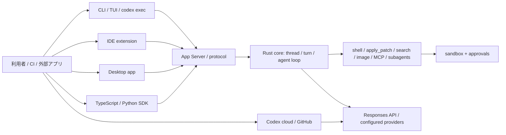

# OpenAI Codex 機能・実装調査

- 調査日: 2026-08-01（Asia/Tokyo）
- 対象リポジトリ: `openai/codex`
- 対象コミット: [`6751b54cae32b23786001e2414d749a9916201e1`](https://github.com/openai/codex/tree/6751b54cae32b23786001e2414d749a9916201e1)
- ライセンス: Apache License 2.0
- 主対象: Codex CLI / Rust core / App Server / TypeScript・Python SDK。デスクトップ、IDE、cloud は公式文書も併用

## 結論

Codex は、**ローカルで安全にコードを読み書き・実行する OSS エージェント中核**を基礎に、CLI、IDE、デスクトップ、cloud、GitHub、SDK へ同じ thread / turn 概念を広げた製品群である。実装面では Rust の core、TUI、sandbox、MCP client/server、App Server、非対話実行、セッション永続化、subagent orchestration が同じリポジトリに揃う。

特色は、単なるコード生成よりも次の4点にある。

1. sandbox と approval を分離した実行制御
2. `AGENTS.md`、rules、skills、hooks、plugins、MCP の多層カスタマイズ
3. thread を単位とする resume / fork / cloud handoff / SDK 埋め込み
4. subagent を spawn・待機・中断・追加入力できる並列実行基盤

一方、デスクトップ UI や cloud backend の全コードがこの OSS リポジトリだけで完結するわけではない。OSS として直接検証できる範囲と、公式サービスとして提供される範囲は区別が必要である。

## 全体構成

## OSS リポジトリで確認できる実装

### 1. CLI とサブコマンド

Rust CLI は、対話 TUI のほか次を公開する。

- `codex exec`: 非対話実行
- `codex review`: コードレビュー
- `codex mcp`: 外部 MCP server 管理
- `codex plugin`: plugin 管理
- `codex mcp-server`: Codex 自身を stdio MCP server として公開
- `codex app`: デスクトップ起動
- `codex sandbox`: sandbox 内で任意コマンドを実行
- `codex apply`: cloud 等で生成した diff を適用
- `codex resume` / `fork` / `archive` / `delete` / `unarchive`
- `codex cloud`: cloud task を閲覧しローカルへ適用（CLI では experimental 表記）
- App Server、exec-server、診断、shell completion

根拠は [`Subcommand`](https://github.com/openai/codex/blob/6751b54cae32b23786001e2414d749a9916201e1/codex-rs/cli/src/main.rs#L123-L212) にまとまっている。公式 [Codex CLI](https://learn.chatgpt.com/docs/codex/cli) も、ローカル repo の調査・編集・コマンド実行、権限選択、`codex exec` による script / CI を主要機能としている。

### 2. Agent loop とツール

Core は model response の tool call を routing し、shell、unified exec、`apply_patch`、MCP、Web search、画像閲覧、計画更新、ユーザー入力、subagent などへ振り分ける。長い shell process は session を保持して追加入力・poll ができる。

代表的な実装領域:

- `core/src/tools/handlers/shell.rs`
- `core/src/tools/handlers/unified_exec/`
- `core/src/tools/handlers/apply_patch.rs`
- `core/src/tools/handlers/mcp.rs`
- `core/src/tools/handlers/view_image.rs`
- `core/src/tools/handlers/multi_agents_v2/`

TUI は tool call、diff、command output、approval、token / context 状態を構造化イベントとして表示する。

### 3. Default / Plan の collaboration mode

Codex は通常作業用の Default と、設計・確認を重視する Plan を持つ。Plan では計画の更新とユーザーへの質問が前面に出る。これは単一の read-only flag ではなく、モデルへ渡す instructions、利用可能 tool、UI の対話を組み合わせる collaboration mode である。

旧 `collaboration_modes` feature flag は、調査コミットでは「常に有効になったため互換用」と明記されている。したがって、古い記事にある feature flag の手動有効化は現行ソースには適さない。

### 4. Sandbox と approvals

Codex は次を別の層として扱う。

- sandbox: OS が許すファイル・ネットワーク範囲
- approval policy: sandbox を超える操作や危険操作をいつ利用者に確認するか

典型的な sandbox mode は read-only、workspace-write、danger-full-access で、workspace-write では `.git` や `.codex` 等の保護も考慮する。macOS は Seatbelt、Linux は bubblewrap ベース、Windows にも専用実装がある。設定は user / project / profile / system / managed requirements の優先順位で解決される。

公式 [Config basics](https://learn.chatgpt.com/docs/config-file/config-basic) は、`approval_policy` と `sandbox_mode` を別項目として説明し、project `.codex/config.toml` は信頼済み repo だけで読み込むとしている。

### 5. Subagents / multi-agent

Codex の公開ソースには2世代の collaboration tool があり、現行 feature registry では `multi_agent` は stable / default enabled、`multi_agent_v2` は stable / default disabled である。V2 は次を実装する。

- `spawn_agent`
- `send_message`
- `followup_task`
- `wait_agent`
- `interrupt_agent`
- `list_agents`

[`multi_agents_v2.rs`](https://github.com/openai/codex/blob/6751b54cae32b23786001e2414d749a9916201e1/codex-rs/core/src/tools/handlers/multi_agents_v2.rs#L1-L45) で tool surface、[`spawn.rs`](https://github.com/openai/codex/blob/6751b54cae32b23786001e2414d749a9916201e1/codex-rs/core/src/tools/handlers/multi_agents_v2/spawn.rs#L39-L174) で child thread、履歴 fork、role / model / reasoning override、親子 metadata を確認できる。

公式 [Customization](https://learn.chatgpt.com/docs/customization/overview) も subagent を専門処理の委譲手段として位置付ける。実装は「子プロセスを1回呼ぶ」だけでなく、独立 thread と agent path、相互通信、状態管理を持つ点が重要である。

### 6. MCP client と MCP server

Codex は両方向を提供する。

- MCP client: stdio / HTTP の外部 server から tools、resources、prompts を利用
- MCP server: `codex mcp-server` で Codex の機能を他の MCP client へ公開

Core には connection manager、resource list / template / read handler、OAuth、approval、tool search / deferred tool の実装がある。MCP tool の数が増えた場合に、全 schema を常時 context へ載せず検索・遅延ロードする構造も持つ。

### 7. カスタマイズ層

公式文書は次を相補的な層として整理している。

| 層 | 役割 |
|---|---|
| `AGENTS.md` | repo とディレクトリ単位の永続指示 |
| Rules | 条件・scope を持つ指示 |
| Memories | 過去作業から保持する局所文脈 |
| Skills | 再利用可能な手順・専門知識・付属 script |
| Hooks | lifecycle event に対する機械的な検査・処理 |
| Plugins | skills、MCP、hooks、assets 等の配布単位 |
| MCP / connectors | 外部データと操作 |

公式 [Customization](https://learn.chatgpt.com/docs/customization/overview) は `AGENTS.md`、memories、skills、MCP、subagents の役割を明示する。ソース側でも skill loader、plugin manifest、hook engine、memory DB が別 crate に分離されている。

Hooks は調査コミットの feature registry で stable / default enabled で、Claude-style の `hooks.json` をロードする。PreToolUse、PostToolUse、SessionStart / End、Stop、SubagentStart / Stop、PreCompact 等の schema が生成されている。現行 OSS 実装の handler は command hook が中心であり、Claude Code の prompt / agent / MCP-tool hook と完全同一とは扱わない。

### 8. Plugins、Apps、Browser、画像

feature registry では plugins、apps、in-app browser、Browser Use、Computer Use、image generation が stable として登録されている。ただし、これらにはデスクトップ要件、組織ポリシー、インストール済み plugin、サービス提供状況が絡む。

したがって「Rust enum が stable」だけで全 CLI ユーザーが無条件に利用できるとは結論しない。公式の現行ドキュメントは、デスクトップ / web で Browser、Computer Use、plugins、Web search、image generation / input を別 capability として案内している。

### 9. モデルプロバイダー

調査コミットの built-in provider は OpenAI、Amazon Bedrock、Ollama、LM Studio である。加えて `model_providers` で Responses API 互換 endpoint、環境変数 key、header、query parameter、retry 等を定義できる。

根拠は [`model-provider-info`](https://github.com/openai/codex/blob/6751b54cae32b23786001e2414d749a9916201e1/codex-rs/model-provider-info/src/lib.rs#L1-L144) と [built-in provider list](https://github.com/openai/codex/blob/6751b54cae32b23786001e2414d749a9916201e1/codex-rs/model-provider-info/src/lib.rs#L437-L464) にある。

Continue ほど多数の provider adapter を個別実装する方式ではなく、**OpenAI Responses API 互換を軸に拡張する設計**である。Ollama / LM Studio によりローカル `gpt-oss` 系を使えるが、provider ごとの全機能が OpenAI backend と同等とは限らない。

### 10. セッション、履歴、resume / fork

会話は thread / turn として永続化される。CLI は resume / fork / archive を持ち、SDK も保存済み thread ID から再開できる。compaction、token budget、rollout trace、thread store、SQLite migration が実装され、長い作業を単なる一回の prompt として扱わない。

### 11. SDK と App Server

TypeScript SDK は CLI を spawn し JSONL event を交換する。thread の継続、streaming、JSON Schema の structured output、画像入力、resume、working directory、sandbox 設定を提供する。詳細は [`sdk/typescript/README.md`](https://github.com/openai/codex/blob/6751b54cae32b23786001e2414d749a9916201e1/sdk/typescript/README.md) にある。

Python SDK も thread start、turn、stream、approval、workspace access を公開する。App Server は IDE / desktop / SDK 等が同じ agent runtime を利用するための JSON-RPC 系 protocol surface である。

## 公式サービス側のサーフェス

公式文書では次を提供する。

- CLI: terminal-first のローカル作業
- IDE extension: editor context と diff review
- Desktop app: 複数 task、計画、レビュー、local / cloud 環境
- Codex cloud / web: hosted task、GitHub repo、並列・長時間作業
- GitHub integration / Action
- SDK / App Server / MCP Server

OSS リポジトリはこれらの共通 runtime と client 部分を多く含むが、cloud backend やすべての GUI 実装が OSS であるという意味ではない。

## 強み

1. **OSS の実行基盤が厚い**: agent loop、TUI、sandbox、protocol、SDK が公開される。
2. **安全性の層が明確**: sandbox、approval、project trust、managed requirements を分離。
3. **長時間・並列作業**: thread persistence、resume / fork、subagent、cloud handoff。
4. **拡張面が広い**: `AGENTS.md`、rules、skills、hooks、plugins、MCP、connectors。
5. **複数サーフェスの一貫性**: CLI / IDE / app / cloud / SDK が thread を中心に接続する。

## 制約・リスク

1. **OpenAI / Responses API 中心**: Continue ほど provider adapter の選択肢は広くない。
2. **製品全体が OSS ではない**: cloud backend と全 GUI / service 実装は公開 repo の範囲外を含む。
3. **feature maturity と entitlement**: source の flag、公式 docs、実際のアカウント・surface 可用性を分ける必要がある。
4. **設定面が多層**: user、project、profile、system、managed requirements の理解が必要。
5. **自律性と権限のトレードオフ**: network や広い filesystem access を許すほど prompt injection の影響範囲も広がる。

## 向いている用途

- ローカル repo を安全な sandbox で自律的に編集・検証したい
- CLI、IDE、desktop、cloud 間で作業を継続したい
- 複数 subagent に調査・レビュー・実装を委譲したい
- SDK / App Server から自社ツールへ Codex agent を組み込みたい
- `AGENTS.md`、skills、plugins、MCP を組織的に運用したい

## 主要参照資料

### クローン済みソース

- [README](https://github.com/openai/codex/blob/6751b54cae32b23786001e2414d749a9916201e1/README.md)
- [CLI subcommands](https://github.com/openai/codex/blob/6751b54cae32b23786001e2414d749a9916201e1/codex-rs/cli/src/main.rs)
- [Feature registry](https://github.com/openai/codex/blob/6751b54cae32b23786001e2414d749a9916201e1/codex-rs/features/src/lib.rs)
- [Multi-agent V2](https://github.com/openai/codex/tree/6751b54cae32b23786001e2414d749a9916201e1/codex-rs/core/src/tools/handlers/multi_agents_v2)
- [Model provider registry](https://github.com/openai/codex/blob/6751b54cae32b23786001e2414d749a9916201e1/codex-rs/model-provider-info/src/lib.rs)
- [TypeScript SDK](https://github.com/openai/codex/blob/6751b54cae32b23786001e2414d749a9916201e1/sdk/typescript/README.md)
- [Python SDK](https://github.com/openai/codex/blob/6751b54cae32b23786001e2414d749a9916201e1/sdk/python/README.md)

### 公式 Web 文書

- [Codex CLI](https://learn.chatgpt.com/docs/codex/cli)
- [Config basics](https://learn.chatgpt.com/docs/config-file/config-basic)
- [Customization](https://learn.chatgpt.com/docs/customization/overview)
- [Codex overview](https://learn.chatgpt.com/docs)
