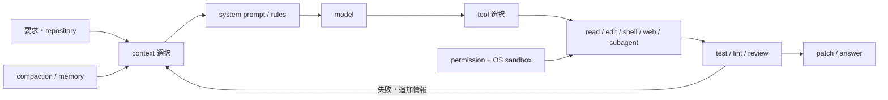

# Codex / Claude Code / Continue / OpenCode：Coding Agent 性能差の実装・プロンプト・レビュー比較

- 調査基準日: 2026-08-03（Asia/Tokyo）
- 対象: OpenAI Codex、Anthropic Claude Code、Continue、OpenCode
- 主眼: モデル単体ではなく、モデルにコードを調査・編集・実行・検証させる **agent harness** の性能差
- 関連する詳細資料: [Codex](codex.md)、[Claude Code](claude-code.md)、[Continue](continue.md)、[OpenCode](opencode.md)、[機能比較](comparison.md)

## 結論

4製品を単一の順位に並べることはできない。coding agent の結果は、少なくとも「モデル」「system / developer prompt」「tool schema」「context 管理」「実行・承認環境」「タスク」の積で決まるからである。

| 主な用途 | 第1候補 | 判断理由 |
|---|---|---|
| 仕様が明確な実装、terminal 作業、backend、diff review | **Codex** | 公開ベンチマークと実利用レビューで強い。公開された Rust agent core、モデル別 prompt、sandbox、検証を継続させる指示を監査できる |
| 長時間の曖昧な作業、frontend、文書、組織 workflow | **Claude Code** | 長い作業の一貫性、subagent / team、hooks、memory、plugin の統合が強い。レビューでは意図・文章・UIを含む仕事が高評価。ただし本体 loop と基幹 prompt は非公開 |
| 任意モデル、ローカルモデル、低コスト大量処理、harness 改造 | **OpenCode** | provider とモデルを最も自由に差し替えやすく、モデル別 prompt、LSP、formatter、snapshot、server が公開される。絶対性能は選択モデルと adapter の相性に強く依存 |
| IDE autocomplete / Next Edit と agent の統合、機能別モデル構成 | **Continue** | chat / edit / apply / autocomplete / embed / rerank を分離できる。ただし対象 upstream は保守終了で、現時点の自律 agent を新規採用する際の第1候補にはしにくい |

「最も強いモデルを使えば harness は何でもよい」とは言えない。SWE-Bench Mobile は同一モデルでも agent により最大6倍の差を観測し、最高構成でも成功率12%だった。反対に、「harness だけでモデル差を消せる」とも言えない。OpenCode と Continue は多数のモデルを載せられるが、tool calling、長文脈、画像、patch、指示追従の品質差は残る。

## 1. 比較方法と限界

### 1.1 対象 source snapshot

ローカルに取得済みの各 repository を実際に検索し、次の commit を比較した。

| 製品 | commit / tag | 公開範囲 |
|---|---|---|
| Codex | `6751b54cae32b23786001e2414d749a9916201e1` | Rust core、CLI / TUI、prompt、tool router、sandbox、protocol、SDK |
| Claude Code | `7ef6eec9d9ba84ea6f233f26c45f1df5c5991843` / `v2.1.220` | README、CHANGELOG、plugins、hooks、custom agent prompt。基幹 runtime は非公開 |
| Continue | `5522c6f44ca0ac3528b37244818fbfa39b5af470` | TypeScript core、IDE extensions、CLI、prompt construction、tools、indexing |
| OpenCode | `19231fce4b70aa5f7894a0a0eb20ff29bd417db5` | TypeScript core、TUI、server、prompt、tools、provider、LSP、SDK |

### 1.2 証拠の読み方

本稿では証拠を次の順に重く扱う。

1. 固定 commit の実装と公開 prompt
2. 公式文書と、運営者が検証した公開 leaderboard
3. 査読採択論文または再現条件を記載した研究
4. 複数製品を実際に使ったレビュー
5. Reddit、Hacker News、SNS の体験談

ベンダー公表の SWE-bench 数値同士は、モデル、agent、prompt、tool、試行回数、推論 effort が違うことが多いため、単純比較から外した。GitHub star、利用者数、回答速度だけもコードの正しさを示さない。

## 2. Coding agent の性能を決める箇所

モデルは重要だが、agent は一回のコード生成ではない。必要なファイルを選び、tool を正しく呼び、失敗結果を読み、修正し、テストが通るまで反復する。prompt は探索・編集・検証の方針を決め、tool 実装と parser はモデルの意図を現実の操作へ変換し、compaction は長い作業で何を保持するかを決める。

## 3. 実装アーキテクチャの差

| 観点 | Codex | Claude Code | Continue | OpenCode |
|---|---|---|---|---|
| core | Rust、OSS | 非公開 | TypeScript、OSS、対象 upstream は保守終了 | TypeScript、MIT、OSS |
| model 統合 | OpenAI Responses API と Codex 系に最適化 | Claude に垂直統合 | provider / role adapter。native tool と prompt tool を切替 | AI SDK / Models.dev。provider とモデル別変換 |
| context | `AGENTS.md`、Skills、MCP、thread、compaction | `CLAUDE.md`、rules、auto memory、Skills、MCP、compaction | rules、repo map、index、context provider | `AGENTS.md` / `CLAUDE.md`、Skills、MCP、session compaction |
| edit / verification | `apply_patch`、shell、review、subagent | Edit / Write、shell、LSP、hooks、subagent / team | edit / apply 専用モデル、IDE diagnostics、agent loop | model 別に patch / edit、formatter、LSP diagnostics |
| 並列化 | tool 並列、child thread、multi-agent | tool 並列、subagent、agent teams、worktree | native tool 依存。fallback は1回1 tool。subagent は beta | tool 並列、child session、background は experimental |
| 安全境界 | permission + OS sandbox | permission + OS sandbox | permission。一般的 OS sandbox は未確認 | permission。一般的 OS sandbox はなし |
| 監査可能性 | 高い | core は低い、拡張層は中程度 | 高い | 高い |

### 3.1 Codex

Codex は model response を Rust の tool router で shell、`apply_patch`、MCP、Web、画像、計画、subagent などへ振り分ける。長い command は session として保持し、poll や追加入力ができる。multi-agent は単なる追加 prompt ではなく、child thread、履歴 fork、status、message、wait / interrupt を持つ（[実装](https://github.com/openai/codex/tree/6751b54cae32b23786001e2414d749a9916201e1/codex-rs/core/src/tools/handlers/multi_agents_v2)）。

大きな利点は permission と OS sandbox を分けていることである。permission は「モデルの提案を承認するか」、sandbox は「承認後の process が実際に到達できる範囲」を制御する。model が誤ることを前提に autonomy を上げやすい。Codex の system card も local 実行時の sandbox を明記する（[GPT-5.2-Codex system card](https://cdn.openai.com/pdf/ac7c37ae-7f4c-4442-b741-2eabdeaf77e0/oai_5_2_Codex.pdf)）。

弱点は、最大性能が Codex 向け OpenAI model と Responses API の動作に結びつきやすいこと、provider-neutral な実験基盤としては Continue / OpenCode より狭いことである。また cloud backend や全 GUI が OSS という意味ではない。

### 3.2 Claude Code

Claude Code は Read / Edit / Write、Glob / Grep、shell、Web、Agent 等を持ち、`CLAUDE.md`、auto memory、Skills、MCP、LSP、hooks、subagent、agent teams を一つの製品 workflow に統合する。subagent は独立 context と固有 prompt / model / tool / permission / memory / worktree を持ち、親へ要約を返す。公式文書は、通常の subagent が親の全会話を受け取らず、委譲文と固有 system prompt、環境、rules / memory 等から開始すると説明する（[Subagents](https://code.claude.com/docs/en/sub-agents)）。

hooks は command だけでなく HTTP、MCP tool、単発 LLM prompt、tool を使う agent hook を扱う（[Hooks reference](https://code.claude.com/docs/en/hooks)）。長い作業で、編集後の lint、停止前の未完了判定、組織 policy、レビュー工程を deterministic に挿入しやすい。Claude Code も filesystem / network を OS primitive で隔離する sandbox を公式に提供する（[Sandboxing](https://code.claude.com/docs/en/sandboxing)）。

最大の調査上の制約は、基幹 agent loop と標準 system prompt が公開されていないことである。公開 repository で読めるのは plugin、hook script、custom agent prompt、変更履歴が中心で、context 選択や retry の内部条件を Codex / Continue / OpenCode と同じ粒度では検証できない。

### 3.3 Continue

Continue の IDE Agent は tool schema を user request と共に送り、モデルの tool call、承認、実行、結果返却を反復する（[How Agent Mode Works](https://docs.continue.dev/ide-extensions/agent/how-it-works)）。特色は次の2点である。

- `chat`、`edit`、`apply`、`autocomplete`、`embed`、`rerank` を別 role とし、用途別にモデルを交換できる。
- native function calling が弱いモデル向けに、tool definition と call format を system message に埋める fallback を持つ（[Model Setup](https://docs.continue.dev/ide-extensions/agent/model-setup)）。

fallback 実装は `TOOL_NAME` と `BEGIN_ARG` / `END_ARG` を含む fenced block を要求し、1回に1 tool だけ呼ぶ。対応モデルを広げる利点がある一方、native parallel tool calling より round trip が増え、指示追従の弱いモデルでは format error が性能上限になる（[実装](https://github.com/continuedev/continue/blob/5522c6f44ca0ac3528b37244818fbfa39b5af470/core/tools/systemMessageTools/toolCodeblocks/index.ts#L68-L81)）。

IDE autocomplete、Next Edit、codebase indexing まで含むことは他3製品にない強みである。しかし対象 repository は read-only と最終2.0.0を告知しており（[README](https://github.com/continuedev/continue/blob/5522c6f44ca0ac3528b37244818fbfa39b5af470/README.md)）、CLI subagent も beta である。既存環境の固定運用や fork には使えるが、agent harness の継続的改善を upstream に期待する新規導入では大きな不利になる。

### 3.4 OpenCode

OpenCode は terminal TUI 自体も local HTTP / OpenAPI server の client として構成し、同じ session を CLI、Web、Desktop、IDE、SDKから扱える。tool registry は model により `apply_patch` と `edit` / `write` を切り替え、編集後に formatter と LSP diagnostics を返す（[tool registry](https://github.com/anomalyco/opencode/blob/19231fce4b70aa5f7894a0a0eb20ff29bd417db5/packages/opencode/src/tool/registry.ts#L204-L244)）。provider、model、agent、prompt の組合せを広く変更できる。

prompt も単一ではない。model ID を見て Codex、GPT、Claude、Gemini、Kimi 等に別の基幹 prompt を選ぶ（[system prompt selector](https://github.com/anomalyco/opencode/blob/19231fce4b70aa5f7894a0a0eb20ff29bd417db5/packages/opencode/src/session/system.ts#L27-L41)）。これはモデル固有の tool-use 習性へ合わせられる利点がある反面、provider を交換しても同じ harness 性能になるとは限らないことを実装自身が示している。

LSP、formatter、Git snapshot、undo / redo、custom agents、npm plugins、MCP、experimental background subagent は強い。一方、shell は通常の child process で、Codex / Claude Code のような OS-level filesystem / network sandbox はない。既定 permission も比較的 permissive である。未知 repository や外部入力を扱う自律実行では container / VM 等を外側に置く必要がある。

## 4. 公開 prompt の比較

### 4.1 比較できる範囲

| 製品 | 基幹 prompt の公開 | 対象 snapshot で直接確認した特徴 |
|---|---|---|
| Codex | 公開 | persistence、repo 調査、`apply_patch`、dirty worktree 保護、検証、review-first、簡潔な進捗・最終回答 |
| Claude Code | **非公開** | custom agent / plugin prompt は公開。role、responsibility、process、output format を明示する様式 |
| Continue | 公開 | 短い基本指示 + cwd / platform / date / 初期 git status + rules。Plan / headless / JSON を追加 |
| OpenCode | 公開 | model family 別の長い prompt。Codex系、Claude系、GPT系、Gemini系等で proactiveness、Todo、Task、style を変更 |

文字数は動的 context と tool schema を含まないため品質指標ではないが、対象ファイルでは Codex用 template が約7.3KB、OpenCode の model別 prompt が約7.4〜15.4KBだった。Continue CLI の固定 `baseSystemMessage` 自体は短く、環境・rules・mode 指示を実行時に連結する。Claude Code の標準値は測定できない。

### 4.2 Codex prompt

公開 template は「同じ workspace で共同作業する coding agent」と役割を定め、次を強く指示する（[model instructions template](https://github.com/openai/codex/blob/6751b54cae32b23786001e2414d749a9916201e1/codex-rs/core/templates/model_instructions/gpt-5.2-codex_instructions_template.md)）。

- `rg` を優先して repository を調べる
- 単一ファイル編集には `apply_patch` を優先する
- user の dirty worktree を壊さず、破壊的 Git 操作を避ける
- review 依頼では不具合・回帰・不足テストを先に出す
- 大きな変更は結果を先に報告し、実行できなかった検証を明示する

これらは「正しいコードを書け」という抽象命令ではなく、失敗しやすい操作を具体的に制約する。特に persistence と verification は、途中で説明だけして終了する挙動を減らす。一方、長い prompt が常に有利とは限らず、モデル更新に合わせた template 管理が必要である。

### 4.3 Claude Code prompt

標準 prompt は非公開なので、漏洩物や逆解析を正規の実装根拠として用いなかった。公開 plugin の `code-explorer`、`code-architect`、`code-reviewer` では、専門 role、責務、調査手順、出力形式を分離する。公式の agent 作成資料も system prompt を「role → responsibilities → process → output」の構造にする（[公開例](https://github.com/anthropics/claude-code/tree/7ef6eec9d9ba84ea6f233f26c45f1df5c5991843/plugins/feature-dev/agents)）。

この様式は曖昧な長期タスクを専門工程へ分ける Claude Code の使用感と整合する。ただし、公開 custom agent prompt から標準 loop の内部判断や標準 prompt 全体を推定することはできない。

### 4.4 Continue prompt

CLI の固定部は「利用可能 tool で回答する」「簡潔にする」という短い指示に、cwd、Git repository 判定、platform、日付、開始時 git status を付ける。その後 `AGENTS.md` / `AGENT.md` / `CLAUDE.md` / `CODEX.md` の最初の1ファイル、`.continue/rules`、設定 rules、Plan / headless / JSON 指示を連結する（[systemMessage.ts](https://github.com/continuedev/continue/blob/5522c6f44ca0ac3528b37244818fbfa39b5af470/extensions/cli/src/systemMessage.ts#L43-L61)）。

長所は構成が単純で、利用者が `baseAgentSystemMessage` を上書きしやすいこと。短所は、標準状態では Codex のような実装・検証・worktree hygiene の詳細方針が少なく、性能がモデルと user rules に寄りやすいことである。IDE版は別の base prompt と tool schema を使い得るため、CLIの観察を全 surface に一般化してはいけない。

### 4.5 OpenCode prompt

OpenCode の Codex 向け prompt は Codex の公開 template と近い探索・編集・Git hygiene・frontend・回答方針を持つ。Claude向け prompt は Todo と Task subagent の利用を強く促し、default prompt は4行未満の回答、既存規約の調査、lint / typecheck、非依頼時の commit 禁止を明示する。

モデル別最適化は OpenCode の重要な実装上の工夫である。ただし prompt の強い `TodoWrite` / `Task` 指示は、単純タスクでは余分な tool call と token を生み得る。逆に長い調査では主 context を節約できる。どちらになるかはタスク粒度と選択モデルに依存する。

## 5. ベンチマークと実運用レビュー

### 5.1 Terminal-Bench 2.0

Terminal-Bench の verified leaderboard は、同一 dataset と資源制約の terminal task を運営側が実行した結果である。2026-08-03に確認した代表値は次の通りだった（[leaderboard](https://www.tbench.ai/leaderboard/terminal-bench/2.0?verified=true)）。

| Agent | Model | Accuracy | 日付 |
|---|---|---:|---|
| Codex CLI | GPT-5.5 | 82.2% ± 2.2 | 2026-04-23 |
| Codex CLI | GPT-5.2 | 62.9% ± 3.0 | 2025-12-18 |
| Claude Code | Claude Opus 4.6 | 58.0% ± 2.9 | 2026-02-07 |
| Claude Code | Claude Opus 4.5 | 52.1% ± 2.5 | 2025-12-18 |

この結果は「terminal の自律 loop では当該 Codex 構成が強い」根拠になる。しかし GPT-5.5 と Opus 4.6 はモデルも日付も異なるため、82.2対58.0を純粋な harness 差とは解釈できない。Continue と OpenCode の同条件 verified entry は確認できず、4者順位には使えない。

### 5.2 SWE-Bench Mobile

SWE-Bench Mobile は50件の実業務由来 iOS task、PRD、Figma、Swift / Objective-C 大規模 codebase、449件の人手確認済み test で22の agent-model 構成を評価した。論文の主な結果は次である（[paper](https://arxiv.org/abs/2602.09540)）。

- 最高構成でも task success は12%
- 同じ Opus 4.5 が agent により12%と2%になり、最大6倍差
- commercial agent は評価対象の OpenCode 構成を一貫して上回った
- 複雑な prompt より単純な defensive-programming prompt が7.4%高かった
- 失敗の54%は feature flag、22%は data model、11〜15%は file coverage の欠落

これは harness と prompt が効く強い証拠である。ただし mobile / multimodal / 単一企業 codebase に特化し、Continue は対象外である。また「commercialなら常にOSSより優秀」を全言語・全モデルへ一般化できない。

### 5.3 実運用PRの受理率

MSR 2026採択研究はAIDev datasetの7,156 PRをtask別に比較した。Codex は9カテゴリで59.6〜88.6%と安定して高く、Claude Code はdocumentation 92.3%、feature 72.6%で首位だった（[paper](https://arxiv.org/abs/2602.08915)）。task type 間の差はagent間の典型差より大きく、「どの仕事か」を無視した総合順位が危険だと示す。

この研究は観察データであり、同一repository・同一prompt・同一modelをrandomizedに割り当てた実験ではない。利用者の選択、task難度、時期などの交絡が残る。

### 5.4 Webレビューの一致点と相違点

複数製品の実利用レビューから再現性のありそうな傾向だけを抽出した。

| 情報源 | 観察 | 本稿での扱い |
|---|---|---|
| Friday | Claude Codeは曖昧さ、frontend、文体、長時間作業。Codexは明確な実装、backend、diff review。OpenCodeは安価な大量処理とモデル自由度 | タスク別の定性的傾向。測定条件がないため順位の証明にはしない |
| AIXplore | Claude Codeはlong-horizon coherence、Codexはatomic terminal work、OpenCodeはmodel substrate freedom | 3製品を継続使用した実務者のarchitecture解釈。著者自身がClaude Codeをdaily driverと明示するためbiasを考慮 |
| Tom's Guide | 3つの小規模appではCodexが2勝して総合優位。Claude Codeは即時利用性と初心者向け完成度で評価 | 再現可能なunit test中心の試験ではなく、少数のgreenfield / UI課題として限定 |
| Thoughtworks Radar | Claude CodeはAdopt、OpenCodeはAssess | enterprise成熟度の補助指標。コード正答率のbenchmarkではない |

Friday は Claude Code を「customer-facing」、Codex を「build / review / backend」、OpenCode を「volume / model freedom」に使い分けている（[review](https://getfriday.dev/blog/claude-code-vs-codex-vs-opencode/)）。AIXplore もほぼ同じ軸を、Claude Codeの長期一貫性、Codexの短い独立task、OpenCodeの基盤自由度と説明する（[review](https://ai.rundatarun.io/ai-development-agents/codex-vs-claude-code-vs-opencode)）。

一方、Tom's Guide の3アプリ比較はCodexを総合勝者としつつ、Claude Codeを素早く使える完成品、Codexを分析・拡張性の高い土台と評価した（[review](https://www.tomsguide.com/ai/claude-code-vs-openai-codex-i-built-3-real-apps-to-find-the-better-agent-heres-the-verdict)）。レビュー間の差は矛盾というより、frontendの「すぐ使えること」と「高度な機能・構造」のどちらを採点したかの差である。

Continue については、現在の4者を同一課題・同一モデルで比較した信頼できる公開レビューまたは verified benchmark を確認できなかった。Continue の性能を「未評価」ではなく「他3者より低い」と断定する根拠はない。ただし保守終了、CLI subagent のbeta、fallback tool protocolという実装上の条件から、新しい frontier model 向け最適化の継続性は不利と判断した。

## 6. 性能差をタスク別に解釈する

### 6.1 小さく明確な修正

Codex が最も選びやすい。短い探索、patch、test、diff review を一つのloopで終える設計とレビュー評価が一致する。Claude Codeも強いが、豊富なcontext / workflowは小課題ではoverheadになり得る。OpenCodeは同じ強いmodelを適切なpromptで使えば競争力があるが、provider adapterとmodel compatibilityを追加で評価する必要がある。

### 6.2 大規模refactor・曖昧なfeature

Claude Code が有力である。memory、Skills、subagent、hooks、worktree、teamを組み合わせ、長い作業を工程化できる。Codex のmulti-agentも強いが、WebレビューではClaude Codeの長期一貫性がより頻繁に評価された。ただし実業務PR研究では新機能でClaude Code、カテゴリ横断の安定性でCodexという差があるため、PoCで自社taskを測るべきである。

### 6.3 frontend / UI

Claude Code は意図、文章、曖昧なデザイン判断で肯定的レビューが多い。Codex は公開promptにもgenericなAI風UIを避ける詳細指示が入り、Tom's Guideではより高度なdashboardを生成した。したがって「Claudeは常に見た目、Codexは常にlogic」という固定観念も安全ではない。visual regression、accessibility、実機確認を共通評価にする必要がある。

### 6.4 大量処理・private code・open model

OpenCode が最も柔軟である。安価なAPIやlocal modelをtaskごとに選び、harness自体も改造できる。Continueもlocal / role別モデルに強い。しかし品質とcostを同時に測り、tool call failure、再試行、長い出力を含む **task成功1件あたりcost** で比較すべきである。token単価が安くても成功までの反復が多ければ逆転する。

### 6.5 IDE補完を含む日常開発

Continue はagentだけでなくautocomplete、Next Edit、embedding、rerankまで機能別に構成できる。CLI agentの単発benchmarkでは捉えられない優位である。ただし新規採用では保守終了を受け入れるか、fork / successorを含めたmaintenance計画が必要になる。

## 7. 導入時に行うべき自社ベンチマーク

公開reviewだけで採用を決めず、4製品を同じrepositoryで次のように測る。

1. 過去に人が解決した20〜50件を、bug、feature、refactor、test、docs、frontendに層化する。
2. 可能な範囲で同一modelをOpenCode / Continueに載せ、native製品構成との比較も別枠で行う。
3. 同一初期commit、同一prompt、同一timeout、同一network / secret policy、同一testで3回以上実行する。
4. pass / failだけでなく、human修正時間、regression、tool error、wall time、input / output token、cost、危険操作を記録する。
5. agentが自己申告した「完了」ではなく、hidden test、lint、typecheck、security check、reviewerによるblind評価で採点する。

最低限の記録形式は次である。

| field | 例 |
|---|---|
| `agent_version` | commit / CLI version |
| `model` / `effort` | provider、model ID、reasoning設定 |
| `prompt_hash` | user promptとproject ruleのhash |
| `task_class` | bug / feature / refactor / frontend等 |
| `success` | hidden testの合否 |
| `human_minutes` | 最終受理までの人手修正 |
| `tool_failures` | parser、permission、timeout、command failure |
| `cost` | cacheを含む実課金 |
| `unsafe_attempts` | scope外file、network、secret、破壊的command |

## 8. 最終評価

- **Codex**: 現時点で、明確なcoding taskとterminal自律実行の最も堅い既定候補。モデルとharnessの垂直最適化、公開core、OS sandboxが強い。
- **Claude Code**: 長期・曖昧・人間的判断を含むworkflowの最有力。拡張とcontext管理は最も厚いが、core非公開のため内部比較には限界がある。
- **OpenCode**: モデル自由度、費用、ローカル性、改造性の最有力。性能は製品名ではなく「OpenCode + model + prompt + provider」で評価し、外部sandboxを設計する。
- **Continue**: IDE補完と機能別モデル構成では独自価値がある。自律agentの新規標準としてはupstream保守終了が決定的なリスクで、既存資産・固定版・fork前提で評価する。

最も現実的な運用は一製品への全面統一とは限らない。明確な実装とreviewをCodex、曖昧な長期作業とUIをClaude Code、安価なbulk taskとlocal modelをOpenCode、IDE補完をContinueへ分ける方が、各harnessの得意領域と公開証拠に合う。ただし機密性と運用単純化を優先する組織では、候補を2つに絞り、自社taskの成功率とhuman修正時間で最終決定するのがよい。

## 主要参考資料

### 実装・公式文書

- [OpenAI Codex repository](https://github.com/openai/codex/tree/6751b54cae32b23786001e2414d749a9916201e1)
- [Codex model instructions template](https://github.com/openai/codex/blob/6751b54cae32b23786001e2414d749a9916201e1/codex-rs/core/templates/model_instructions/gpt-5.2-codex_instructions_template.md)
- [Claude Code repository](https://github.com/anthropics/claude-code/tree/7ef6eec9d9ba84ea6f233f26c45f1df5c5991843)
- [Claude Code tools reference](https://code.claude.com/docs/en/tools-reference)
- [Claude Code subagents](https://code.claude.com/docs/en/sub-agents)
- [Continue repository](https://github.com/continuedev/continue/tree/5522c6f44ca0ac3528b37244818fbfa39b5af470)
- [Continue Agent mode](https://docs.continue.dev/ide-extensions/agent/how-it-works)
- [OpenCode repository](https://github.com/anomalyco/opencode/tree/19231fce4b70aa5f7894a0a0eb20ff29bd417db5)
- [OpenCode agents](https://opencode.ai/docs/agents)

### ベンチマーク・研究・レビュー

- [Terminal-Bench 2.0 verified leaderboard](https://www.tbench.ai/leaderboard/terminal-bench/2.0?verified=true)
- [SWE-Bench Mobile](https://arxiv.org/abs/2602.09540)
- [Comparing AI Coding Agents: A Task-Stratified Analysis of Pull Request Acceptance](https://arxiv.org/abs/2602.08915)
- [Friday: Claude Code vs Codex vs OpenCode](https://getfriday.dev/blog/claude-code-vs-codex-vs-opencode/)
- [AIXplore: From Inside the Harness](https://ai.rundatarun.io/ai-development-agents/codex-vs-claude-code-vs-opencode)
- [Tom's Guide: Claude Code vs OpenAI Codex](https://www.tomsguide.com/ai/claude-code-vs-openai-codex-i-built-3-real-apps-to-find-the-better-agent-heres-the-verdict)
- [Thoughtworks Technology Radar: OpenCode](https://www.thoughtworks.com/radar/tools/opencode)
- [Thoughtworks Technology Radar: Claude Code](https://www.thoughtworks.com/radar/tools/claude-code)
