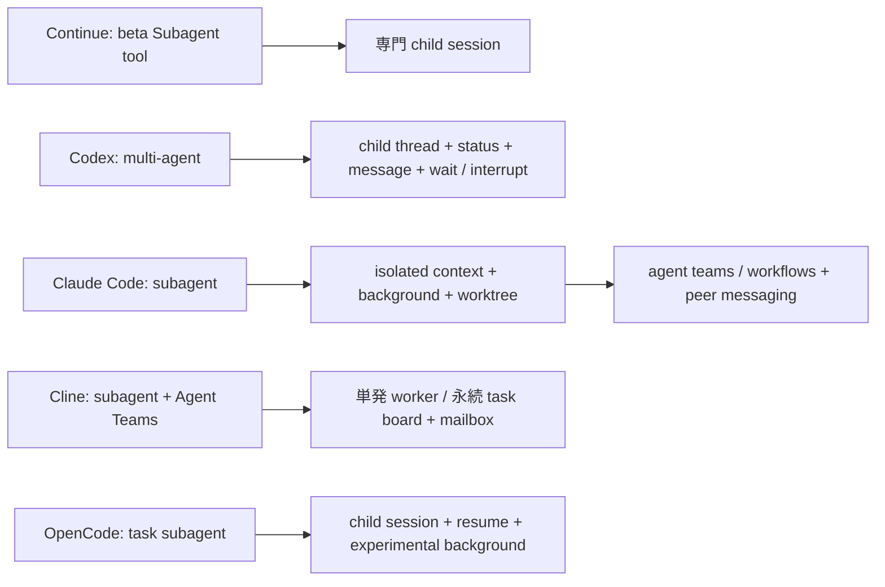

# Continue / Codex / Claude Code / Cline / OpenCode 機能比較

- 比較基準日: 2026-08-01（Asia/Tokyo）
- 対象 snapshot:
  - Continue: `5522c6f44ca0ac3528b37244818fbfa39b5af470`
  - Codex: `6751b54cae32b23786001e2414d749a9916201e1`
  - Claude Code: `7ef6eec9d9ba84ea6f233f26c45f1df5c5991843` / `v2.1.220`
  - Cline: `8e68b146739cea67d6c4d4b3e9eec290d8d9be75` / CLI 3.0.48 / VS Code 4.1.2 / SDK 0.0.68
  - OpenCode: `19231fce4b70aa5f7894a0a0eb20ff29bd417db5` / 1.18.10
- 関連基盤（比較表の対象外）: Open WebUI Computer `6d2efeb3d589dd81c0636fc8fd8c1f499096c58c` / v0.9.20（2026-08-03確認）

個別の根拠と注意点は [Continue](continue.md)、[Codex](codex.md)、[Claude Code](claude-code.md)、[Cline](cline.md)、[OpenCode](opencode.md) を参照。これらを同じ実機上で統合し、browser / mobile / automation から使う関連基盤は [Open WebUI Computer](openwebui-computer.md) を参照。

## 先に結論

5製品は同じ「コーディングエージェント」でも、最適化対象が異なる。

- **Continue**: モデルと IDE 機能を自由に組み替える OSS framework。Autocomplete / Next Edit とローカルモデルが強い。ただし upstream は read-only で最終 2.0.0。
- **Codex**: 安全なローカル実行と thread / subagent を中心に、CLI・IDE・desktop・cloud・SDK をつなぐ OSS agent runtime。OpenAI / Responses API 中心。
- **Claude Code**: Claude に垂直統合された最も広い workflow / extension 製品。Hooks、plugins、subagents / teams が強いが、本体 core は OSS ではない。
- **Cline**: IDE の承認 UX と、provider-neutral な CLI / SDK / Hub をつなぐ OSS agent platform。Checkpoints、browser、plugins、永続 Agent Teams、schedule / connectors が強いが、surface 間の機能差と OS sandbox 非搭載に注意が必要。
- **OpenCode**: terminal-first の TUI と provider-neutral な model 層を、local HTTP / OpenAPI server で Web・Desktop・IDE・SDK へ広げる OSS agent。LSP、Git snapshot、plugins が強いが、既定 permission が広く OS sandbox はない。

## 記号

- ✅: 公開ソースまたは公式文書で通常機能として確認
- ◐: 実験的、ベータ、一部 surface 限定、または機能の一部のみ
- ❌: 対象 snapshot / 公式文書で該当する一般機能を確認できない
- —: 製品設計上、単純な有無に落とし込めない

## 機能有無の総合比較

| 分類 | 機能 | Continue | Codex | Claude Code | Cline | OpenCode |
|---|---|:---:|:---:|:---:|:---:|:---:|
| 公開性 | Agent core の OSS | ✅ Apache-2.0 | ✅ Apache-2.0 | ❌ 本体非公開、repo は plugins / changelog 中心 | ✅ Apache-2.0。JetBrains client は非公開 | ✅ MIT。TUI / server / Web / Desktop / SDK も公開 |
| 保守 | upstream の継続的な active maintenance | ❌ read-only / final 2.0.0 | ✅ | ✅ | ✅ | ✅ |
| 基本 | 対話 CLI / TUI | ✅ `cn` | ✅ `codex` | ✅ `claude` | ✅ `cline` | ✅ `opencode` |
| 基本 | 非対話 / headless | ✅ `cn -p` | ✅ `codex exec` | ✅ `claude -p` | ✅ one-shot / pipe | ✅ `opencode run` / pipe / attach |
| 基本 | JSON / streaming / structured output | ◐ CLI JSON。schema 指定は限定的 | ✅ exec / SDK | ✅ JSON / stream-json / JSON Schema | ◐ NDJSON event stream。schema 指定は未確認 | ◐ raw JSON event stream。schema 指定は未確認 |
| 基本 | セッション resume | ✅ | ✅ | ✅ | ✅ history / `--id` | ✅ `--continue` / `--session` |
| 基本 | セッション fork | ✅ | ✅ | ✅ | ◐ checkpoint restore が新 session を生成 | ✅ `--fork` / API |
| 基本 | context compaction | ✅ | ✅ | ✅ | ✅ agentic / basic / off | ✅ hidden compaction agent |
| モード | Chat / 通常対話 | ✅ | ✅ Default | ✅ | ✅ | ✅ |
| モード | Plan mode | ✅ | ✅ | ✅ | ✅ ただし SDK preset は Bash を保持 | ✅ source 上 Bash は既定許可、plan file edit は可能 |
| モード | Agent / edit-run loop | ✅ | ✅ | ✅ | ✅ | ✅ |
| IDE | VS Code | ✅ | ✅ | ✅ | ✅ | ✅ terminal extension / context bridge |
| IDE | JetBrains | ✅ | ❌ 公式 surface として未確認 | ✅ | ◐ 製品あり、client 非 OSS | ❌ 公式専用 extension は未確認 |
| IDE | インライン autocomplete | ✅ | ❌ | ❌ | ❌ | ❌ |
| IDE | Next Edit prediction | ✅ | ❌ | ❌ | ❌ | ❌ |
| IDE | native diff review | ✅ | ✅ | ✅ | ✅ | ✅ TUI / app |
| Surface | 専用 Desktop app | ❌ | ✅ | ✅ | ❌ SDK example / menubar は製品本体と別 | ✅ beta / Electron |
| Surface | hosted Web / cloud agent | ◐ remote / serve はあるが一般 cloud surface ではない | ✅ | ✅ | ◐ local Kanban / Hub。一般 hosted agent は未確認 | ◐ local Web + public share。hosted execution は未確認 |
| Surface | mobile / remote continuation | ❌ | ✅ cloud / app 系 | ✅ Remote Control / mobile / teleport | ◐ chat connectors 経由 | ◐ remote server attach。専用 mobile は未確認 |
| モデル | 複数 model family / provider | ✅ 最も広い | ◐ Responses API 互換中心 | ◐ Claude の接続先を選択 | ✅ 非常に広い provider / adapter | ✅ 公式75以上 + custom provider |
| モデル | Ollama / LM Studio 等の local LLM | ✅ | ✅ built-in | ❌ 公式一般機能なし | ✅ | ✅ |
| モデル | 機能別 model role | ✅ chat / autocomplete / embed / rerank / edit / apply | ◐ model / effort / subagent role | ◐ main / small-fast / subagent model | ◐ Plan / Act / delegated agent ごとの model | ◐ primary / subagent / command / small model ごと |
| Tool | file read / edit / create | ✅ | ✅ | ✅ | ✅ | ✅ model により patch / edit を切替 |
| Tool | shell / terminal command | ✅ | ✅ | ✅ | ✅ | ✅ Bash / PowerShell / cmd |
| Tool | grep / glob / code search | ✅ | ✅ | ✅ | ✅ | ✅ |
| Tool | Web search / fetch | ✅ | ✅ | ✅ | ✅ surface により search / fetch が異なる | ✅ search は provider / flag 条件付き |
| Tool | browser automation | ❌ 一般機能として未確認 | ◐ app / plugin 等の surface 依存 | ✅ | ✅ 主に IDE / Puppeteer | ❌ 一般 browser tool は未確認 |
| Tool | image input | ✅ model capability 依存 | ✅ | ✅ | ✅ model / surface 依存 | ✅ model capability 依存 |
| Tool | built-in image generation | ❌ | ✅ surface / plugin / entitlement 依存 | ❌ core 一般機能として未確認 | ❌ 一般機能として未確認 | ❌ 一般機能として未確認 |
| Context | repo rules / durable instructions | ✅ `.continue/rules` 等 | ✅ `AGENTS.md` / rules | ✅ `CLAUDE.md` / rules | ✅ `.clinerules` / `AGENTS.md` 等 | ✅ nested `AGENTS.md` / `CLAUDE.md` / URL |
| Context | `SKILL.md` | ✅ | ✅ | ✅ | ✅ | ✅ `.opencode` / `.agents` / `.claude` compatible |
| Context | 自動・永続 memory | ❌ 一般機能として未確認 | ✅ feature / surface 依存 | ✅ auto memory | ❌ rules / history はあるが auto memory は未確認 | ❌ session / rules はあるが auto memory は未確認 |
| MCP | MCP client | ✅ | ✅ | ✅ | ✅ | ✅ stdio / Streamable HTTP / SSE / OAuth |
| MCP | MCP tools / resources / prompts | ✅ | ✅ | ✅ | ✅ resources / prompts は surface 依存 | ✅ tools / resources / templates / prompts / instructions |
| MCP | 自身を MCP server として公開 | ❌ 一般機能として未確認 | ✅ `codex mcp-server` | ✅ 公式 MCP guide に記載 | ❌ 一般 command として未確認 | ❌ HTTP / OpenAPI と ACP はあるが MCP server は未確認 |
| 拡張 | Lifecycle hooks | ◐ command / HTTP。prompt / agent 未実装 | ◐ command hooks 中心 | ✅ command / HTTP / MCP / prompt / agent | ✅ file hooks + runtime hooks | ✅ plugin events、LLM / tool / permission / compaction hooks |
| 拡張 | 配布可能 plugin / marketplace | ❌ 同等の統合 package system は未確認 | ✅ | ✅ | ✅ npm / Git / local plugin。IDE は対象外 | ✅ npm / local plugins。V2 API は beta |
| Agent | Custom subagent | ◐ CLI beta | ✅ | ✅ | ✅ IDE 版は実験的 read-only、SDK は構成可能 | ✅ Markdown / JSON agent |
| Agent | Subagent の並列実行 | ◐ review / beta tool | ✅ | ✅ | ✅ | ✅ 同一 turn の複数 task call |
| Agent | Agent 間 message / shared coordination | ❌ | ✅ V2 | ✅ teams / workflows（実験機能を含む） | ✅ persistent teams / mailbox / task board | ❌ parent-child result return。team mailbox はなし |
| Agent | Background agent | ❌ background shell job はあり | ✅ | ✅ | ✅ Zen / Hub / team runs | ◐ background subagent は experimental |
| Git | commit / PR workflow | ✅ agent / CLI guide | ✅ | ✅ | ✅ Kanban / agent command 経由 | ✅ GitHub / GitLab automation |
| Git | built-in code review | ✅ `review` | ✅ `codex review` | ✅ `/code-review` / cloud review | ◐ example / workflow はあるが専用 core command は未確認 | ◐ GitHub Action review。専用 local command は未確認 |
| Git | worktree isolation | ◐ review command 内 | ✅ app / agent environment | ✅ CLI / subagent | ✅ CLI `--worktree` / Kanban | ✅ API / app の task worktree |
| Git | checkpoint / workspace rollback | ◐ review worktree 等 | ◐ Git / thread surface に依存 | ✅ | ✅ private Git refs / shadow repo | ✅ separate Git snapshot + undo / redo |
| Automation | CI 利用 | ✅ headless / checks | ✅ exec / GitHub Action | ✅ headless / GitHub / GitLab | ✅ headless / NDJSON | ✅ run / JSON / GitHub Action |
| Automation | 永続 schedule / recurring agent | ❌ 一般機能として未確認 | ✅ Automations surface | ✅ scheduled tasks / cloud | ✅ cron / event / Hub | ◐ GitHub Actions schedule。local scheduler は未確認 |
| Automation | chat platform connector | ❌ | ◐ 外部 MCP / app 依存 | ✅ Slack 等 | ✅ Telegram / Slack / Discord 等 | ◐ OSS Slack bot package |
| SDK | 公開 Agent SDK | ◐ internal / CLI service はある | ✅ TypeScript / Python | ✅ TypeScript / Python | ✅ TypeScript / layered packages | ✅ TypeScript + OpenAPI server |
| Security | tool 単位 allow / ask / deny | ✅ | ✅ | ✅ | ✅。CLI は auto-approve が既定 | ✅。Build は原則 allow、`.env` / external path は ask |
| Security | OS-level filesystem sandbox | ❌ 一般機能として未確認 | ✅ | ✅ | ❌ state / plugin sandbox は別概念 | ❌ worktree `sandbox` は別概念 |
| Security | network sandbox / allowlist | ❌ 一般機能として未確認 | ✅ sandbox / proxy | ✅ proxy / domain policy | ❌ 一般機能として未確認 | ❌ 一般機能として未確認 |
| Enterprise | managed policy | ◐ shared config / org config | ✅ requirements / managed config | ✅ managed settings | ✅ remote config / policy / telemetry | ✅ remote config、SSO / internal gateway options |

## 比較で誤解しやすい点

### 1. 「OSS」の意味が5者で違う

| 製品 | 公開されるもの |
|---|---|
| Continue | Core、IDE extensions、CLI を含む agent 実装。ただし upstream は保守終了 |
| Codex | Rust core、CLI / TUI、sandbox、App Server、SDK 等。cloud backend / 全 GUI は別 |
| Claude Code | README、CHANGELOG、公式 plugins / scripts。CLI core は非公開 |
| Cline | Agent core、VS Code extension、CLI、SDK、Hub。JetBrains client は非公開で、Kanban は別 repository |
| OpenCode | TUI、agent / server、Web app、Desktop、SDK、plugins 等を含む monorepo。現行1.xとV2移行用 packageが同居 |

Claude Code repo を clone できることは Claude Code 本体が OSS であることを意味しない。また Cline は主要 core が OSS でも、Cline ブランドの全 surface が同じ repository・同じ公開範囲に入るわけではない。OpenCode は公開範囲が広い一方、Zen / Go、account、public share 等の hosted service と local agent core は分けて評価する必要がある。

### 2. 「モデルを選べる」の意味が違う

- Continue: 異なる企業・OSS の model family を多数 adapter で選び、role ごとにも分ける。
- Codex: OpenAI / Bedrock / Ollama / LM Studio と、Responses API 互換 custom provider。agent feature の完全互換は provider 能力に依存する。
- Claude Code: Claude model を Anthropic / Bedrock / Vertex / Foundry / gateway のどこから呼ぶかを選ぶ。
- Cline: 多数の商用 API、gateway、Ollama / LM Studio、他社 coding subscription adapter を選べる。Plan / Act / delegated agent ごとに model を分けられるが、Continue の autocomplete / embedding / reranking のような IDE 機能別 role とは性格が違う。
- OpenCode: AI SDK と Models.dev を介して公式75以上の provider、local model、gateway、Copilot / GitLab Duo 等を扱う。agent / subagent / custom command ごとに model を分けられるが、実用機能は各 model の tool-calling compatibility に依存する。

### 3. 「Plan mode」は同じ安全保証ではない

Plan mode は5者とも存在するが、モデルへの指示、tool filtering、permission、OS sandbox の組み合わせが異なる。特に Continue CLI の Plan policy は Bash と任意 MCP を許す。Cline も公式説明では Plan を変更・command 実行不可としている一方、対象 snapshot の SDK preset は editor を無効化しても Bash を有効にしている。OpenCode 1.18.10も一般ファイルのeditはdenyするが、計画ファイルは編集可能で、Bashはsource上の既定`allow`を引き継ぐ。名称だけで「OSレベル完全read-only」と判断してはいけない。

### 4. 「Subagent」も成熟度が違う

Continue は「専門 worker を呼ぶ」段階、Codex は親子 thread と相互通信の orchestration、Claude Code は team / workflow UX と plugin ecosystem を前面に出している。Cline は実験的な IDE subagent に加え、CLI / SDK / Kanban 側に永続 team、task board、mailbox、mission log を実装する。OpenCode は独立 child session の並列・resume と実験的 background 実行を持つが、peer mailbox や shared task board は持たない。名称が似ていても、対応 surface、永続性、権限、安定度は同一ではない。

### 5. Permission と sandbox は別物

- Permission: agent が操作を提案した時に allow / ask / deny を決める。
- Sandbox: command が実際に到達できる filesystem / network を OS で制限する。

Continue、Cline、OpenCode は前者を実装するが、今回の範囲では一般的な OS sandbox を確認できなかった。Cline の `--data-dir` による state 分離や plugin subprocess、OpenCode app の `sandbox` と呼ばれる Git worktree は、任意 command の filesystem / network を OS で封じる機能ではない。OpenCode はさらに Build agent が原則 `allow` なので、承認が常に出るとも限らない。Codex と Claude Code は permission と OS sandbox の両方を持つ。Claude Code は sandbox 起動失敗時の既定 fallback に特に注意が必要である。

## 選定ガイド

### Continue を選びやすい条件

- VS Code / JetBrains の autocomplete と Agent を一つにしたい
- Ollama / LM Studio / vLLM や多数の API provider を自由に使いたい
- autocomplete、chat、embed、rerank に別モデルを割り当てたい
- 保守終了した upstream を自社で維持できる、または固定版利用でよい

### Codex を選びやすい条件

- OSS の agent runtime、sandbox、protocol を直接監査・改造したい
- OpenAI model / Responses API と緊密な coding workflow がほしい
- CLI、IDE、desktop、cloud の間で thread を継続したい
- subagent orchestration と SDK / App Server を重視する

### Claude Code を選びやすい条件

- Claude model を前提に最高密度の coding UX を求める
- custom agents、background、worktree、agent teams を活用したい
- hooks、plugins、MCP、LSP を組織 workflow として配布したい
- OSS core の改造性より、製品機能と各 surface の広さを優先する

### Cline を選びやすい条件

- active な OSS core と VS Code の human-in-the-loop UX を両立したい
- Anthropic / OpenAI / Gemini / gateway / local LLM などを横断して選びたい
- browser 操作と checkpoint rollback を IDE agent に組み込みたい
- CLI / SDK / Hub を使い、永続 Agent Teams、schedule、chat connector までローカル中心に拡張したい
- OS sandbox が必要な場合は、Cline の approval とは別に container / VM 等を設計できる

### OpenCode を選びやすい条件

- terminal-first の高機能 TUI と provider-neutral な model 選択を両立したい
- local HTTP / OpenAPI server を Web、Desktop、IDE、社内 client、TypeScript SDK から共用したい
- LSP diagnostics、formatter、Git snapshot undo / redo を agent loop に統合したい
- custom agents、commands、tools、npm plugins、MCP、ACP を OSS core 上で拡張したい
- permissive な既定 permission を組織設定で締め、必要なら container / VM 等を外側に設計できる

## 要件別の推奨順位

| 要件 | 第1候補 | 理由 |
|---|---|---|
| ローカル / 異種モデル自由度 | Continue、Cline、OpenCode | Continue は機能別 role、Cline / OpenCode は active な provider-neutral platform が強い |
| IDE autocomplete / Next Edit | Continue | 専用実装を持つ |
| terminal-first の TUI | OpenCode | 高機能 TUI を共通 server の client として実装 |
| OSS core の継続開発 | Codex、Cline、OpenCode | いずれも active。sandbox、IDE/browser、TUI/server の重点で選ぶ |
| 強制 sandbox とローカル agent | Codex | sandbox / approval の実装を公開ソースで監査可能 |
| 複数 surface の一貫した thread | Codex | CLI / app / cloud / SDK の thread 中心設計 |
| local HTTP / OpenAPI 組み込み | OpenCode | TUI自体も同じserver APIを利用し、SDK生成境界が明確 |
| 成熟した hooks / plugin ecosystem | Claude Code | handler type と配布 component が最も多い |
| provider-neutral な browser 検証 | Cline | VS Code 内で Puppeteer browser を agent tool として統合 |
| workspace checkpoint / rollback | Cline または OpenCode | Clineはprivate refs、OpenCodeは別Git snapshotとundo / redoを実装 |
| LSP / formatter 統合 | OpenCode | edit結果へdiagnosticsを戻し、formatterも実行可能 |
| 永続 local team / schedule / connector | Cline | Hub、task board、mailbox、cron / event、chat connector を持つ |
| 高度な agent team workflow | Claude Code または Cline | Claude Code は製品統合、Cline は OSS の永続 team 基盤が強い |
| 本体を fork・改造 | Codex、Cline、OpenCode | 3者はactiveなOSS core。Continueは保守終了、Claude Code coreは非公開 |

## 最終評価

「機能数」だけなら Claude Code が最も広く見えるが、比較軸によって結論は変わる。

- **自由度**: Continue
- **OSS runtime と安全な実行基盤**: Codex
- **統合 workflow と multi-agent UX**: Claude Code
- **provider-neutral な OSS IDE agent platform**: Cline
- **terminal-first TUI と local OpenAPI platform**: OpenCode

新規採用では、Continue の保守終了と Claude Code の非 OSS 性が大きな分岐点になる。active な OSS core を優先する場合、OpenAI 中心で OS sandbox と複数 surface の thread 継続を重視するなら Codex、provider-neutral な VS Code agent・browser・永続 orchestration なら Cline、terminal-first の TUI・local server API・LSP 統合なら OpenCode が有力である。一方、IDE の補完体験と細かな model role が必須なら Continue、Claude 固定で組織 workflow を最短で高度化するなら Claude Code が優位である。

## 関連基盤: Open WebUI Computer

Open WebUI Computer は6番目の coding agent として同列比較する製品ではない。Codex、Claude Code、Cursor、Grok、OpenCode、Cline、Gemini、Pi の CLI / subscription を native backend として取り込み、実機の file、terminal、Git、browser、chat と一緒に browser / phone へ公開する self-hosted workstation である。API model を Computer 自身の agent loop で使う経路も持つ。

既存 agent を横断する remote workspace、mobile continuation、scheduled task、messaging bot、Open WebUI からの OpenAI-compatible gateway が必要なら有力である。一方、bare-metal install は認証済み user に host shell / filesystem の SSH 相当権限を与え、per-user isolation を持たない。gateway、bot、schedule、webhook は full approval で無人実行されるため、private network と単一 trust domain を前提に選ぶ。source は公開されるが Open Use License の source-available software であり、Apache-2.0 / MIT の OSS agent core と同じ「OSS」欄には加えない。詳細は [個別調査](openwebui-computer.md) を参照。

## 参照

- [Continue 個別調査](continue.md)
- [Codex 個別調査](codex.md)
- [Claude Code 個別調査](claude-code.md)
- [Cline 個別調査](cline.md)
- [OpenCode 個別調査](opencode.md)
- [Open WebUI Computer 個別調査](openwebui-computer.md)
- [Continue Docs](https://docs.continue.dev/)
- [Codex Docs](https://learn.chatgpt.com/docs/codex/cli)
- [Claude Code Docs](https://code.claude.com/docs/en/overview)
- [Cline Docs](https://docs.cline.bot/)
- [OpenCode Docs](https://opencode.ai/docs)
