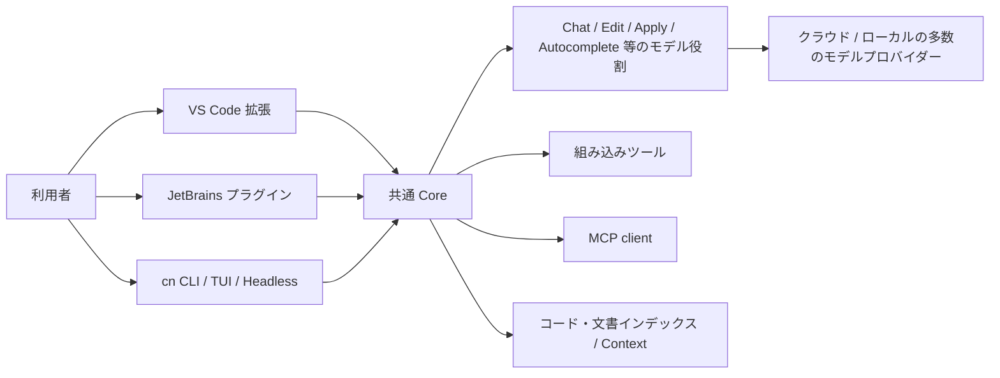

# Continue 機能・実装調査

- 調査日: 2026-08-01（Asia/Tokyo）
- 対象リポジトリ: `continuedev/continue`
- 対象コミット: [`5522c6f44ca0ac3528b37244818fbfa39b5af470`](https://github.com/continuedev/continue/tree/5522c6f44ca0ac3528b37244818fbfa39b5af470)
- ローカル版の目安: `v1.3.40-vscode-11-g5522c6f44`、README が案内する最終製品版は 2.0.0
- ライセンス: Apache License 2.0

## 結論

Continue は、単一ベンダーのモデルに最適化したエージェントというより、**複数のモデル、IDE、モデル役割、MCP ツールを組み替えられる OSS のコーディング基盤**である。特に VS Code / JetBrains におけるインライン補完、Next Edit、選択範囲を使う Edit、Chat / Plan / Agent の統合と、クラウド・ローカルを問わないモデルプロバイダーの幅が特色である。

一方、調査対象コミットの README は、このリポジトリが **read-only で今後は積極保守されず、2.0.0 が最終リリース**だと明記している。そのため「現在も実装されている機能」と「今後も継続的に進化する製品」を同一視すべきではない。また、CLI の Hooks や Subagent には Claude Code 互換を意識した実装があるものの、一部は未実装またはベータである。

## 調査範囲と注意点

本稿は次の2層を分けて確認した。

1. クローン済みソースで、型・サービス・ツール登録・実行器が存在すること
2. Continue 公式ドキュメントで、利用者向け機能として案内されていること

README の保守終了告知は最重要の前提である。ソース上に存在しても、配布版の UI、モデル、プロバイダーによって有効性が異なる機能がある。特に Agent / Plan は、選択したモデルの tool use 対応に左右される。

## 全体構成

ソース構成もこの分離を反映している。

- `core/`: モデル抽象化、Agent loop、ツール、MCP、コンテキスト、インデックス、Autocomplete、Edit、Next Edit
- `gui/`: IDE 内の Chat / Agent UI
- `extensions/vscode/`: VS Code 固有統合
- `extensions/intellij/`: JetBrains 固有統合
- `extensions/cli/`: `cn` の TUI、headless、権限、Hooks、Subagent、セッション

## 主要機能

### 1. Chat / Plan / Agent の3モード

公式仕様では次のように道具の範囲を分ける。

| モード | 目的 | ツール |
|---|---|---|
| Chat | 質問・説明 | 原則なし |
| Plan | 調査・設計 | 読み取り系のみ |
| Agent | 実装・検証 | 読み取り、編集、コマンド、MCP |

ソースの [`MessageModes`](https://github.com/continuedev/continue/blob/5522c6f44ca0ac3528b37244818fbfa39b5af470/core/index.d.ts#L495) には `chat / agent / plan / background` が定義され、GUI はモード別の system message を選ぶ。公式の [Agent mode](https://docs.continue.dev/features/agent/how-it-works) も、Chat はツールなし、Plan は読み取り専用、Agent は全ツールという構造を説明している。

ただし CLI の Plan mode 実装には注意が必要である。既定ポリシーは Edit / Write を除外する一方で Bash と任意 MCP を許可しており、ソースにも Bash の read-only 判定が課題として残る。したがって **IDE の説明上の「読み取り専用」と、CLI の OS レベルで強制された隔離は同義ではない**。

### 2. 組み込みツールと Agent loop

共通 Core は次のツール名を持つ。

- ファイル読み取り、範囲読み取り、現在開いているファイルの読み取り
- 新規作成、既存ファイル編集、単一置換、複数編集
- terminal command
- grep / glob / directory listing
- Web 検索、URL 取得
- diff、codebase 検索、rule block 作成、skill 読み込み

列挙は [`core/tools/builtIn.ts`](https://github.com/continuedev/continue/blob/5522c6f44ca0ac3528b37244818fbfa39b5af470/core/tools/builtIn.ts#L1-L32) で確認できる。Agent mode はモデルへ tool schema を渡し、許可後に実行結果を再びモデルへ返す反復ループである。

Continue の面白い実装上の特色は、モデルに応じて native tool calling だけでなく、ツールを XML として system message に埋め込む方式も選べる点である。これにより、ネイティブ function calling の差が大きいローカルモデルも Agent に利用しやすい。詳細は公式の [Agent model setup](https://docs.continue.dev/ide-extensions/agent/model-setup) にある。

### 3. IDE 向け補完・編集

3製品の中で Continue が最も明確に差別化される領域である。

- インライン Autocomplete
- Next Edit（次に編集しそうな位置・変更を提案）
- 選択範囲を自然言語で変更する Edit
- Chat / Agent から diff を適用
- 開いているファイル、選択範囲、診断、リポジトリ構造を文脈化
- コード・ドキュメントのインデックスと検索

実装は `core/autocomplete/`、`core/nextEdit/`、`core/edit/`、`core/indexing/` に独立しており、単なる Chat UI の付加ではない。モデル設定にも `chat`、`autocomplete`、`embed`、`rerank`、`edit`、`apply` などの役割があり、用途別に別モデルを割り当てられる。公式 [config.yaml reference](https://docs.continue.dev/reference) もこの役割分離を記載している。

### 4. モデル・プロバイダーの自由度

調査コミットの [`LLMClasses`](https://github.com/continuedev/continue/blob/5522c6f44ca0ac3528b37244818fbfa39b5af470/core/llm/llms/index.ts#L12-L135) は、OpenAI、Anthropic、Azure、Amazon Bedrock、Gemini、Vertex AI、Ollama、LM Studio、llama.cpp、vLLM、OpenRouter、Mistral、Cohere、Groq、Together、DeepSeek など多数を登録している。

これは単に chat model を切り替えるだけではない。

- Chat / Agent 用の大規模モデル
- Autocomplete 用の低遅延モデル
- Edit / Apply 用モデル
- Embedding / Reranking 用モデル
- ローカル推論サーバー

を別々に選べる。この**モデル役割の分業**とローカル運用の容易さが Continue の中心的な強みである。

### 5. コンテキスト選択とコードベース理解

IDE では `@` による明示的なファイル・フォルダー・各種 context provider の指定ができる。Core には retrieval pipeline、chunking、docs crawler、reranking、repository map などがある。CLI でも `@file` / `@directory` を利用できる。

旧来の `@codebase` や context provider の一部は deprecated 扱いになっているため、古い記事の説明をそのまま現行仕様とみなすべきではない。

### 6. Rules、Prompts、Skills、Agent files

- Rules: `.continue/rules` などに常時または条件付きの指示を置く
- Prompts: 再利用するプロンプトを定義する
- Skills: `SKILL.md` と付属ファイルを必要時に読み込む
- Agent file / config: モデル、rules、tools をまとめたエージェント構成

CLI の skill loader は `.continue/skills` と `.claude/skills` を探索し、`Skills` ツールから段階的に内容を読み込む。Claude 系の資産との相互運用を意識した設計である。公式 [Rules](https://docs.continue.dev/customize/rules) では、Agent / Chat / Edit にルールが適用されることを説明している。

### 7. MCP

Continue は MCP client として tools、prompts、resources、resource templates を扱う。型定義は stdio、Streamable HTTP、SSE、WebSocket の4 transport を含む。モデル・rules・MCP server は同じ `config.yaml` または `.continue/mcpServers` で組み合わせられる。

公式の [MCP 設定ガイド](https://docs.continue.dev/guides/configuring-models-rules-tools) と [config.yaml reference](https://docs.continue.dev/reference) が利用者向けの設定を説明している。

### 8. CLI (`cn`)

CLI は次を備える。

- Ink / React による対話 TUI
- `-p / --print` の headless 実行と JSON 出力
- stdin pipe
- セッションの resume / fork / rename / compact
- モデル・config・MCP の実行中切替
- `--allow` / `--ask` / `--exclude` のツール権限
- background shell job と `/jobs`
- `review`、`checks`、`serve` サブコマンド

CLI entry point の [`--print`、`--resume`、`--fork`、`--beta-subagent-tool`](https://github.com/continuedev/continue/blob/5522c6f44ca0ac3528b37244818fbfa39b5af470/extensions/cli/src/index.ts#L171-L199) と、公式 [CLI guide](https://docs.continue.dev/guides/cli)、[TUI mode](https://docs.continue.dev/cli/tui-mode) で確認できる。

### 9. 権限管理

CLI はツール呼び出しを `allow / ask / exclude` で評価し、個人設定 `~/.continue/permissions.yaml` に選択を保存できる。Agent file が利用可能ツールを限定する場合は、MCP tool と組み込み tool の allowlist / exclude を組み立てる。

これは便利だが、調査範囲では Codex や Claude Code にある Seatbelt / bubblewrap 等の **OS 強制サンドボックスを Continue 本体の一般機能として確認できなかった**。権限ポリシーと OS 隔離は分けて評価すべきである。

### 10. Hooks の互換実装

Continue CLI は `.continue/settings*.json` に加えて `.claude/settings*.json` も読み、Claude Code 互換のイベント名を型として定義する。Command hook と HTTP hook は実行され、exit code 2 や JSON decision による block も実装されている。

ただし [`hookRunner.ts`](https://github.com/continuedev/continue/blob/5522c6f44ca0ac3528b37244818fbfa39b5af470/extensions/cli/src/hooks/hookRunner.ts#L210-L232) は `prompt` と `agent` hook を「not yet implemented」としてスキップする。よって **Hooks 対応はあるが Claude Code と完全同等ではない**。

### 11. Subagent と並列レビュー

CLI には別セッションで専門エージェントを実行する `Subagent` tool があるが、起動には `--beta-subagent-tool` が必要である。モデル定義の `subagent` role から対象を選ぶ。

また `review` 実装は一時 Git worktree を作成してレビュー worker を走らせ、パッチを回収する。これは隔離レビューには有用だが、汎用的な agent team、相互メッセージ、共有 task list と同一ではない。

## 強み

1. **モデル中立性**: 商用・OSS・ローカルモデルを広く選べる。
2. **IDE ネイティブ機能**: Autocomplete、Next Edit、Edit、Chat、Agent が同じ基盤にある。
3. **役割別モデル**: 品質・遅延・費用を機能ごとに最適化できる。
4. **完全な OSS コードベース**: Core、VS Code、JetBrains、CLI を読んで改造できる。
5. **相互運用志向**: MCP、`SKILL.md`、Claude-compatible Hooks / settings location を取り込んでいる。

## 制約・リスク

1. **保守終了**: リポジトリは read-only で最終 2.0.0 と明記される。
2. **機能の成熟度にばらつき**: Subagent は beta、prompt / agent hooks は未実装。
3. **Plan mode の安全性**: 特に CLI は権限ポリシーであり、OS レベルの読み取り専用サンドボックスとは限らない。
4. **モデル依存性**: Agent / Plan の品質と tool call 対応は選んだモデル・provider に依存する。
5. **設定面の複雑さ**: 自由度が高いぶん、role、capability、prompt template、context、MCP の調整コストがある。

## 向いている用途

- VS Code / JetBrains で補完と Agent を一体運用したい
- Ollama、LM Studio、vLLM などローカルモデルを使いたい
- Chat、補完、Embedding、Reranking に別モデルを割り当てたい
- ベンダーロックインを避け、OSS を自社向けに改造したい

継続保守や最新のクラウド連携を最優先する新規導入では、read-only 化を受け入れられるかが最初の判断点になる。

## 主要参照資料

### クローン済みソース

- [README / maintenance status](https://github.com/continuedev/continue/blob/5522c6f44ca0ac3528b37244818fbfa39b5af470/README.md)
- [Built-in tools](https://github.com/continuedev/continue/blob/5522c6f44ca0ac3528b37244818fbfa39b5af470/core/tools/builtIn.ts)
- [Model providers](https://github.com/continuedev/continue/blob/5522c6f44ca0ac3528b37244818fbfa39b5af470/core/llm/llms/index.ts)
- [CLI entry point](https://github.com/continuedev/continue/blob/5522c6f44ca0ac3528b37244818fbfa39b5af470/extensions/cli/src/index.ts)
- [CLI permissions](https://github.com/continuedev/continue/blob/5522c6f44ca0ac3528b37244818fbfa39b5af470/extensions/cli/src/services/ToolPermissionService.ts)
- [Default / Plan permissions](https://github.com/continuedev/continue/blob/5522c6f44ca0ac3528b37244818fbfa39b5af470/extensions/cli/src/permissions/defaultPolicies.ts)
- [Hooks runner](https://github.com/continuedev/continue/blob/5522c6f44ca0ac3528b37244818fbfa39b5af470/extensions/cli/src/hooks/hookRunner.ts)
- [Subagent executor](https://github.com/continuedev/continue/blob/5522c6f44ca0ac3528b37244818fbfa39b5af470/extensions/cli/src/subagent/executor.ts)

### 公式 Web 文書

- [Continue CLI](https://docs.continue.dev/guides/cli)
- [Agent mode](https://docs.continue.dev/features/agent/how-it-works)
- [Plan mode](https://docs.continue.dev/guides/plan-mode-guide)
- [Agent model setup](https://docs.continue.dev/ide-extensions/agent/model-setup)
- [Configuration reference](https://docs.continue.dev/reference)
- [Rules](https://docs.continue.dev/customize/rules)
