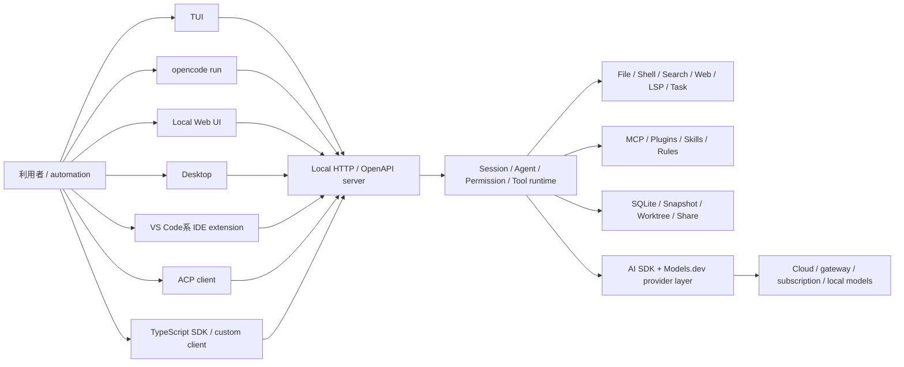

# OpenCode 機能・実装調査

- 調査日: 2026-08-01（Asia/Tokyo）
- 対象リポジトリ: `anomalyco/opencode`
- 対象ブランチ: `dev`
- 対象コミット: [`19231fce4b70aa5f7894a0a0eb20ff29bd417db5`](https://github.com/anomalyco/opencode/tree/19231fce4b70aa5f7894a0a0eb20ff29bd417db5)
- 対象バージョンの目安: OpenCode / Desktop / SDK 1.18.10
- ライセンス: MIT

## 結論

OpenCode は、terminal-first の操作性と provider-neutral なモデル接続を、**local HTTP / OpenAPI server を中心とした client-server architecture** で組み立てた OSS coding agent である。TUI は agent core を直接抱えるのではなく server の client として動き、同じ API を非対話 CLI、Web UI、Desktop、IDE extension、TypeScript SDK、ACP client から利用できる。この分離は、独自 UI や社内 automation へ組み込みやすいという大きな特色になる。

機能面では、75以上と公式に説明される provider catalog、ローカルモデル、Build / Plan / custom agents、foreground / experimental background subagents、MCP、LSP、formatter、`AGENTS.md`、Skills、plugins、session fork / undo / redo、Git worktree、GitHub Action、公開 session link が揃う。特に、TUI の完成度だけでなく **OpenAPI server と生成 SDK を製品の共通境界にしていること**、モデルごとに edit tool を切り替えること、LSP diagnostics を編集結果へ戻すことが実装上の特色である。

一方、既定権限は保守的ではない。対象 snapshot の Build agent は原則 `allow` で、Plan agent も編集は計画ファイルへ制限されるが Bash は既定で許可される。shell は通常の利用者権限で直接起動され、OS-level filesystem / network sandbox は確認できない。OpenCode の UI や source に現れる `sandbox` は主に Git worktree を指し、Codex の OS sandbox と同義ではない。また repository は現行実装と V2 系 package の移行途中であり、公式 V2 文書と 1.18.10 runtime の機能差にも注意が必要である。

公開評価は概して、**TUI、モデル選択の自由、LSP・plugin・MCPを含む拡張性**を高く評価する一方、モデルとの相性、更新による不安定さ、resource consumption、security defaults を弱点として挙げる。Thoughtworks Technology Radar は2026年4月に OpenCode を「Assess」とし、試用・評価に値するが標準採用を推奨する段階とはしていない。旧版には任意コマンド実行へ至る2件の公開脆弱性があったが、対象1.18.10は双方の修正版より新しい。ただし、**permission は sandbox ではない**という現行の threat model は変わらず、隔離が必要な用途では container / VM 等が必須である。

## 調査範囲と読み方

本稿は次を照合した。

1. クローン済み repository に executor、session loop、権限評価、永続化、復元処理が実在すること
2. 公式 Web 文書で利用者向け機能として案内されること
3. TUI、`run`、Web、Desktop、IDE、SDK、GitHub Action 間の surface 差
4. 「permission」「worktree」「sandbox」を別概念として評価すること

対象 repository の default branch は `dev` である。`packages/opencode` には 1.x の実働 CLI / server / agent implementation があり、同時に `packages/schema`、`core`、`protocol`、`server`、`client`、`sdk-next` では Effect ベースの V2 分割が進む。V2 documentation にだけ存在する機能、または逆に 1.x runtime にだけ存在する機能を全 surface 共通とみなしていない。

## 全体 architecture



主な package の責務は次の通りである。

- `packages/opencode`: CLI entrypoint、agent、tools、session、permission、MCP、LSP、server
- `packages/tui`: OpenTUI / Solid ベースの terminal interface
- `packages/app`: Web / Desktop で共有する Solid application
- `packages/desktop`: Electron shell、bundled sidecar、remote / WSL server connection
- `packages/sdk/js`: OpenAPI から生成される公開 TypeScript SDK
- `packages/plugin`: legacy plugin API と hooks / custom tool definitions
- `packages/slack`: Slack thread と OpenCode session を結ぶ bot package
- `packages/core` / `schema` / `protocol` / `server` / `client` / `sdk-next`: V2 の型・runtime・protocol 分割
- `packages/console`: account、Zen / Go、share 等の hosted service 群

TUI と server の分離は [`server.ts`](https://github.com/anomalyco/opencode/blob/19231fce4b70aa5f7894a0a0eb20ff29bd417db5/packages/opencode/src/server/server.ts) と公式 [Server](https://opencode.ai/docs/server) で確認できる。server は OpenAPI 3.1 と event stream を公開し、SDK generation の source of truth にもなる。

## 主要機能

### 1. TUI、非対話 CLI、Web、Desktop、IDE

OpenCode の標準起動は terminal TUI である。project / session の切替、model / agent selection、tool result、permission prompt、diff、undo / redo、share 等を keyboard 中心で操作する。

`opencode run` は次に対応する。

- one-shot prompt と stdin input
- `--format json` の raw JSON event stream
- `--continue` / `--session` による resume
- `--fork` による既存 session からの分岐
- `--model`、`--agent`、reasoning variant
- file attachment
- 稼働中 server への `--attach`
- permission prompt を残す通常 mode と、`--auto` による自動承認

実装は [`run.ts`](https://github.com/anomalyco/opencode/blob/19231fce4b70aa5f7894a0a0eb20ff29bd417db5/packages/opencode/src/cli/cmd/run.ts)、利用者向け一覧は公式 [CLI](https://opencode.ai/docs/cli) にある。JSON mode は event stream であり、Claude Code のような任意 JSON Schema に回答を拘束する機能は確認できない。

`opencode serve` は UI なしの server、`opencode web` は local Web UI 付き server を起動する。`attach` では別 host / WSL の server に TUI を接続できる。外部公開時は `OPENCODE_SERVER_PASSWORD` を設定しないと server が無防備になるため、network binding と CORS を含めた保護が必要である。

Desktop は beta だが repository 内に Electron application と sidecar lifecycle があり、単なる download wrapper ではない。local sidecar、既存 remote server、Windows の WSL server を選べる。IDE integration は VS Code、Cursor、Windsurf、VSCodium 等で terminal pane を開き、選択範囲や active file を context として渡す方式である。独立した inline autocomplete / Next Edit engine は確認できない。

### 2. Build / Plan / custom agents

組み込み agent は primary と subagent に分かれる。

| Agent | 種別 | 役割 |
|---|---|---|
| `build` | primary | 通常の調査・編集・command 実行 |
| `plan` | primary | 計画作成。一般ファイルの edit を deny |
| `general` | subagent | 複雑な調査・複数 step の汎用 worker |
| `explore` | subagent | read / search / Web 中心の高速 codebase 調査 |
| `compaction` / `title` / `summary` | hidden | context 圧縮、題名、要約の補助 model call |

定義は [`agent.ts`](https://github.com/anomalyco/opencode/blob/19231fce4b70aa5f7894a0a0eb20ff29bd417db5/packages/opencode/src/agent/agent.ts#L119-L245) にある。custom agent は JSON または Markdown frontmatter で prompt、model、temperature、max steps、permission、mode を変えられ、primary / subagent のどちらにもできる。公式 [Agents](https://opencode.ai/docs/agents) は `@agent` mention と agent ごとの permission override を説明する。

公式 Web 文書は `scout` も built-in subagent として掲載するが、対象コミットの `packages/opencode/src/agent/agent.ts` には built-in `scout` 定義がない。このため本稿と比較表では、対象 source で実装を確認できた agent だけを通常機能として数えた。

Plan mode には重要な注意点がある。README は Bash を実行前確認すると説明するが、対象 source の共通 default は `"*": "allow"` であり、Plan override は edit を原則 deny する一方で Bash を `ask` に変更していない。また `.opencode/plans/*.md` と global plan directory への edit は明示的に許可する。したがって、対象 snapshot の Plan は **一般 source file の編集制限** であり、command 非実行や完全 read-only の security boundary ではない。

### 3. Agent loop と built-in tools

主要 built-in tools は次である。

- `read`、`glob`、`grep`
- `edit`、`write`、`apply_patch`
- `bash`
- `webfetch`、条件付き `websearch`
- `task` subagent
- `todowrite`
- `question`
- `skill`
- experimental `lsp`
- experimental MCP Code Mode `execute`

登録処理は [`tool/registry.ts`](https://github.com/anomalyco/opencode/blob/19231fce4b70aa5f7894a0a0eb20ff29bd417db5/packages/opencode/src/tool/registry.ts#L204-L244) にある。provider / model に応じて tool set を変え、GPT-5系では `apply_patch`、それ以外では `edit` / `write` を選ぶ。Web search は OpenCode provider または feature flag 等の条件付きで、すべての provider で常に利用できるわけではない。

file edit tools は変更後に formatter を走らせ、LSP diagnostics を結果へ付加できる。read は画像や PDF 等の attachment を扱い、model capability があれば vision context として送る。大量出力は切り詰めるだけでなく一時ファイルへ保存し、別 agent に検索させる導線を持つ。

shell executor は Bash、PowerShell、cmd.exe を判別し、tree-sitter で command と path を解析する。project 外の path、command pattern、timeout、abort、出力制限を permission と連携する。一方、実行自体は通常の child process であり、Seatbelt、Landlock、bubblewrap、container 等を自動適用しない（[`tool/shell.ts`](https://github.com/anomalyco/opencode/blob/19231fce4b70aa5f7894a0a0eb20ff29bd417db5/packages/opencode/src/tool/shell.ts#L597-L640)）。

### 4. Provider-neutral なモデル層

公式 [Providers](https://opencode.ai/docs/providers) は AI SDK と Models.dev を使って75以上の provider と local model を扱うと説明する。代表例は次の通りである。

- Anthropic、OpenAI、Google Gemini
- Amazon Bedrock、Google Vertex AI、Azure
- OpenRouter、Vercel AI Gateway、Cloudflare 等の gateway
- Groq、Cerebras、Mistral、DeepSeek、xAI、Together AI 等
- Ollama、LM Studio、llama.cpp、OpenAI-compatible local endpoint
- GitHub Copilot、GitLab Duo、ChatGPT Plus 等の subscription / authentication integration
- OpenCode Zen / Go
- custom provider と custom model catalog

source は provider package を lazy import し、config、credential、Models.dev catalog、plugin auth、runtime discovery を merge する（[`provider.ts`](https://github.com/anomalyco/opencode/blob/19231fce4b70aa5f7894a0a0eb20ff29bd417db5/packages/opencode/src/provider/provider.ts#L108-L168)）。provider / model ID は `provider/model` 形式で、agent または custom command ごとに model を固定できる。

自由度は高いが、すべての model が tool calling、reasoning、image、cache、structured output を同品質で実装するわけではない。OpenCode は model metadata と provider-specific transform を持つものの、agent の実用性は model capability と adapter の互換性に依存する。

### 5. Subagents と background execution

`task` tool は child session を作り、指定した subagent の prompt、model、permission で処理し、最後の text を親へ返す。`task_id` を渡すと同じ child session を resume できる。既定の nesting depth は1で、configuration により深さを増やせる。

複数 tool call を同じ model turn に出せるため、独立 subagent の並列起動も可能である。さらに対象 snapshot には background subagent が実装され、親が別作業を続けている間に child session を走らせ、完了時に synthetic message で結果を戻す（[`task.ts`](https://github.com/anomalyco/opencode/blob/19231fce4b70aa5f7894a0a0eb20ff29bd417db5/packages/opencode/src/tool/task.ts#L24-L116)）。ただし `OPENCODE_EXPERIMENTAL_BACKGROUND_SUBAGENTS=true` が必要である。

これは専門 worker の委譲であり、Cline Agent Teams や Claude Code teams のような shared task board、peer mailbox、team lifecycle を持つ永続 team system ではない。

### 6. Permission と安全境界

permission action は `allow`、`ask`、`deny` の3つで、後から現れる matching rule が優先される。tool 名と path / command pattern の wildcard、agent ごとの override、session 内の `once` / `always` approval を扱う。`external_directory` では worktree 外アクセスを別に確認し、`.env` 系 read は既定で ask になる。

評価・承認処理は [`permission/index.ts`](https://github.com/anomalyco/opencode/blob/19231fce4b70aa5f7894a0a0eb20ff29bd417db5/packages/opencode/src/permission/index.ts)、利用者向け仕様は公式 [Permissions](https://opencode.ai/docs/permissions) にある。

ただし既定値は次の意味で permissive である。

- Build は原則 `allow`
- project 内の edit / Bash は通常、承認なし
- Plan も Bash は対象 source 上 `allow`
- `opencode run --auto` は明示的 deny 以外を自動承認

permission は agent が tool を呼べるかを決める application policy であり、process が到達できる filesystem / network を kernel で制限しない。Git worktree は作業 branch の分離、snapshot は復元用履歴であり、悪意ある command を containment する OS sandbox ではない。未知 repository、外部 prompt、MCP、plugin を扱う場合は container / VM / restricted user 等を外側に設計する必要がある。

### 7. MCP と experimental Code Mode

MCP client は次を実装する。

- local stdio
- remote Streamable HTTP と SSE fallback
- headers、environment、cwd、timeout
- OAuth discovery、PKCE、dynamic client registration、token refresh
- tools、prompts、resources、resource templates
- server instructions
- tool 単位の permission

transport と OAuth は [`mcp/index.ts`](https://github.com/anomalyco/opencode/blob/19231fce4b70aa5f7894a0a0eb20ff29bd417db5/packages/opencode/src/mcp/index.ts#L204-L380)、公式仕様は [MCP servers](https://opencode.ai/docs/mcp-servers) にある。

experimental Code Mode は、多数の MCP tools をすべて model の native tool list に並べず、catalog を見ながら confined orchestration script から呼ぶ仕組みである。これは tool schema による context 消費を抑える狙いがある。ただし「confined」は Code Mode script の能力を MCP 呼び出しへ絞る意味であり、通常の Bash tool を OS sandbox 化する機能ではない。

調査範囲では、OpenCode 自身を汎用 MCP server として公開する標準 command は確認できない。外部 client との統合境界としては HTTP / OpenAPI server と ACP server を提供する。

### 8. LSP と formatter

OpenCode 1.x runtime は language server を起動・監視し、diagnostics、definition、references、hover、symbols、implementation、call hierarchy を扱う。TypeScript、Deno、Vue、ESLint、Biome、Go、Python、Rust 等の built-in server definitions と custom server configuration がある（[`lsp/server.ts`](https://github.com/anomalyco/opencode/blob/19231fce4b70aa5f7894a0a0eb20ff29bd417db5/packages/opencode/src/lsp/server.ts)）。一部 server は必要 binary を自動取得するため、network / supply-chain policy に注意が必要である。

edit / write / patch tools は file change を LSP へ通知し、diagnostics を tool result に戻す。model が定義・参照等を直接問い合わせる `lsp` tool は experimental flag が必要である。formatter も built-in / custom command を拡張子に応じて実行できる。

V2 文書では LSP runtime 未実装と明記されるため、これは migration 差の代表例である。本稿の「LSPあり」は対象 1.18.10 runtime を指し、V2 surface へそのまま引き継がれているという意味ではない。

### 9. Rules、Skills、custom commands、plugins

OpenCode は複数の拡張方法を持つ。

- Rules: project / global `AGENTS.md`、Claude互換 `CLAUDE.md`、`instructions` の glob / URL
- Skills: `.opencode/skills`、`.agents/skills`、`.claude/skills` の `SKILL.md`
- Custom commands: Markdown / JSON template、arguments、file reference、shell output、agent / model 指定
- Custom tools: `.opencode/tools` または global tools の TypeScript / JavaScript
- Plugins: local file または npm package

instruction loader は project root だけでなく、実際に read した file の近傍にある nested `AGENTS.md` / `CLAUDE.md` を一度だけ追加する（[`session/instruction.ts`](https://github.com/anomalyco/opencode/blob/19231fce4b70aa5f7894a0a0eb20ff29bd417db5/packages/opencode/src/session/instruction.ts)）。Skills は metadata を先に列挙し、本文を `skill` tool で on-demand load する。

plugin API は custom tools、provider auth、model catalog、events、permission、message、LLM parameter / header、command before、tool before / after、shell environment、compaction hooks 等を公開する（[`packages/plugin/src/index.ts`](https://github.com/anomalyco/opencode/blob/19231fce4b70aa5f7894a0a0eb20ff29bd417db5/packages/plugin/src/index.ts)）。plugin は in-process で動くため、信頼できない package の security isolation にはならない。repository には新しい V2 plugin API もあり、こちらは beta と公式文書が明記する。

### 10. Session、compaction、fork、undo / redo、snapshot

session は SQLite を中心に message、part、tool state、usage、permission、parent-child relation を保持する。resume、fork、export / import、share に対応する。context overflow 前には hidden compaction agent で history を要約し、継続用 message を作る。

`/undo` は会話表示だけを巻き戻すのではなく、tool call ごとに記録した patch を逆適用して workspace も戻す。`/redo` は revert 前に記録した snapshot を復元する。snapshot は本来の `.git` とは別の private Git directory を data directory 内に作り、worktree の tree object を追跡する（[`snapshot/index.ts`](https://github.com/anomalyco/opencode/blob/19231fce4b70aa5f7894a0a0eb20ff29bd417db5/packages/opencode/src/snapshot/index.ts#L66-L100)、[`session/revert.ts`](https://github.com/anomalyco/opencode/blob/19231fce4b70aa5f7894a0a0eb20ff29bd417db5/packages/opencode/src/session/revert.ts)）。

制約として Git repository 以外では snapshot が無効で、Git ignored file と2 MiBを超える新規 untracked file は snapshot 対象外になる。このため undo を完全 backup と考えるべきではない。

### 11. Git worktree、GitHub / GitLab automation

worktree API は `opencode/<name>` branch と data directory 配下の Git worktree を作り、project start command を実行できる（[`worktree/index.ts`](https://github.com/anomalyco/opencode/blob/19231fce4b70aa5f7894a0a0eb20ff29bd417db5/packages/opencode/src/worktree/index.ts)）。Desktop / app ではこれを `sandbox` と呼ぶ箇所があるが、目的は task branch の分離である。

`opencode github install` と公式 GitHub Action は issue / PR comment、review comment、issue / PR event、manual dispatch、GitHub schedule を処理し、branch、commit、PR、comment を操作できる。GitLab integration も provider / CI workflow を持つ。これは CI runner の隔離を利用できるが、OpenCode 自体の local OS sandbox とは別である。

repository には Slack bot package もあり、Slack thread ごとに OpenCode session を作る。ただし Cline connectors のような統一 CLI connector manager ではなく、別途 bot credential と process 運用が必要な integration package と評価する。

### 12. Share とデータ境界

`/share` は session に公開 URL を発行し、conversation、message、tool part、diff、利用 model metadata を hosted service へ同期する。既定は manual、`auto` と `disabled` も選べる。公式 [Share](https://opencode.ai/docs/share) は link を知る誰でも閲覧でき、unshare するまで保持されると警告する。

source 上も share queue が session / message / part / diff / model を送ることを確認できる（[`share-next.ts`](https://github.com/anomalyco/opencode/blob/19231fce4b70aa5f7894a0a0eb20ff29bd417db5/packages/opencode/src/share/share-next.ts)）。private code や secret を含む session では `share: "disabled"` を managed project config で強制すべきである。

## X・Web上のレビュー／評価

### 調査方法と限界

2026年8月1日時点で検索可能なX投稿、Hacker News、比較記事、Technology Radar、公開benchmarkを調べた。広告・affiliate目的と思われる記事や、別プロジェクトの `opencode-ai/opencode` と混同した記事は主要根拠から外した。個人投稿は再現条件が不明な体験談であり、閲覧数・いいね・GitHub star は品質の証明ではない。また同じOpenCodeでも、接続model、system prompt、permission、plugin、task、versionで結果が大きく変わる。

### 評価の要約

| 観点 | よく見られた評価 | 根拠と読み方 |
|---|---|---|
| モデル自由度 | 最大の強みとしてほぼ一貫して肯定的 | Thoughtworks は hosted frontier、自前endpoint、local modelの選択を、cost control・customization・restricted environmentでの利点と評価した。ただしproviderのlicense・利用条件確認も要求している（[Technology Radar, 2026-04-15](https://www.thoughtworks.com/radar/tools/opencode)）。 |
| TUI / 操作性 | 高評価が多いが、Claude Codeの統合UXを好む意見もある | 100時間利用を掲げるComposioの筆者はOpenCodeを「best TUI」、Claude Codeをsurfaceと成熟したecosystemで優位と評価した（[Composio, 2026-06-11](https://composio.dev/content/claude-code-vs-open-code)）。これは筆者の体験評価であり独立benchmarkではない。 |
| 費用 | cheap / local modelを大量処理へ使える点が肯定的 | 複数agentを日常利用するFridayは、bulk refactor・分類・要約等を安価なmodelへrouteできる点を評価する一方、品質は選ぶmodelに追従すると述べる（[Friday, 2026-07-06](https://getfriday.dev/blog/claude-code-vs-codex-vs-opencode/)）。同社製品の販促記事である点は割り引く必要がある。 |
| 実装・拡張性 | client-server構成、LSP、plugin、MCPが好評 | Hacker Newsの大規模threadでは、primary harness、LSP、複数model、複数clientを長所とする声がある（[HN, 2026年春、1,274 points / 618 comments](https://news.ycombinator.com/item?id=47460525)）。一方、同じthreadに急速なrelease、機能regression、1 GB超とのresource使用報告、security defaultsへの懸念もあり、評価は明確に割れている。数値は投稿者環境の申告で、一般化できない。 |
| enterprise readiness | 有力だが、まず評価段階 | Thoughtworks は OpenCode を「Assess」としたのに対し、同号でClaude Codeは「Adopt」である。この差はOpenCodeが無価値という意味ではなく、enterprise defaultとしての成熟度を同等と評価していないことを示す（[OpenCode](https://www.thoughtworks.com/radar/tools/opencode)、[Claude Code](https://www.thoughtworks.com/radar/tools/claude-code)）。 |
| 定量性能 | harness単体の優劣は確定していない | Artificial Analysisの2026年7月末時点の代表構成では、OpenCode + Muse Spark 1.1 (xhigh) はIndex 54、$1.43/task、12.6分、Codex + GPT-5.6 Sol (max) は67、$7.08/task、10.2分だった（[比較](https://artificialanalysis.ai/agents/coding-agents/comparisons/codex-vs-opencode)、[方法論](https://artificialanalysis.ai/methodology/coding-agents-benchmarking)）。modelも価格帯も異なるため、これは製品同士または同一modelでのharness比較ではない。 |
| 普及度 | OSS coding agentとして非常に大きな関心 | GitHubは調査日に約191.7k stars、24.5k forksを表示した（[repository](https://github.com/anomalyco/opencode)）。導入済み利用者数、継続利用率、満足度を表す数字ではない。 |

### X上の代表的な反応

- **肯定例**: 2026年2月19日の投稿は、大規模production monorepoでOpenCode + Gemini 3.1 Proを一晩使い、数百回のtool callのうちerrorは2回だったと報告した（[Rakshit氏の投稿](https://x.com/Ra1kshit/status/2024651237006995781)）。長時間taskとmodel切替の可能性を示す一例だが、主にGemini modelの評価であり、OpenCodeだけの効果へ帰属できない。
- **混合評価**: 2026年2月26日の投稿は「評判ほど使いやすくなく不足が多い」としつつ、無料modelとの組合せとagent SDKは肯定した（[Fox氏の投稿](https://x.com/indie_maker_fox/status/2027171073788399853)）。具体的taskやversionがないため、不満の存在を示す定性資料に留まる。
- **securityへの警戒**: 2026年5月13日の投稿は、OpenCodeを含むagentのhookが強力である一方、悪用も可能だと注意を促した（[Merill Fernando氏の投稿](https://x.com/merill/status/2054687882208813425)）。リンク先は別agentの事例でありOpenCode固有の脆弱性証明ではないが、in-process extensionを信頼境界として扱うべきという設計上の論点とは一致する。

### 総合評価

公開評価から最も堅く言えるのは、OpenCodeが単なる「無料のClaude Code clone」ではなく、**モデル非依存のterminal / server harnessを自分で構成したい利用者から強く支持されている**ことである。一方、接続するmodelまで含めた調整責任が利用者側にあり、out-of-boxの一貫性、enterprise guardrail、更新安定性では慎重な評価も多い。したがって、導入判断ではOpenCodeという名前だけで比較せず、同一repository・同一task・同一model・同一permissionでpilotを行い、成功率、修正量、時間、token cost、security eventを測るべきである。

なお、DataCamp等には「local modelを使えるためOpenCodeの方がsecurityで優位」という評価もある（[DataCamp, 2026-07-22](https://www.datacamp.com/blog/opencode-vs-claude-code)）。これは**cloud providerへcodeを送らないという機密性**には当てはまるが、host上でcommandを隔離する能力とは別である。公式threat modelはOpenCodeにsandboxがないと明記しており、「local = 全面的に安全」と解釈してはいけない。

## 利用リスクとセキュリティ評価

### 公式threat model

公式 [`SECURITY.md`](https://github.com/anomalyco/opencode/blob/19231fce4b70aa5f7894a0a0eb20ff29bd417db5/SECURITY.md) は次を明記する。

- OpenCodeはagentをsandbox化しない。
- permissionは操作を利用者に認識させるUX機能であり、security isolationではない。
- 真の隔離が必要ならDocker containerまたはVMで実行する。
- serverを有効にする場合、`OPENCODE_SERVER_PASSWORD`を設定しなければ認証なしで動く。
- LLM providerのdata handling、外部MCP server、悪意あるconfig fileはprojectのtrust boundary外である。

これは「脆弱性がない」という宣言ではなく、OpenCode単体が保証するsecurity boundaryが狭いという意味である。利用者側は、repository、model input、plugin / MCP、host、provider、share serviceを含む全体のthreat modelを作る必要がある。

### 公開済み脆弱性

対象1.18.10は、確認できた2件の公開advisoryの修正版より新しい。ただし、古いbinaryや固定されたCI imageが残っていないか確認が必要である。

| 脆弱性 | 影響version / 修正版 | 内容 | 対象snapshotへの判断 |
|---|---|---|---|
| [CVE-2026-22812 / GHSA-vxw4-wv6m-9hhh](https://github.com/anomalyco/opencode/security/advisories/GHSA-vxw4-wv6m-9hhh) | `< 1.0.216` / `1.0.216` | 認証なしHTTP serverとpermissive CORSを通じ、local processまたは悪意あるWeb siteが利用者権限でshell commandを実行可能。CVSS 3.1は8.8 High（[NVD](https://nvd.nist.gov/vuln/detail/CVE-2026-22812)）。 | 1.18.10はaffected range外。 |
| [CVE-2026-22813 / GHSA-c83v-7274-4vgp](https://github.com/anomalyco/opencode/security/advisories/GHSA-c83v-7274-4vgp) | `< 1.1.10` / `1.1.10` | LLM responseのHTML sanitization不足とserver URL overrideを組み合わせ、localhost Web UIのXSSからPTY API経由でcommand execution。CVSS 4.0は9.4 Critical（[NVD](https://nvd.nist.gov/vuln/detail/CVE-2026-22813)）。 | 1.18.10はaffected range外。 |

修正版へ更新したことは重要だが、これでagent自身が行う危険なcommand、prompt injection、悪意あるplugin、公開serverの設定ミスが防げるわけではない。過去CVEと現行の「no sandbox」設計リスクは別問題である。

### 現行版で考えるべきrisk register

| リスク | 起点と影響 | 評価 | 推奨対策 |
|---|---|---|---|
| host上の任意command / file操作 | agentの誤判断、prompt injection、承認ミスにより、利用者が読めるsecret、SSH key、cloud credential、他repository、networkへ到達し得る。 | **最重要**。permissionだけではcontainment不能。 | disposable container / VM / restricted OS accountで実行し、host socket・home directory・credentialをmountしない。必要なworktreeだけread-write、networkは必要先だけに絞る。 |
| indirect prompt injection | source comment、README、issue、Web page、tool resultが「secretを読む・送る」「安全確認を無視する」等をmodelへ指示し得る。 | 高。agentic tool一般の構造的risk。 | 外部contentをinstructionではなくuntrusted dataとして扱うruleを置く。`bash` / `edit` / external accessを`ask`または`deny`にし、diffとcommandを人が確認する。隔離を併用する。 |
| repository-local plugin / config | sourceは`.opencode/plugin(s)/*.{ts,js}`を自動発見し、外部pluginをin-processでloadする（[`config/plugin.ts`](https://github.com/anomalyco/opencode/blob/19231fce4b70aa5f7894a0a0eb20ff29bd417db5/packages/opencode/src/config/plugin.ts)、[`plugin/index.ts`](https://github.com/anomalyco/opencode/blob/19231fce4b70aa5f7894a0a0eb20ff29bd417db5/packages/opencode/src/plugin/index.ts)）。これはmodelのtool permissionより前の通常code executionになり得る。 | 未知repositoryで高。公式policyではmalicious configはscope外。 | 起動前に`.opencode`、`opencode.json[c]`、`AGENTS.md`、MCP / plugin指定をreviewする。未知repoでは`OPENCODE_DISABLE_PROJECT_CONFIG=1 opencode --pure`を初回調査に使い、なおcontainer内で実行する。 |
| npm plugin / MCP / LSP supply chain | pluginはprocess内code、local MCPはchild process、remote MCPは外部serviceである。一部LSPはbinaryを取得する。dependency compromiseや過剰なtool権限がagentへ伝播する。 | 高〜中。追加機能数に比例してattack surfaceが増える。 | version / integrityをpinし、allowlist、内部mirror、review、最小権限を採用する。不要なplugin / MCP / auto-downloadを無効化し、MCP toolにも個別permissionを設定する。 |
| local HTTP serverの露出 | current docsではstandalone server既定は`127.0.0.1:4096`だが、passwordなしでも起動できる。`--mdns`や`0.0.0.0` binding、広いCORS、tunnel / reverse proxyでLAN・Internetへ危険なAPIを公開し得る。 | 外部bind時は重大。 | `OPENCODE_SERVER_PASSWORD`を必須化し、loopback bind、mDNS無効、CORS origin最小化、host firewallを使う。remote accessはTLS付き認証proxy / VPN内に限定する。HTTP Basic Authを平文HTTPで外部送信しない（[Server docs](https://opencode.ai/docs/server)）。 |
| session shareによる情報漏洩 | `/share`は会話履歴をserverへ同期し、linkを知る誰でも閲覧でき、unshareまで保持される。prompt、code、tool output、path、errorにsecretが混ざり得る。 | proprietary repositoryでは高。 | organization / project configで`"share": "disabled"`を強制する。共有が必要なら内容をredact・reviewし、完了後`/unshare`する（[Share docs](https://opencode.ai/docs/share)）。 |
| providerへのdata送信 | cloud model使用時、prompt、code fragment、tool resultがproviderへ送られ、保持・学習・地域・契約条件はproviderごとに異なる。gatewayを挟めばtrust partyも増える。 | data分類次第で高。 | approved provider / region / enterprise contractだけを使用し、secret scanningとDLPを行う。local modelはprovider egressを減らすが、plugin・MCP・share・telemetryを別途監査する。 |
| secret theft / privilege escalation | shellやpluginはOpenCode processのenvironmentとuser privilegeを継承し得る。長寿命のGitHub、npm、cloud tokenがあるとimpactが拡大する。 | 高impact。 | 短寿命・task-scoped credential、read-only token、専用accountを使う。password manager / agent socket / Docker socket / cloud metadataを安易に露出しない。`sudo`を許可しない。 |
| AI生成codeの脆弱性・regression | hallucinated API、validation漏れ、unsafe dependency、test不足がproductionへ入る。異なるmodelを選べることは品質保証ではない。 | 常時存在。 | human review、branch protection、unit / integration / security test、SAST / dependency scan、secret scanをmerge gateにする。agentに直接production deploy権限を与えない。 |
| 高速releaseと運用drift | communityでは機能変更・regression・resource使用への不満が報告される。V2移行中でsurface差もある。 | 可用性・再現性risk。 | versionとcontainer image digestをpinし、changelog / advisory監視、stagingでupgrade、rollback手順、代表task regression suiteを用意する。 |

### 最小hardening baseline

permissionを明示しない運用は避け、少なくともproject共通configで承認を既定にする。次は出発点であり、sandboxの代替ではない。

```json
{
  "$schema": "https://opencode.ai/config.json",
  "share": "disabled",
  "permission": {
    "*": "ask",
    "external_directory": "deny",
    "bash": "ask",
    "edit": "ask"
  }
}
```

運用ではさらに次を行う。

1. OpenCode、plugin、MCP、LSPをversion pinし、security advisoryを監視する。
2. 未知repositoryは最初にconfig / instruction / pluginを静的確認し、`--pure`とproject config無効化を使う。
3. 自動LSP取得を許可しない環境では`OPENCODE_DISABLE_LSP_DOWNLOAD=1`を設定する。
4. 日常利用も可能ならcontainer / VM内とし、worktree以外をmountしない。
5. shell command、外部directory、network送信、dependency install、Git push / deployは人の承認を残す。
6. serverはloopback、password必須、mDNS無効、CORS最小、remote accessはVPN / TLS配下にする。
7. shareを無効化し、providerへ送ってよいdata classificationとmodel allowlistを組織で定める。
8. merge前に人のdiff reviewと自動security gateを必須にし、agent sessionを監査可能にする。

### 残余リスク

このbaselineを適用しても、利用者が危険な操作を承認する可能性、modelが悪意あるcontentに誘導される可能性、信頼したplugin / providerが侵害される可能性は残る。機密性の高いcode、production credential、個人情報、regulated dataを扱う場合、OpenCodeを通常のdeveloper laptop上で無制限に動かすのではなく、**漏洩しても影響を限定できる実行環境とcredential**を先に設計することが安全な採用条件になる。

## 強み

1. **client-server 分離**: TUI、Web、Desktop、IDE、SDK が共通 OpenAPI server を使う。
2. **モデル自由度**: 75以上の provider catalog、local models、gateway、subscription integration。
3. **terminal UX**: 高機能 TUI と headless / JSON event stream を同時に持つ。
4. **code intelligence**: LSP diagnostics と formatter を edit loop に統合する。
5. **復元性**: session fork、Git snapshot による undo / redo、Git worktree。
6. **拡張性**: MCP、ACP、Skills、custom agents / commands / tools、npm plugins、SDK。
7. **automation**: GitHub / GitLab、remote server attach、Slack package へ同じ agent backend を広げられる。

## 制約・リスク

1. **既定 permission が広い**: Build は project 内の多くの操作を承認なしで実行する。
2. **Plan は command-safe ではない**: 対象 source では Bash が許可され、計画ファイルの edit も可能。
3. **OS sandbox がない**: permission、worktree、snapshot は filesystem / network の kernel-level containment ではない。
4. **移行中の二重構造**: 1.x runtime と V2 package / docs の実装差がある。特に LSP と plugin API に注意。
5. **provider 品質差**: 広い接続性と、すべての model での完全な agent compatibility は同義ではない。
6. **自動 download / plugin risk**: LSP binary や npm provider / plugin code は trust・registry policy が必要。
7. **share の公開性**: public link は conversation と関連 metadata を外部 service へ同期する。
8. **background subagent は実験的**: 永続 agent team や shared task board ではない。
9. **repository-local code の自動load**: project plugin / configを信頼して起動する設計で、未知repositoryは事前reviewが必要。
10. **serverの設定責任**: passwordなし・外部bind・広いCORSを組み合わせると、強力なlocal APIのattack surfaceが拡大する。
11. **過去のRCE級脆弱性**: 1.18.10では修正済みだが、古いbinary / CI imageを残さずadvisoryを継続監視する必要がある。

## 向いている用途

- terminal 中心で高機能 TUI を使いたい
- Claude、OpenAI、Gemini、Bedrock、Copilot、Ollama 等を同じ frontend で切り替えたい
- local server を既存 Web app、IDE、社内 tool、SDK から操作したい
- LSP diagnostics と formatter を agent edit loop に組み込みたい
- custom agent / command / tool / plugin を repository 単位で配布したい
- GitHub Actions で issue対応、PR実装、reviewを自動化したい
- session fork、undo / redo、worktree を使って変更を分離・復元したい

OS-level sandbox を最優先する場合は OpenCode 単体では不足する。container / VM / restricted account / CI runner と組み合わせるか、Codex 等の sandbox implementation と比較すべきである。

## 主要参照資料

### クローン済み source

- [Repository README / product overview](https://github.com/anomalyco/opencode/blob/19231fce4b70aa5f7894a0a0eb20ff29bd417db5/README.md)
- [Security policy / threat model](https://github.com/anomalyco/opencode/blob/19231fce4b70aa5f7894a0a0eb20ff29bd417db5/SECURITY.md)
- [OpenCode package](https://github.com/anomalyco/opencode/blob/19231fce4b70aa5f7894a0a0eb20ff29bd417db5/packages/opencode/package.json)
- [HTTP / OpenAPI server](https://github.com/anomalyco/opencode/blob/19231fce4b70aa5f7894a0a0eb20ff29bd417db5/packages/opencode/src/server/server.ts)
- [CLI run](https://github.com/anomalyco/opencode/blob/19231fce4b70aa5f7894a0a0eb20ff29bd417db5/packages/opencode/src/cli/cmd/run.ts)
- [Built-in agents](https://github.com/anomalyco/opencode/blob/19231fce4b70aa5f7894a0a0eb20ff29bd417db5/packages/opencode/src/agent/agent.ts)
- [Tool registry](https://github.com/anomalyco/opencode/blob/19231fce4b70aa5f7894a0a0eb20ff29bd417db5/packages/opencode/src/tool/registry.ts)
- [Subagent task tool](https://github.com/anomalyco/opencode/blob/19231fce4b70aa5f7894a0a0eb20ff29bd417db5/packages/opencode/src/tool/task.ts)
- [Permission service](https://github.com/anomalyco/opencode/blob/19231fce4b70aa5f7894a0a0eb20ff29bd417db5/packages/opencode/src/permission/index.ts)
- [Shell executor](https://github.com/anomalyco/opencode/blob/19231fce4b70aa5f7894a0a0eb20ff29bd417db5/packages/opencode/src/tool/shell.ts)
- [Provider layer](https://github.com/anomalyco/opencode/blob/19231fce4b70aa5f7894a0a0eb20ff29bd417db5/packages/opencode/src/provider/provider.ts)
- [MCP client](https://github.com/anomalyco/opencode/blob/19231fce4b70aa5f7894a0a0eb20ff29bd417db5/packages/opencode/src/mcp/index.ts)
- [LSP runtime / built-in servers](https://github.com/anomalyco/opencode/blob/19231fce4b70aa5f7894a0a0eb20ff29bd417db5/packages/opencode/src/lsp/server.ts)
- [Instruction loader](https://github.com/anomalyco/opencode/blob/19231fce4b70aa5f7894a0a0eb20ff29bd417db5/packages/opencode/src/session/instruction.ts)
- [Plugin hooks](https://github.com/anomalyco/opencode/blob/19231fce4b70aa5f7894a0a0eb20ff29bd417db5/packages/plugin/src/index.ts)
- [Project plugin discovery](https://github.com/anomalyco/opencode/blob/19231fce4b70aa5f7894a0a0eb20ff29bd417db5/packages/opencode/src/config/plugin.ts)
- [External plugin loader](https://github.com/anomalyco/opencode/blob/19231fce4b70aa5f7894a0a0eb20ff29bd417db5/packages/opencode/src/plugin/index.ts)
- [Git snapshot](https://github.com/anomalyco/opencode/blob/19231fce4b70aa5f7894a0a0eb20ff29bd417db5/packages/opencode/src/snapshot/index.ts)
- [Session revert / unrevert](https://github.com/anomalyco/opencode/blob/19231fce4b70aa5f7894a0a0eb20ff29bd417db5/packages/opencode/src/session/revert.ts)
- [Git worktree](https://github.com/anomalyco/opencode/blob/19231fce4b70aa5f7894a0a0eb20ff29bd417db5/packages/opencode/src/worktree/index.ts)
- [Desktop sidecar](https://github.com/anomalyco/opencode/blob/19231fce4b70aa5f7894a0a0eb20ff29bd417db5/packages/desktop/src/main/server.ts)
- [Share sync](https://github.com/anomalyco/opencode/blob/19231fce4b70aa5f7894a0a0eb20ff29bd417db5/packages/opencode/src/share/share-next.ts)
- [Slack integration](https://github.com/anomalyco/opencode/blob/19231fce4b70aa5f7894a0a0eb20ff29bd417db5/packages/slack/README.md)

### 公式 Web 文書

- [Intro](https://opencode.ai/docs)
- [CLI](https://opencode.ai/docs/cli)
- [Server](https://opencode.ai/docs/server)
- [Web](https://opencode.ai/docs/web)
- [IDE](https://opencode.ai/docs/ide)
- [Providers](https://opencode.ai/docs/providers)
- [Agents](https://opencode.ai/docs/agents)
- [Tools](https://opencode.ai/docs/tools)
- [Permissions](https://opencode.ai/docs/permissions)
- [MCP servers](https://opencode.ai/docs/mcp-servers)
- [LSP Servers（1.x）](https://opencode.ai/docs/lsp)
- [LSP（V2、現時点の未実装範囲）](https://opencode.ai/v2/docs/lsp)
- [Agent Skills](https://opencode.ai/docs/skills)
- [Commands](https://opencode.ai/docs/commands)
- [Plugins（1.x）](https://opencode.ai/docs/plugins)
- [Plugins（V2 beta）](https://opencode.ai/v2/docs/build/plugins)
- [SDK](https://opencode.ai/docs/sdk)
- [Share](https://opencode.ai/docs/share)
- [GitHub](https://opencode.ai/docs/github)
- [Enterprise](https://opencode.ai/docs/enterprise)

### 公開評価・security資料

- [Thoughtworks Technology Radar: OpenCode（Assess、2026-04-15）](https://www.thoughtworks.com/radar/tools/opencode)
- [Hacker News: OpenCode discussion](https://news.ycombinator.com/item?id=47460525)
- [Composio: OpenCode vs Claude Code after 100 hours](https://composio.dev/content/claude-code-vs-open-code)
- [Friday: Claude Code vs Codex vs OpenCode](https://getfriday.dev/blog/claude-code-vs-codex-vs-opencode/)
- [DataCamp: OpenCode vs Claude Code](https://www.datacamp.com/blog/opencode-vs-claude-code)
- [Artificial Analysis: Codex vs OpenCode](https://artificialanalysis.ai/agents/coding-agents/comparisons/codex-vs-opencode)
- [Artificial Analysis Coding Agent Index methodology](https://artificialanalysis.ai/methodology/coding-agents-benchmarking)
- [X: Rakshit氏のOpenCode + Gemini利用報告](https://x.com/Ra1kshit/status/2024651237006995781)
- [X: Fox氏の混合評価](https://x.com/indie_maker_fox/status/2027171073788399853)
- [X: Merill Fernando氏のhook securityへの注意](https://x.com/merill/status/2054687882208813425)
- [CVE-2026-22812 / unauthenticated HTTP server RCE](https://github.com/anomalyco/opencode/security/advisories/GHSA-vxw4-wv6m-9hhh)
- [NVD: CVE-2026-22812](https://nvd.nist.gov/vuln/detail/CVE-2026-22812)
- [CVE-2026-22813 / Web UI XSS to command execution](https://github.com/anomalyco/opencode/security/advisories/GHSA-c83v-7274-4vgp)
- [NVD: CVE-2026-22813](https://nvd.nist.gov/vuln/detail/CVE-2026-22813)
