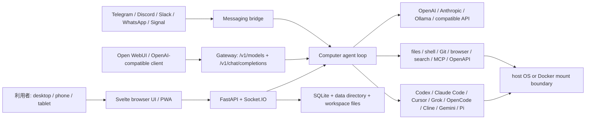
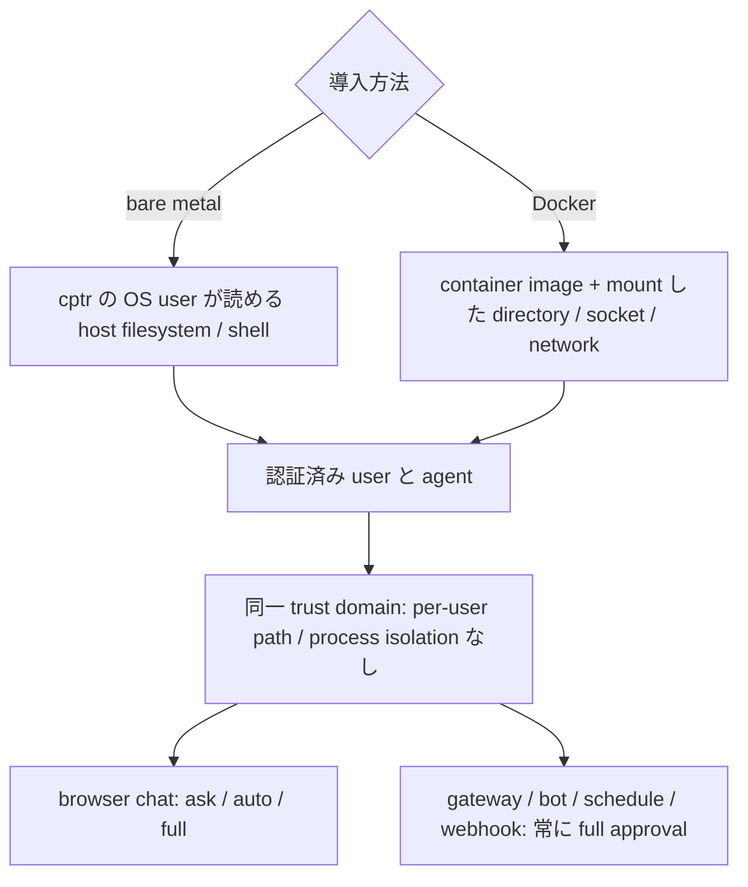

# Open WebUI Computer（`cptr`）機能・実装・安全性調査

- 調査日: 2026-08-03（Asia/Tokyo）
- 対象: `open-webui/computer` v0.9.20
- 対象コミット: [`6d2efeb3d589dd81c0636fc8fd8c1f499096c58c`](https://github.com/open-webui/computer/tree/6d2efeb3d589dd81c0636fc8fd8c1f499096c58c)
- 公開日: 2026-08-01
- 実装: Python 3.10+ / FastAPI / SQLite / Svelte frontend
- ライセンス: Open Use License（ELv2 を取り込み、追加の帰属表示条件を課す source-available license）

## 結論

Open WebUI Computer は、**自分の実機または自分で管理する container を、ファイル・editor・terminal・Git・AI chat・coding agent 付きの browser workstation として公開する self-hosted application**である。Open WebUI 本体の別 skin でも、独自 LLM でも、単なる remote desktop でもない。

最大の特色は、作業環境の複製を cloud に作るのではなく、**既存のファイル、dirty な Git tree、ログイン済み CLI、起動中の terminal session を同じ machine 上のまま** browser / phone / messaging bot / OpenAI-compatible client から扱える点にある。AI は次の2経路から選べる。

1. OpenAI、Anthropic、Ollama、OpenRouter 等の model APIを、Computer 自身の agent loop と built-in tools で使う
2. Codex、Claude Code、Cursor、Grok、OpenCode、Cline、Gemini、Pi の既存 CLI / subscription を native backend として接続する

ただし、その便利さは強い trust assumption と表裏一体である。bare-metal install では認証済み user は host の filesystem と shell に SSH 相当で到達し、path sandbox や user 間 isolation はない。さらに gateway、messaging bot、scheduled task、webhook は人が approval button を押せないため **full approval で無人実行**される。したがって、一般公開型 multi-user service ではなく、原則として単一の trusted owner が private network 上で使う workstation と評価すべきである。

## 何であり、何ではないか

| 観点 | Open WebUI Computer |
|---|---|
| 中心 | 実機上の workspace、file、shell、Git、継続 session |
| UI | desktop / mobile 対応 browser UI、PWA |
| AI | optional。API model または既存 coding-agent CLI を接続 |
| 実行場所 | `cptr` を動かす host。Docker 時は mount した範囲 |
| 永続性 | workspace、chat、layout、terminal、Git state を同じ machine に保持 |
| 外部公開 | LAN、Tailscale、認証付き tunnel / reverse proxy を利用可能 |
| 対象 user | 1人の trusted owner、または SSH access を渡せる同一 trust domain |

公式の位置付けでは、Open WebUI は conversation / control layer、Open Terminal は Open WebUI に action environment を与える基盤、Computer は real-machine workspace である。[公式比較](https://docs.openwebui.com/ecosystem/computer/choose/) は Computer を「faster-moving personal AI workstation and agent runtime」としており、Open WebUI / Open Terminal より新機能が先に入る一方、安定した multi-user control plane と同一視しない。



## 実装構成

### Server と state

v0.9.20 の package は Python 3.10+ を要求し、FastAPI、SQLAlchemy async、SQLite、bcrypt、JWT、Socket.IO を主要 dependency とする。wheel には build 済み frontend assets も含まれるため、別 frontend server は不要である。根拠は [`pyproject.toml`](https://github.com/open-webui/computer/blob/6d2efeb3d589dd81c0636fc8fd8c1f499096c58c/pyproject.toml#L1-L58) にある。

起動時には database 初期化、前回 crash で残った chat state の reconcile、model cache、automation scheduler、timer、messaging bots が開始される。終了時には background subagent、browser session、stdio MCP process を清掃する。実装は [`cptr/app.py`](https://github.com/open-webui/computer/blob/6d2efeb3d589dd81c0636fc8fd8c1f499096c58c/cptr/app.py#L38-L128) で確認できる。

主要 router は admin、auth、automation、bridge、browser、chat、file、gateway、Git、memory、notification、search、skills、terminal、workspace に分かれる。これは「chat UI」だけでなく workstation service 一式を同一 process にまとめた構成である。

### Workspace と browser UI

workspace は upload された copy ではなく、Computer host 上の実在 folder である。browser UI から次を扱える。

- file browse、create / rename / upload、syntax-highlight editor
- Markdown、PDF、CSV、Office、image、JSON、SQLite 等の preview
- shell と長時間 command session
- Git status、diff、stage、commit、branch、push
- file / chat search、split layout、複数 workspace
- mobile-first UI、PWA、browser notification
- managed browser または personal Chrome session

terminal と agent task は browser tab を閉じても server process が動く限り継続する。これは VNC のように画面 pixel を転送する方式ではなく、file、terminal、Git、chat を web-native component として提供する設計である。[公式 overview](https://docs.openwebui.com/ecosystem/computer/) と [quickstart](https://docs.openwebui.com/ecosystem/computer/quickstart/) が機能範囲を説明している。

## AI の2つの実行経路

### 1. API model + Computer built-in agent

OpenAI、Anthropic、Ollama、OpenRouter、OpenAI-compatible endpoint を connection として登録すると、Computer の agent loop が model response を built-in tool に接続する。主な tool は file read / write / edit / search、foreground / background command、browser navigation、web search、task plan、subagent、automation、MCP / OpenAPI である。

shell 実装は Unix では PTY を開き `shell=True` で workspace を `cwd` として process group を起動する。したがって Computer 自体が OS sandbox を追加しているわけではない。`.env` や代表的 credential path の read を拒否する application-level guard はあるが、任意 command が同じ OS account で動くことを置き換える境界ではない。実装は [`cptr/utils/tools.py` の process 起動](https://github.com/open-webui/computer/blob/6d2efeb3d589dd81c0636fc8fd8c1f499096c58c/cptr/utils/tools.py#L44-L101) と [sensitive-file checks](https://github.com/open-webui/computer/blob/6d2efeb3d589dd81c0636fc8fd8c1f499096c58c/cptr/utils/tools.py#L225-L254) を参照。

### 2. 既存 coding-agent CLI を native backend として使う

v0.9.20 の source は次の agent type を profile として列挙する。

| Agent | 接続の要点 |
|---|---|
| Codex | `codex app-server`、thread resume、approval / sandbox 設定 |
| Claude Code | `claude-agent-sdk`、Claude session resume、permission mode |
| Cursor | Agent CLI protocol |
| Grok | CLI / login または `XAI_API_KEY` |
| OpenCode | `opencode serve` を自動起動、または既存 server URL |
| Cline | CLI session |
| Gemini | Gemini CLI |
| Pi | provider namespace を含む model |

default profile と許可値は [`cptr/utils/agents/models.py`](https://github.com/open-webui/computer/blob/6d2efeb3d589dd81c0636fc8fd8c1f499096c58c/cptr/utils/agents/models.py#L13-L127) にある。Computer は command path、alternate home、model list、agent 固有 option を profile 化し、`agent:<profile-id>/<model>` として model selector に並べる。backend が返す session / thread id を chat に保存し、次 turn に resume するため、phone から同じ conversation を続けられる。[公式 coding-agent guide](https://docs.openwebui.com/ecosystem/computer/ai/coding-agents/) も、CLI を Computer host に install / login する必要があると明記する。

重要なのは、Computer が各 agent の能力を再実装するのではなく、**それぞれの protocol / SDK / server を adapter で包む**点である。approval、sandbox、tool semantics の最終的な保証は backend ごとに異なる。

## Approval、Plan mode、review

browser chat には3つの approval mode がある。

| Mode | 無確認で実行 | 確認が必要 |
|---|---|---|
| `ask` | なし | 全 tool call |
| `auto` | read-only tool | write、command、automation 等。v0.9.20 は model review が安全と判定した call を自動許可し得る |
| `full` | 全 tool call | なし |

公式文書は `auto` を「read-only は進め、変更は尋ねる」日常 mode と説明する。一方 v0.9.20 release notes では、safe / expected と model が判断した tool use を Auto mode で自動承認する変更が入っている。実装は別 model または current model に tool 名・引数・直近依頼を渡し、JSON の approve / deny を生成させる [`review_tool_approval`](https://github.com/open-webui/computer/blob/6d2efeb3d589dd81c0636fc8fd8c1f499096c58c/cptr/utils/chat_task.py#L737-L791) である。したがって `auto` を deterministic policy や OS isolation と考えてはいけない。

Plan mode は write tool を外し、read-only investigation と plan artifact 作成を行い、利用者が実装開始を承認する flow である。生成 output の edit と Git diff review も提供する。詳細は [Approvals, plan mode, and review](https://docs.openwebui.com/ecosystem/computer/ai/approvals-and-plan-mode/) を参照。

## Subagent、skills、memory、context

### Subagent

`delegate_task` は独立 chat と tool access を持つ worker を並列起動し、完了結果を parent chat に戻す。既定は background enabled、最大同時20、各 worker 最大30 iteration、出力最大30,000文字である。

ただし background worker は process-bound で、server restart 後に再開する durable job ではない。全 worker は parent と同じ machine access を持ち、file isolation もない。同じ file を並列 edit させる用途より、独立した調査・検索・log analysis に適する。実装も registry を in-memory に保持し、shutdown 時に cancel する [`cptr/utils/async_subagents.py`](https://github.com/open-webui/computer/blob/6d2efeb3d589dd81c0636fc8fd8c1f499096c58c/cptr/utils/async_subagents.py#L1-L40) 構造である。

### Skills と instructions

Computer は `SKILL.md` folder を progressive disclosure で扱い、次から discovery する。

- workspace: `.cptr/skills`、`.agents/skills`、`.claude/skills`、`.codex/skills`
- global: `~/.cptr/skills`、`~/.agents/skills`

workspace root の `MEMORY.md`、`AGENTS.md`、`AGENT.md`、`CLAUDE.md` も最大32KBで読み込む。既存 Codex / Claude Code skill と repository instructions を流用しやすい。一方、skill、instruction、memory は model context に入るため secret を置かない。[Skills and memory](https://docs.openwebui.com/ecosystem/computer/ai/skills-and-memory/) に discovery order と保存先がある。

memory は per-user で `<data-dir>/memory/users/<id>/` に保存され、review / edit / delete できる。ただし複数 account が同じ filesystem / shell boundary を共有する点は変わらない。

## Web search と browser automation

Web search は未設定でも DuckDuckGo を使え、Exa、Perplexity、Tavily、Brave、Firecrawl、SearXNG、search-capable chat endpoint に切り替えられる。

browser automation は既定 off で、次の3 provider を持つ。

- `local`: host の Chrome / Chromium / Brave / Edge を CDP で操作
- `firecrawl`: Firecrawl cloud API
- `browser_use`: Browser-Use cloud API

local provider は page navigation、click、form fill、screenshot を行う。UI browser tab は managed profile と personal Chrome profile を選べるが、後者は login / extension を含む本人権限で purchase、post、delete 等も可能になる。通常は managed browser を使い、personal profile は supervised task に限定すべきである。[Web search and browsing](https://docs.openwebui.com/ecosystem/computer/ai/web-search-and-browsing/) に provider と risk が記載される。

## Automation と外部統合

Computer は browser を閉じた後も次の経路から task を受ける。

- recurring schedule / RRULE
- webhook trigger と notification target
- Telegram、Discord、Slack、WhatsApp、Signal bot
- OpenAI-compatible gateway
- MCP remote（Streamable HTTP）/ stdio と OpenAPI tool server

server lifespan で scheduler と bot manager が常駐し、automation record は prompt、model、workspace、RRULE、次回実行時刻を SQLite に保持する。[`Automation` model](https://github.com/open-webui/computer/blob/6d2efeb3d589dd81c0636fc8fd8c1f499096c58c/cptr/models/automations.py#L18-L37) と [`app.py`](https://github.com/open-webui/computer/blob/6d2efeb3d589dd81c0636fc8fd8c1f499096c58c/cptr/app.py#L69-L83) が実装根拠である。

MCP は optional dependency `cptr[mcp]` を必要とし、Docker image には含まれる。stdio MCP server は Computer と同じ OS account の local process として動き、remote MCP / OpenAPI server は model が作った arguments を受けるため、trusted server だけを接続する。[Tool server guide](https://docs.openwebui.com/ecosystem/computer/automate/tool-servers/) が transport と credential 設定を説明している。

### OpenAI-compatible gateway

各 workspace は `cptr/<folder-name>` という model として公開される。

- `GET /v1/models`: API key owner の workspace を列挙
- `POST /v1/chat/completions`: 選択 workspace で agent loop を実行
- `X-Chat-Id`: 任意 client で conversation を継続
- `X-OpenWebUI-*`: Open WebUI の chat tree、edit / regeneration branch、utility task を対応付け

API key は一度だけ表示され SHA-256 hash で保存される。gateway router は bearer token を hash と照合し、workspace を model に変換して agent task を開始する。[`cptr/routers/gateway.py`](https://github.com/open-webui/computer/blob/6d2efeb3d589dd81c0636fc8fd8c1f499096c58c/cptr/routers/gateway.py#L1-L112) が実装根拠である。

互換性には限界がある。`temperature`、`top_p`、`max_tokens` は受理するが無視し、response の usage token は常に0、idle stream は300秒で閉じる。Open WebUI の knowledge base、tools、prompts、users が Computer に同期されるわけでもない。[Gateway API reference](https://docs.openwebui.com/ecosystem/computer/reference/gateway-api/) を参照。

## Security model

### 最重要の境界



公式 security model は「signed-in user は Computer が到達できる全 filesystem と shell に SSH session 相当で access する」と明示する。bare install は host 全体、Docker は mount した folder が主な boundary である。account role は admin setting を分けるが OS-level isolation を作らない。[Security model](https://docs.openwebui.com/ecosystem/computer/phone-and-remote/security/) を参照。

### Authentication

- default password mode: bcrypt hash、初回 one-time setup token
- JWT cookie: 30日。localhost bypass なし
- signup: admin approval 前は pending role
- Linux PAM mode
- reverse proxy の trusted header mode
- gateway: separately issued bearer key

logout はその browser cookie だけを消し、password change は既存 session を一括失効しない。全 JWT を revoke するには `config.toml` の server secret を rotate して restart し、gateway key と bot token も別に rotate する必要がある。

### 実運用の最低条件

1. Internet へ raw port を公開せず、Tailscale 等の private overlay または強い前段認証を使う。
2. `trusted_header` 利用時は proxy が client supplied identity header を必ず strip / overwrite する。
3. 複数の相互に信頼しない user を同一 instance に入れない。
4. blast radius を限定したい場合は Docker を使い、project directory だけを mount する。Docker socket、SSH agent、home、cloud credential directory を安易に mount しない。
5. gateway / bot / schedule 専用 workspace と credential を分離する。
6. audit logging は既定 off なので有効化を検討する。ただし full terminal transcript ではない。
7. personal Chrome profile を agent に渡す task は対話監督下に限定する。
8. project と data directory を別々に backup する。

## Install と運用

### Python install

```bash
python -m venv .venv
. .venv/bin/activate
python -m pip install cptr==0.9.20
cptr run
```

既定は `127.0.0.1:8000`。LAN access のため `--host 0.0.0.0` にする前に、network と認証境界を設計する。AIなしでも file、editor、terminal、Git は利用できる。[Quickstart](https://docs.openwebui.com/ecosystem/computer/quickstart/) は macOS / Linux / Windows と Python 3.10+ を対象にする。

### Docker install

```bash
docker run --rm -it \
  -p 8000:8000 \
  -v cptr-data:/data \
  -v "$PWD:/workspace" \
  -w /workspace \
  ghcr.io/open-webui/computer:latest
```

再現性が必要なら `latest` ではなく検証済み digest / version を固定する。`/data` に app state、`/workspace` に project を分ける。agent browser automation が必要な公式 image variant は `:browser` である。[Repository README](https://github.com/open-webui/computer/tree/6d2efeb3d589dd81c0636fc8fd8c1f499096c58c#docker) に volume と image の説明がある。

offline install 用に wheelhouse と Docker image を事前取得でき、core local features は network なしで動く。ただし hosted model、web search、remote MCP、Git remote、messaging service は当然それぞれの endpoint が必要である。

## License と「OSS」の扱い

Computer の source は公開されるが、Apache-2.0 / MIT のような permissive OSS ではない。v0.9.20 の [`LICENSE`](https://github.com/open-webui/computer/blob/6d2efeb3d589dd81c0636fc8fd8c1f499096c58c/LICENSE) は ELv2 全文を取り込み、logo、product name、about screen 等の attribution を除去・変更・置換・追加できない条件を課す。

公式 terms（2026-07-07 effective）は「work / commercial use を含め無料、commercial plan は必須でない」とする一方、distributed license text が software use を支配すると明記する。license 自身も commercial / organizational / production use は published commercial terms に従うとしている。したがって結論は次のように分ける。

- 無料 self-host / 商用利用可能という公式方針は確認できる。
- source code は閲覧・改変可能だが、標準的な open-source license とは分類しない。
- 再配布、rebranding、派生製品、SaaS 提供、企業調達では、その時点の [official terms](https://openwebui.com/terms) と配布物の license を法務確認する。

## 強み

1. **one machine, one truth**: code、document、terminal、Git、chat、agent が同じ state を参照する。
2. **mobile / remote continuity**: desk で始めた terminal と agent task を phone で確認・継続できる。
3. **agent subscription reuse**: API課金だけでなく login 済み coding-agent CLI を native backend にできる。
4. **provider-neutral**: cloud API、Ollama、複数 agent CLI を同じ model selector から扱う。
5. **automation surface**: schedule、bot、webhook、gateway、MCP / OpenAPI が workspace に直接つながる。
6. **plain-file compatibility**: `AGENTS.md`、`CLAUDE.md`、複数 ecosystem の `SKILL.md` を再利用できる。
7. **UI の統合度**: terminal だけでなく editor、diff、preview、browser、voice、notifications を同じ workspace に置く。

## 制約と注意点

1. **single trust domain**: account 数と OS isolation は別。multi-user SaaS の安全境界にはならない。
2. **OS sandbox は標準でない**: bare install では Computer process の OS権限が実効境界。Docker は明示 mount した範囲に縮められる。
3. **unattended path は full approval**: gateway key や bot token は chat credential ではなく remote-shell credential 相当に扱う。
4. **Auto approval は model judgment を含む**: deterministic allowlist と同等ではない。
5. **parallel subagent は file isolation なし**: 同じ file への並列書込みは競合する。
6. **background subagent は restart-resumable でない**: schedule record の永続化と混同しない。
7. **gateway は完全な OpenAI API clone ではない**: sampling parameter と usage accounting に制限がある。
8. **Open WebUI integration は sync ではない**: Open WebUI 側 knowledge、tools、prompts、users を転送しない。
9. **高速に変化する若い製品**: 0.x のため main / latest の挙動は本稿の固定 snapshot から変わり得る。
10. **source-available license**: fork / rebrand / redistribution の自由度を OSS coding agent と同一視しない。

## 選定ガイド

### 適する

- 自宅 workstation / GPU machine / development server を phone や別端末から継続利用したい
- Codex、Claude Code、Cursor、OpenCode 等を1つの remote UI に集約したい
- local file と running process を cloud workspace へ copy せず agent に渡したい
- Open WebUI から real workspace を agent model として呼びたい
- trusted personal environment に schedule / bot / MCP automation を追加したい

### 適さない、または外側の隔離が必要

- 相互に信頼しない多数 user に共有する service
- agent ごと・user ごとの厳密な filesystem / network isolation が必要
- approval なしの command 実行を許容できない regulated environment
- permissive OSS license を必須とする fork / redistribution
- durable queue、HA、server restart を跨ぐ background worker recovery が必須

## 推奨 deployment pattern

| 用途 | 推奨 |
|---|---|
| 個人 workstation | localhost bind + Tailscale、password auth、interactive `ask` / `auto` |
| remote coding server | dedicated OS user または Docker、project のみ mount、managed browser |
| 無人 automation | 専用 workspace / Git branch / credential、最小権限 token、実行後 notification |
| Open WebUI gateway | private network、専用 gateway key、Open WebUI 0.10.0+ header mapping |
| 小規模 team | 「全員に同じ SSH 権限を渡せるか」を基準に判断。不可なら instance / container を分離 |

## 再現確認コマンド

```bash
# release と tag commit
curl -sS https://api.github.com/repos/open-webui/computer/releases/latest \
  | jq '{tag_name, published_at, html_url}'
curl -sS https://api.github.com/repos/open-webui/computer/git/ref/tags/v0.9.20 \
  | jq '.object'

# source を固定して確認
git clone https://github.com/open-webui/computer.git
cd computer
git checkout 6d2efeb3d589dd81c0636fc8fd8c1f499096c58c
rg -n 'DEFAULT_AGENT_PROFILES|_VALID_AGENTS|sandbox_mode' cptr/utils/agents/models.py
rg -n 'scheduler_worker_loop|BotManager|cancel_all_async_subagents' cptr/app.py
rg -n 'GET  /v1/models|POST /v1/chat/completions|full tool approval' cptr/routers/gateway.py
rg -n 'subprocess.Popen|shell=True|_SENSITIVE_HOME' cptr/utils/tools.py
sed -n '1,80p' LICENSE
```

## 主要参照

- [Open WebUI Computer documentation](https://docs.openwebui.com/ecosystem/computer/)
- [What is Computer?](https://docs.openwebui.com/ecosystem/computer/what-is-computer/)
- [Computer, Open WebUI, or Open Terminal?](https://docs.openwebui.com/ecosystem/computer/choose/)
- [AI in your workspace](https://docs.openwebui.com/ecosystem/computer/ai/)
- [Security model](https://docs.openwebui.com/ecosystem/computer/phone-and-remote/security/)
- [Gateway API](https://docs.openwebui.com/ecosystem/computer/reference/gateway-api/)
- [Official repository at v0.9.20 commit](https://github.com/open-webui/computer/tree/6d2efeb3d589dd81c0636fc8fd8c1f499096c58c)
- [v0.9.20 release](https://github.com/open-webui/computer/releases/tag/v0.9.20)
- [Open WebUI Terms](https://openwebui.com/terms)
