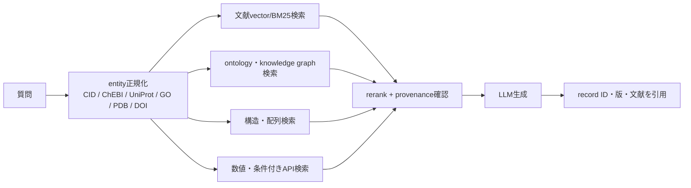

# RAGで利用できる化学・生物・物理の知識データベース調査

- 調査基準日: 2026-08-05（Asia/Tokyo）
- 対象: 化学、生物学、物理学のRAG／GraphRAG／tool-augmented retrievalで利用できる公開知識資源
- 評価軸: RAG論文・実装での採用証拠、収録内容、API・一括取得、ライセンス、更新・版固定、検索方式との適合性

## 結論

最初のPoCで優先すべき組合せは次である。

| 分野 | 第1候補 | 補助候補 | 理由 |
|---|---|---|---|
| 化学 | **PubChem + ChEBI** | ChEMBL、PMC OA、Materials Project | PubChemはChemRAG-Benchで実使用され、化合物・物性・bioassayをAPI/FTP/RDFで取得できる。ChEBIは安定IDとオントロジー階層をCC BY 4.0で提供する |
| 生物 | **UniProt + GO + Reactome + PDB** | NCBI Gene/Taxonomy、STRING、PMC OA | protein、機能、pathway、3D構造を相互IDで結べる。Reactomeは公式RAGサービス、UniProt・GO・PDBにもRAG利用例がある |
| 物理 | **arXiv/INSPIRE + HEPData**（HEP） | NASA ADS（天文）、Materials Project/NOMAD/COD（物性・材料） | 物理は汎用的な事実DBより分野別の文献・数値データ基盤が強い。HEPでは文献、引用、実験表を組み合わせるRAG実装が既にある |

ただし、文献全文だけをチャンク化する「vector RAG」は科学知識に十分ではない。化学構造、遺伝子・蛋白ID、オントロジー階層、単位付き数値、結晶構造は、文字列類似度ではなく専用検索を併用すべきである。



## 1. 調査範囲と証拠レベル

本稿の「知識データベース」には次の3種類を含める。

1. **構造化知識DB**: 化合物、蛋白、遺伝子、pathway、実験値、材料特性など。
2. **オントロジー／knowledge graph**: class、同義語、階層、relation、cross-referenceなど。
3. **文献コーパス／索引**: 論文本文、abstract、書誌・引用グラフ。科学RAGでは事実DBと併用されるため対象に含める。

採用証拠は以下で区別する。

- **A（直接）**: RAG論文・査読論文・運用中の公式RAGが、そのDBをretrieval sourceとして明記する。
- **B（関連）**: RAG類似のretrieval/tool利用例がある、または論文がRAG用候補として扱うが、公開実装の直接利用証拠が弱い。
- **C（適性）**: API、dump、ライセンス、構造の点でRAGに適するが、今回確認した範囲ではDB固有の直接採用論文を確認できない。

この区別により、「RAGで使える」と「RAG論文で実際に使われた」を混同しない。

## 2. 論文・実装で確認できる代表例

| 分野 | 研究・サービス | retrieval source | 状態と意味 |
|---|---|---|---|
| 化学 | [ChemRAG-Bench / Toolkit](https://arxiv.org/abs/2505.07671) | PubChem、PubMed abstracts、USPTO、OpenStax、Wikipedia等 | COLM 2025。1,932問のchemistry benchmarkとcorpusを構築し、RAGはdirect inference比で平均17.4%相対改善。corpusとtaskの相性が重要で、混合すれば常に良いわけではない |
| 化学・材料 | [LLaMP](https://openreview.net/forum?id=uMLeOlzlZ2) | Materials Project API | multimodal agentic RAG。結晶構造、弾性tensor等をAPIから動的取得し、単なる文章chunk以外をLLMへgroundingする例 |
| 化学 | [TextReact](https://aclanthology.org/2023.emnlp-main.784/) | 化学文献中の反応記述 | EMNLP 2023。厳密にはLLM QA型RAGではないが、反応条件推薦・逆合成を文献retrievalで改善した先行例 |
| 生物 | [React-to-Me](https://pmc.ncbi.nlm.nih.gov/articles/PMC12934981/) | Reactome pathway knowledgebase | 公式の自然言語RAG interface。Reactome graphから生成した知識をhybrid retrievalし、recordへのcitation付き回答を返す |
| 生物 | [scRAG](https://aclanthology.org/2025.findings-acl.53/) | 生物knowledge graph、reference cell database、marker genes | Findings of ACL 2025。structured triplesと類似cell情報を組み合わせたhybrid RAGでcross-tissue cell annotationを行う |
| 生物 | [RTK_RAG](https://pmc.ncbi.nlm.nih.gov/articles/PMC12264935/) | UniProt由来の追加protein sequences | receptor tyrosine kinaseのATP binding site予測で、UniProtから313配列を外部retrieval DBとして構成した例 |
| 生物 | [RCSB PDB AI Help Desk](https://arxiv.org/abs/2604.22800) | PDB deposition資料・help desk knowledge | 2026 preprint。PDB本体の全構造をvector化したものではなく、PDB登録支援文書をRAG化した運用例。PDB資源そのもののRAG適性と混同しない |
| 物理 | [EIC scientific literature QA](https://arxiv.org/abs/2604.02259) | Electron-Ion Collider関連arXiv論文 | 2026 preprint。arXiv論文をlocal DBにindexし、citation付き回答を生成する核物理RAG |
| 物理 | [HEP-CoPilot](https://arxiv.org/abs/2605.02491) | HEP文献、HEPData数値表、再構成plot | 2026 preprint。CMSのBSM searchを対象に、実験表からexclusion limitを再構成しcross-paper比較するmultimodal/agentic RAG |
| 物理 | [MITRA](https://arxiv.org/abs/2603.09800) | CMS内部文書 | private corpusの例。abstractでanalysisを選び、全文DBを検索する二段vector architecture。公開DBの候補ではないがphysics RAG設計の参考になる |

重要な観察は、ChemRAG-Benchが示すように **corpusを増やせば必ず改善するわけではない** ことである。同研究ではtaskごとにPubChem、USPTO、textbookの有効性が異なり、混合corpusで有用なchunkの順位が落ちる場合がある。また化学式、SMILES、IUPAC名、慣用名の表記差は通常のtext embeddingだけでは解決できない。

## 3. 化学の利用可能なデータベース

### 3.1 優先候補

| DB | 主な知識 | 取得方法 | 利用条件 | 証拠 | RAGでの使い方 |
|---|---|---|---|---|---|
| [PubChem](https://pubchem.ncbi.nlm.nih.gov/docs/) | compound/substance、2D/3D構造、物性、synonym、bioassay、注釈 | PUG-REST、PUG-View、Entrez、FTP、CSV/JSON/XML/SDF/RDF | 公開・無料。ただし集約された個々の注釈のprovenanceと原データのlicenseを保持し、一律public domainと仮定しない。APIは原則5 req/s以下 | **A**: ChemRAG-Bench | name/SMILES/InChIKeyをCIDへ正規化し、structure/property/bioassayはAPIで取得。説明文のみvector indexにする |
| [ChEBI](https://www.ebi.ac.uk/chebi/about/) | 生物学的に重要なsmall molecule、同義語、定義、class hierarchy、chemical relation | REST API、月次OWL/OBO/JSON/SDF/TSV/PostgreSQL dump | **CC BY 4.0**。版を記録しattribution | **B**: [biomedical associationのRAG検証protocol](https://pubmed.ncbi.nlm.nih.gov/42133493/)がChEBIとGOを使用 | ontology/GraphRAG、entity linking、上位・下位class展開。stable ChEBI IDを回答に付ける |
| [ChEMBL](https://www.ebi.ac.uk/chembl/api/data/docs) | drug-like molecule、target、assay、activity、文献 | REST API、SQLite/PostgreSQL dump、SDF | dataは **CC BY-SA 3.0**。release番号を明示し、派生DBのShareAlike影響を検討 | **C** | compound–target–assay graph、活性値のfilter。自然言語vector検索よりSQL/graph queryを優先 |
| [Materials Project](https://docs.materialsproject.org/downloading-data/how-do-i-download-the-materials-project-database) | 計算材料、結晶、thermodynamics、band structure、elasticity、battery等 | API key付きREST、公式`mp-api`、一部Parquet/Delta | coreは公開・無償だがaccount/API keyが必要。外部由来subsetは別条件があり、例としてGNoME由来構造はBY-NC。取得recordごとのorigin/license確認が必要 | **A**: LLaMP | formula/material IDを軸にproperty endpointをtool call。数値・tensor・structureを文章化し過ぎない |
| [Crystallography Open Database (COD)](https://www.crystallography.net/cod/) | organic/inorganic/metal-organic crystal structures、CIF | HTTP、rsync、SQL query、CIF/SDF、一括archive | **CC0** | **C** | composition、space group、cell parameter検索とstructure similarity。材料RAGのopen fallback |

### 3.2 補足

- PubChemは最も導入しやすいが、propertyの出典が複数の場合がある。回答では `CID + heading + source + retrieval date` を返す。
- ChEBIは物性値DBではなくontologyである。compound QAの唯一のsourceにせず、PubChem/ChEMBLのID bridgeとして使う。
- ChEMBLのactivity値はassay条件・単位・relation（`=`, `<`, `>`）を無視して単一数値に集約してはいけない。
- Materials Projectは実験値DBではなく主として計算値である。method、database version、provenanceを回答に含める。

## 4. 生物学の利用可能なデータベース

| DB | 主な知識 | 取得方法 | 利用条件 | 証拠 | RAGでの使い方 |
|---|---|---|---|---|---|
| [UniProt](https://www.uniprot.org/help/api) | protein sequence、function、domain、PTM、subcellular location、cross-reference | REST、ID mapping、SPARQL、FTP、FASTA/XML/text/RDF | copyrightable部分は **CC BY 4.0**。特許等の第三者権利は別 | **A**: RTK_RAG | reviewed Swiss-Protを高信頼tierにし、TrEMBLを分離。accessionとreleaseを引用 |
| [Gene Ontology](https://geneontology.org/docs/download-ontology/) | molecular function、biological process、cellular component、annotation、GO-CAM | GO API、OBO/OWL/JSON、annotation files、dated release/Zenodo | **CC BY 4.0**。release date/versionの表示を公式が要求 | **B**: [GO/HPO term normalization RAG](https://bearworks.missouristate.edu/theses/4045/)と[association検証protocol](https://pubmed.ncbi.nlm.nih.gov/42133493/) | hierarchy-aware retrieval、ancestor/descendant展開、evidence codeを保持。term名だけでなくGO IDを返す |
| [Reactome](https://reactome.org/ContentService/) | expert-curated human pathway、reaction、entity、disease、他種orthology、文献 | REST Content Service、Neo4j/relational dump、BioPAX、SBML等 | database data/derived filesは **CC0**。図・art等はCC BY 4.0、softwareは原則Apache 2.0 | **A**: React-to-Me | pathway graph + narrativeのhybrid retrieval。reaction/pathway stable IDとspeciesを付ける |
| [Protein Data Bank / RCSB PDB](https://data.rcsb.org/) | 実験決定した3D macromolecular structure、sequence、ligand、experimental metadata | REST、GraphQL、Search API、archive download、mmCIF | wwPDB core archiveは **CC0**。RCSB追加annotationや連携元dataは個別provenanceを確認 | **A/B**: PDB AI Help Desk、drug-target GraphRAGで構造取得 | text embeddingではなくsequence/structure/chemical similarity APIを併用し、PDB ID・chain・assembly・method・resolutionを返す |
| [NCBI Gene / Taxonomy / sequence resources](https://www.ncbi.nlm.nih.gov/datasets/docs/v2/api/) | gene、genome、sequence、organism classification、cross-links | Datasets API/CLI、E-utilities、FTP dump | 米国政府作成dataは広く再利用可能だが、NCBI集約contentを一律同一licenseと仮定しない。source別条件を確認 | **B/C** | gene symbol曖昧性をTaxID + GeneIDで解消。sequence retrievalはvector文章検索から分離 |
| [STRING](https://www.string-db.org/cgi/access?footer_active_subpage=apis) | protein functional association network、confidence、evidence channel | REST API、organism別download | **CC BY 4.0** | **C** | graph traversalとscore threshold。associationを直接の物理的bindingと表現しない |
| [Open Targets Platform](https://platform-docs.opentargets.org/data-access) | target–disease evidence、genetics、drug、tractability、safety | GraphQL、FTP/cloud bulk、BigQuery | academic/commercial利用向けopen access。統合元ごとのlicense/provenanceも保持 | **C** | drug-target discoveryのmulti-hop GraphRAG。evidence sourceとscore componentを回答に残す |

### 生物RAGで特に重要な条件

1. **識別子を先に正規化する**: gene symbolだけでは種・旧名・aliasが衝突する。TaxID、NCBI GeneID、UniProt accessionを併記する。
2. **evidenceを落とさない**: GO evidence code、Reactomeのcuration/reference、STRING evidence channel、PDB experimental methodを生成contextに含める。
3. **reviewed/unreviewedを分ける**: UniProtKB/Swiss-ProtとTrEMBL、実験構造とcomputed structureを同じ信頼度で混ぜない。
4. **medical answerと研究知識を分ける**: DBの記述は診断・治療推奨を意味しない。clinical useには別の検証・規制対応が必要である。

## 5. 物理学の利用可能なデータベース

物理学全体を一つで覆う構造化knowledgebaseは存在せず、subfieldごとに組み合わせる必要がある。

| DB | 主な知識 | 取得方法 | 利用条件 | 証拠 | RAGでの使い方 |
|---|---|---|---|---|---|
| [arXiv](https://info.arxiv.org/help/api/) | physics、astronomy、math等のpreprint metadataと本文 | API、OAI-PMH、S3 bulk source/PDF、RSS | metadata取得と全文再利用は別。論文ごとにarXiv non-exclusiveまたは各種CC licenseが異なるため、全文の再配布・商用利用はitem-level licenseを確認 | **A**: EIC QA | version固定したsource/HTML/PDFをchunk化。preprintでありpeer review済みとは限らないことを表示 |
| [INSPIRE-HEP](https://inspirehep.net/help/) | HEP文献、author、conference、institution、experiment、citation、data link | JSON REST API、BibTeX/LaTeX export | metadataは原則 **CC0** だが、abstract/keywordはsource条件があり、full text再構成は禁止 | **B** | HEPのquery expansion、citation graph、author/experiment/entity resolution。本文は正規OA sourceへ辿る |
| [HEPData](https://www.hepdata.net/formats) | publicationに対応する数値表、uncertainty、qualifier、plot resource、DOI | record JSON/JSON-LD、YAML、CSV、ROOT、YODA、一括record download | upload dataのdefaultは **CC0**。record/table/resourceのlicense metadataを確認 | **A**: HEP-CoPilot | 数値filter・再plot・cross-paper比較。値、単位、uncertainty、qualifier、record versionを一体で取得 |
| [NASA Astrophysics Data System](https://ui.adsabs.harvard.edu/help/api/) | astronomy/astrophysics/physics bibliography、abstract、citation、fulltext links | token付きREST API、export | API termsとrate limitに従う。publisher由来abstract/全文をADSの一括open corpusとみなさない | **B/C** | 天文学の文献retrieval、citation graph、object/database link。全文は合法なOA copyへ解決 |
| [Materials Project](https://docs.materialsproject.org/) | computational materials physics | REST/`mp-api` | 上記参照。subset別license注意 | **A**: LLaMP | condensed-matter/materialsのproperty tool |
| [NOMAD](https://nomad-laboratory.de/) | first-principles calculationのraw/normalized data、workflow、materials metadata | REST API、OPTIMADE、Archive/Encyclopedia、download | 公開dataは原則CC BY系。upload単位のlicense・embargoを確認 | **C** | calculation methodを含むprovenance-aware retrieval。raw simulation outputまで追跡可能 |
| [COD](https://www.crystallography.net/cod/) | open crystal structures | HTTP/rsync/SQL/CIF/SDF | **CC0** | **C** | experimental crystal structureのopen sourceとしてMaterials Project/NOMADを補完 |

### 物理での推奨構成

- **高エネルギー・核物理**: INSPIREでmetadata/citation retrieval → arXivまたはpublisher OA本文 → HEPDataの数値表。
- **天文・宇宙物理**: ADSで書誌・引用検索 → arXiv/OA本文 → object catalogやmission archiveを用途別に追加。ADS自体は観測値catalogではない。
- **物性・材料**: Materials Project/NOMAD/CODをfederatedに検索する。可能なら[OPTIMADE](https://www.optimade.org/)対応APIでcomposition/structure queryを共通化する。
- **共同研究の内部知識**: MITRA型のprivate RAGを別indexにし、公開知識とのaccess-control境界を維持する。

## 6. 全分野共通の文献コーパス

### PubMedとPMCを区別する

- [PubMed](https://pubmed.ncbi.nlm.nih.gov/help/)はcitation/abstract索引で、年次baseline XMLと日次updateがある。しかしabstractはpublisher提供であり、NCBIが著作権を一括許諾するものではない。
- [PMC Open Access Subset](https://pmc.ncbi.nlm.nih.gov/tools/openftlist/)は全文RAGに適する。FTP、Cloud、OAI-PMH、E-utilities、BioC等の許可された経路から取得できる。
- PMC OA内でも **Commercial Use Allowed / Non-Commercial / Other** に分かれ、article-level licenseが異なる。単に「PMCで無料閲覧できる」ことは一括再配布権を意味しない。

ChemRAG-BenchはPubMed abstractsを利用し、biomedical RAGの多数のbenchmarkもPubMed/PMCをcorpusにする。しかしproduction corpusでは、商用可否に応じてCC0/CC BY/CC BY-SA等をfilterし、licenseをchunk metadataへ保持するのが安全である。

## 7. 利用に注意が必要な有名DB

| DB | なぜ魅力的か | 制約と判断 |
|---|---|---|
| [KEGG](https://www.kegg.jp/kegg/legal.html) | pathway、gene、compound、reactionが高度に統合 | academic userのwebsite/API利用は可能だが、APIはacademic use限定、全量FTPはacademic subscription、非academic利用はcommercial license。公開RAGサービスや商用製品へ無条件に組み込めない |
| [DrugBank](https://go.drugbank.com/releases/latest) | drug、target、interaction、pharmacologyが統合 | academic licenseはCC BY-NC 4.0で、2026-08-05確認時はacademic dataset downloadが一時停止中。商用・再配布・サービス化には別licenseが必要 |
| [CAS Content Collection / CAS Common Chemistry](https://www.cas.org/services/commonchemistry-api) | 化学物質・反応・文献の大規模human curation | 一般のCAS contentは契約資源。Common Chemistry APIも用途条件があり、標準commercial API licenseはML/AI/LLM投入を禁止する条項を持つ。RAGにはAI用途を明示的に許す個別契約が必要 |
| PubMed abstract / publisher PDF | 広い文献coverage | 公開閲覧可能でも一括再利用可能とは限らない。PMC OAの許可subsetまたはarticle-level licenseでfilterする |
| Materials Project外部subset | 大規模材料候補を統合できる | GNoME由来等にBY-NCが混在する。core DBがfreeであることから全recordの商用可を推定しない |

## 8. 用途別の選択

| したいこと | 推奨source | retrieval方式 | 避けるべき実装 |
|---|---|---|---|
| 化合物の同定・基本物性 | PubChem + ChEBI | exact ID/name、InChIKey、substructure/similarity、ontology | SMILESを通常の文章embeddingだけで検索 |
| 薬剤–target–assay | ChEMBL + UniProt + Open Targets | SQL/GraphQL/graph + numeric filter | activityの単位・assay条件を捨ててvector化 |
| pathway・機能説明 | Reactome + GO + UniProt | graph traversal + BM25/vector hybrid | relation direction、species、evidence codeを削除 |
| 蛋白3D構造 | PDB | sequence/structure/chemical similarity + metadata filter | PDB title/abstractだけのsemantic search |
| 化学・生物文献QA | PMC OA + PubMed metadata | hybrid retrieval + citation rerank | PMC全体またはpublisher PDFをlicense無確認で収集 |
| HEP文献QA | INSPIRE + arXiv OA/version + HEPData | citation graph + fulltext hybrid + numeric API | abstractだけで数値結論を生成 |
| 材料物性QA | Materials Project + NOMAD + COD | composition/structure/property query + text explanation | 計算値と実験値、異なるDFT methodを混同 |
| 天文学文献QA | ADS + arXiv/OA本文 | bibliographic/citation retrieval + fulltext | ADS metadataを観測catalogそのものとして扱う |

## 9. 実装上の推奨

### 9.1 最小PoC

各分野とも、最初から全DBを統合せず、100〜1,000件程度の版固定snapshotでretrieval qualityを測る。

1. **化学**: PubChem CID 1,000件のPUG-View JSON + ChEBI ontology subset。
2. **生物**: human reviewed UniProt subset + GO basic + Reactomeの対象pathway + 関連PDB record。
3. **物理**: 一つのexperiment/topicに限定したINSPIRE/arXiv metadata・合法な本文 + 対応HEPData record。

評価用質問には、単純lookup、synonym、multi-hop、数値条件、否定・不明、更新差分を含める。回答正解率だけでなく、retrieval recall、citation correctness、ID correctness、数値・単位一致、abstentionを測る。

### 9.2 保存すべきprovenance

最低限、各chunk/recordに次を保持する。

```text
source_database
stable_record_id
source_url
database_release_or_record_version
retrieved_at
license_spdx_or_url
original_provider
species_or_chemical_system
evidence_type
publication_id
```

回答citationは文書URLだけでなく、PubChem CID、ChEBI ID、UniProt accession、GO ID、Reactome stable ID、PDB ID、HEPData DOI/table、Materials Project IDなどのrecord IDを表示する。

### 9.3 retrievalを分業する

- **BM25/vector**: narrative、abstract、definition、protocol。
- **graph/ontology**: pathway、class hierarchy、gene–function、compound–target。
- **exact/lexical entity resolver**: synonym、abbreviation、old ID、species。
- **domain search**: chemical substructure、protein sequence、3D structure、composition。
- **SQL/API numeric filter**: activity、temperature、pressure、energy、uncertainty、resolution。

最後にrerankerで統合する。異種sourceを最初から一つのvector indexへ平坦化すると、同名異物、単位消失、階層relationの逆転、弱いevidenceの過大評価が起きやすい。

## 10. 限界

- 本稿は公開情報で確認できるDBとRAG採用例を対象にし、研究機関内DBや契約DBの網羅調査ではない。
- 「A」はその論文・サービスの用途で採用された証拠であり、あらゆるRAG taskで優越することを意味しない。
- 2026年のphysics RAG例には査読前preprintが多い。production採用根拠としては、再現code、corpus、evaluation setの公開状況を追加確認すべきである。
- licenseは変更され得る。実装時には取得snapshotのterms、record-level license、第三者由来fieldを法務確認する。本稿は法的助言ではない。

## 参考一次資料

- [PubChem documentation: download and programmatic access](https://pubchem.ncbi.nlm.nih.gov/docs/)
- [ChEBI 2.0 data products](https://www.ebi.ac.uk/chebi/beta/downloads)
- [ChEMBL licensing](https://chembl.github.io/chembl-licensing/)
- [UniProt license](https://www.uniprot.org/help/license) / [downloads](https://www.uniprot.org/help/downloads)
- [Gene Ontology license and version citation](https://geneontology.org/docs/go-citation-policy/)
- [Reactome license](https://reactome.org/license)
- [RCSB PDB Data API](https://data.rcsb.org/)
- [PMC Open Access Subset and terms](https://pmc.ncbi.nlm.nih.gov/tools/openftlist/)
- [INSPIRE terms of use](https://help.inspirehep.net/knowledge-base/terms-of-use/)
- [HEPData formats and record API](https://www.hepdata.net/formats)
- [Materials Project API/download guidance](https://docs.materialsproject.org/downloading-data/how-do-i-download-the-materials-project-database)
- [KEGG copyright and licensing](https://www.kegg.jp/kegg/legal.html)
